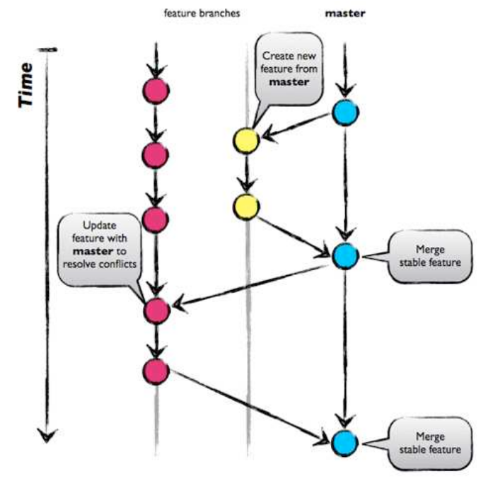
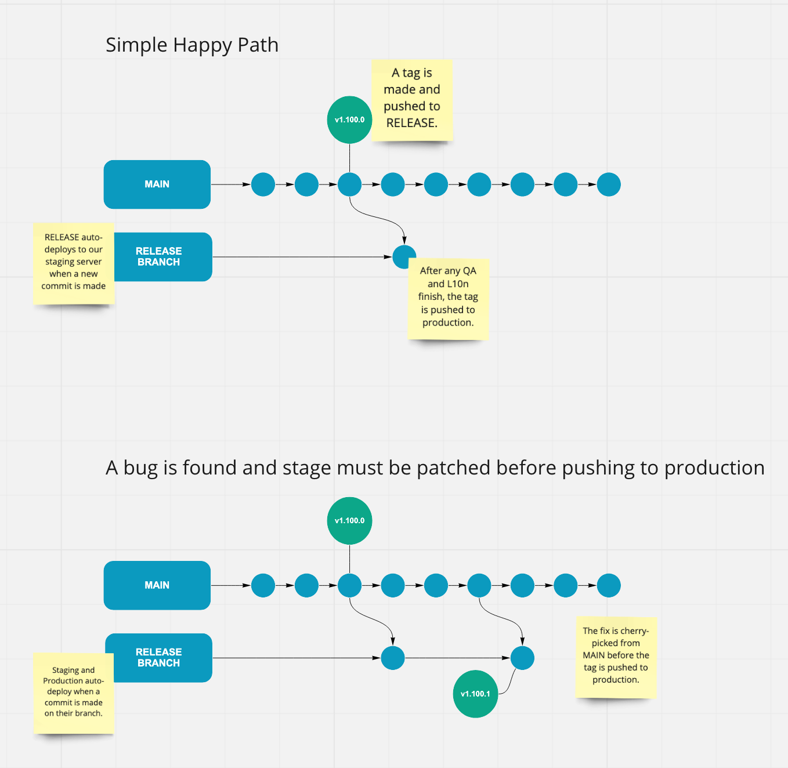
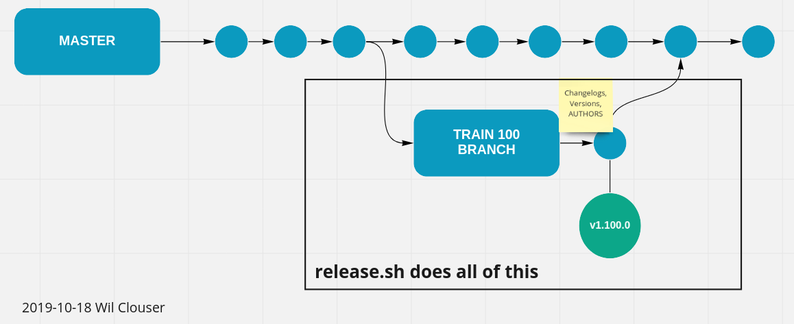

# FxA Process Evolution

- Status: proposed
- Deciders: Wil Clouser, Ivo Plamenac, Jon Buckley, Dustin Lactin
- Date: 2022-06-02

## Context and Problem Statement

We have a [documented process](https://mozilla.github.io/ecosystem-platform/reference/team-processes/development-process)
today (see also the [release owner duties](https://mozilla.github.io/ecosystem-platform/reference/team-processes/release-process)),
but it’s complex and can be error-prone. The release process was built before we have the tools
we have today and the priorities then were different. We’d like to revisit
that release process by defining what properties we’d like to see in a process
and then determining the best way to get there.

### Requirements of a release process include

- Needs to be robust. This means resilient to human error (or indifferent to
  certain decisions). We can rollback changes and there isn’t a failure state
  where production is half-pushed.
- Needs to allow stakeholders to do their work in a reasonable time and manner
- Bias towards fewer steps a human needs to do

### Stakeholders and their expectations:

#### SRE

- Expects reliable software. SRE is currently on pager-duty.
- Expects good communication about significant changes. We currently document
  configuration and database changes in a deployment document.

#### Engineers

- Expects a reliable and expedient process
- Expects an easy way to know the current status of any environment

#### QA

- Expects good communication about changes

#### L10n

- Expects strings accessible in the L10n tooling. Currently this is
  pontoon.mozilla.org.
- Expects minimal changes to strings once available
- Expects strings available with enough lead time to localize them before a
  major feature ships. We cannot ship major features which aren’t localized.

#### Relying parties

- Expects a stable platform and high availability

## Considerations

### Do we need to push all 8 servers all the time?

If we allow the servers to run different versions of code we need to be
mindful of:

- Careful API versioning to ensure the servers can continue to communicate with each other
- Careful database updates if more than one server is accessing the database directly
- Differences between staging and production when testing
- An easy way to know what version each server is running

In light of the above it’s probably best to continue to keep all servers pushed
to their latest versions. _That doesn’t necessarily mean the same version_, but
if a newer version exists it should go out.

### Do we need tags?

When we are ready to deploy our code we tag it (eg. v1.100.0) as an easy means
of identifying the code we are pushing. Tags are just aliases in git so our
usage is purely for ease of use. That said, it is significantly easier to
remember a tag name than a hash which makes it easier to identify what is live,
what was live at an arbitrary time in the past, and if we need to roll back,
easier to get the right code live. Since they offer benefits and no real
drawback we should continue to use tags.

### Who uses the change logs and what are their expectations?

We’ve maintained change logs in each package for many years and they are
updated with each release. We release often enough that not all of the
packages change between each release and we regularly update the changelogs
just to say nothing has changed. This causes considerable churn in our
deployment pipeline for no reason because we unnecessarily deploy packages with
changelog and version updates with no actual code changes.

We asked our stakeholders about the changelogs and the only people currently
using them are QA. After [a
conversation](https://groups.google.com/a/mozilla.com/g/fxa-staff/c/OuKEsHs67fk)
we found using Github's release notes feature would allow us to stop writing our change logs to
the repository and reduce our deployment churn.

### Do we need to maintain versions in each package.json?

Our build script currently increments the version of every package in our
monorepo when we run it. But do we need those versions? [The docs
say](https://docs.npmjs.com/cli/v8/configuring-npm/package-json#version) “If
you don't plan to publish your package, the name and version fields are
optional.” We used to publish our packages to npm but we don’t do that anymore.
SRE doesn't use the version field in any scripts. We use the version to [tell
what is live](https://accounts.firefox.com/__version__) but the commit hash is
also there and we could look at other options.

So, no, we don't need the version in each package.json.

## Decision Outcome

TBD, but the authors are recommending option 3

## Options

### Option 1: The main branch is always ready to push live

Something like [Github Flow](https://docs.github.com/en/get-started/quickstart/github-flow).
This is mainly used for continuous deployment which we aren’t aiming for so likely
isn't a good fit here.

#### Pros:

- Forced robustness in DB/data schema changes
- Never have to “roll back” a release? I could be wrong about this

#### Cons:

- Have to carefully juggle feature flags
- L10n has no time to push unless we land the code early behind a feature flag
- This would encourage feature branches which we’ve discouraged up until now to
  avoid merging problems like conflicts
- Doesn’t scale well with large teams

### Option 2: A single long running release branch

#### Pros

- Easy to understand

#### Cons

- We’d have to set up infrastructure somewhere else to push to production
  making this less simple or efficient

### Option 3: Long running stage and production branches

We make new long-running stage and production branches (essentially [GitLab Flow](https://docs.gitlab.com/ee/topics/gitlab_flow.html)). From that link:

> After announcing a release branch, only add serious bug fixes to the branch. If
> possible, first merge these bug fixes into main, and then cherry-pick them into
> the release branch. If you start by merging into the release branch, you might
> forget to cherry-pick them into main, and then you’d encounter the same bug in
> subsequent releases. Merging into main and then cherry-picking into release is
> called an “upstream first” policy, which is also practiced by
> [Google](https://www.chromium.org/chromium-os/chromiumos-design-docs/upstream-first/)and
> [Red Hat](https://www.redhat.com/en/blog/a-community-for-using-openstack-with-red-hat-rdo).
> Every time you include a bug fix in a release branch, increase the patch
> version (to comply with [Semantic Versioning](https://semver.org/)) by setting a new tag.

#### Pros:

- Pretty common workflow
- We already have scripts set up to deploy our stage branch automatically. Easy to add to the production branch as well, presumably
- Uses tooling everyone is familiar with (git)

#### Cons:

-

### Option 4: Continue cutting and merging release branches

As described in [our
documentation](https://mozilla.github.io/ecosystem-platform/reference/team-processes/release-process)
we currently branch our code when we're ready to tag and, at a minimum,
generate changelogs and version numbers on the branch. For serious fixes that
need to go out before `main`, there are [three documented ways](https://mozilla.github.io/ecosystem-platform/reference/team-processes/release-process#patch-releases)
to get patches from wherever they've landed to the branch which can cause
confusion between release owners and the people writing the patches.

For every patch that lands we add another commit with changelogs and versions,
and create a new tag. At some point after creating the tag but before the next
tag the release owner will merge the train back into main.

As far as I know this isn't a common practice so there aren't a lot of other
resources we can use to compare the flows.

#### Pros:

- We don't have to change anything!

#### Cons:

- The current process is inconsistent and time consuming
