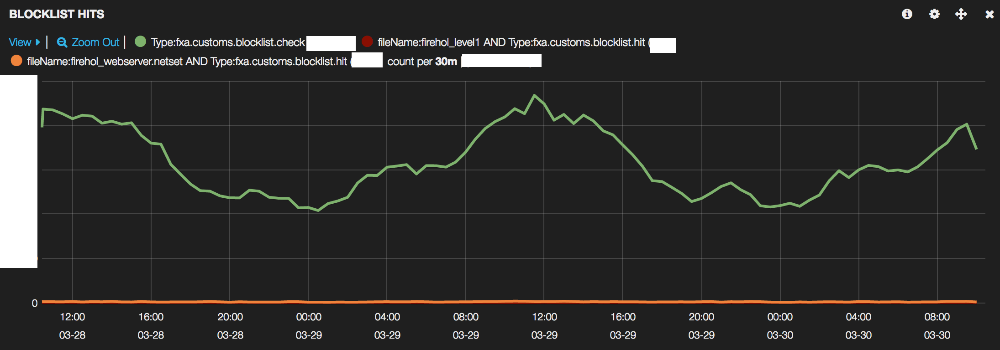

# Use Third-Party IP Blocklists

## Problem Summary

Currently, Firefox Accounts uses the
[customs server](https://github.com/mozilla/fxa-customs-server)
to detect potentially malicious traffic.
Its judgements of what is malicious
are based on observing unusual behaviour
within the FxA API itself,
for example that a single IP address
has made failed login attempts on several different accounts.
This can make it slow for us
to identify new malicious connections.

There are a variety of third-party IP blocklists
that claim to identify sources of malicious traffic.
If we can validate that these lists have good accuracy
and integrate them into the customs server,
we can more quickly identify and reject malicious traffic.

This feature proposes to integrate and evaluate
such IP blocklists.
Candidate lists include the
[Spamhaus BCL](https://www.spamhaus.org/bcl/)
and several lists from
[FireHOL](http://iplists.firehol.org/).

### Assumptions

* Third-party lists of sufficient quality are available.
  Analysis of traffic during a recent attack attempt
  showed that Spamhaus BCL (2016-06-21)
  identified 66% of the IPs that customs-server
  eventually flagged as malicious,
  which suggests this may be worthwhile.

* Some non-zero rate of false positives is tolerable.
  Legitimate users who appear on the lists
  may be inconvenienced, but should not be
  completely blocked from signing in to FxA.

## Outcomes

The initial outcome for this feature will be
to understand blocklist performance
and the potential benefits and costs of using them.

If initial metrics prove promising,
we will deploy one or more IP blocklists
as part of the security decision-making system
within fxa-customs-server.

## Hypothesis

We believe that using third-party IP blocklists
will provide more security for our system
without significantly inconveniencing legitimate users.

We will know this to be true
when we see a non-negligible rate of requests
matching one of the lists,
and a low percentage of matched requests
being reported as false positives.

## Metrics

### Key Success Metrics

We will know our hypothesis to be true
if we see a non-negligible rate of
requests matching against a blocklist,
and if we see a low rate of such requests
being unblocked via email confirmation loop.

We will emit the following events:

* `fxa.customs.blocklist.check`
  * Emitted whenever an IP is checked against a blocklist
* `fxa.customs.blocklist.hit`
  * Emitted whenever there is a hit on the blocklist.
* `fxa.customs.blocklist.error`
  * Emitted whenever there is an error on blocklist lookup.
* `fxa.customs.blocklist.false_positive`
  * Emitted when a blocked request is unblocked via email loop.
* `fxa.customs.blocklist.contains`
  * Emitted when there is a hit on the blocklist manager loaded lists.

For each candidate blocklist,
we will monitor the following over time:

* The hit rate:
  * fxa.customs.blocklist.hit / fxa.custsom.blocklist.check
* The false-positive rate:
  * fxa.customs.blocklist.false_positive / fxa.custsom.blocklist.hit

## Implementation Plan

### Phase 1

The first phase of development
will validate whether the available blocklists
have a sufficiently high hit-rate
to justify further investigation.

We will deploy candidate blocklists in metrics-only mode,
emitting only the `blocklist.check` and `blocklist.hit` events.
Once the code is running in production
we will review the hit rate
and decide whether to proceed to Phase 2.

We will initially test with lists from [FireHOL](http://firehol.org/).
FireHOL has a prebuilt script that is capable of downloading and updating blocklists
through a [cron job](https://github.com/firehol/blocklist-ipsets/wiki/Installing-update-ipsets).

Acceptance criteria:

* [x] The fxa-customs-server is able to load one or more
      ip blocklists and check incoming IPs against them.
* [x] The loaded blocklists are regularly updated.
* [x] A `blocklist.check` event is emitted for each
      request checked by customs-server, and for each blocklist.
* [x] A `blocklist.hit` event is emitted for each request
      whose source IP matched an entry in a blocklist.
* [x] There is a graph of hit-rate over time
      for each candidate blocklist.

### Phase 2

The second phase of development
will validate whether the available blocklists
have a sufficiently low false-negative rate
to be useful in practice.

We will deploy candidate blocklists in blocking mode,
and in conjunction with the "sign-in unblock" feature.
When a user unblocks themselves after being matched
against one of the lists,
we will emit a `blocklist.false_positive` event.

Acceptance criteria:

* [ ] The fxa-customs-server blocks login attempts
      from IP addresses that appear on a blocklist,
      emitting a `blocklist.hit` event for each.
* [ ] Users blocked due to a blocklist match,
      are able to unblock themselves
      by completing an email confirmation loop.
* [ ] When a user successfully unblocks themselves,
      a `blocklist.false_positive` event is emitted.
* [ ] There is a graph of false-positive-rate over time
      for each candidate blocklist.

### Module Structure

The customs-server module is composed of these primary functions.

* load(path)
 * Takes a relative path to a blocklist and sets up the internal structures to perform query.
* contains(ip)
 * Checks to see if the given ip address is contained in the loaded blocklist.
* clear()
 * Clears the loaded blocklist
* refresh()
 * Checks if the timestamp of loaded blocklist file has changed. Reload the list if so.

The blocklist file format is simply a text file
hat contains one column of ip addresses.
These addresses can be in the form of
an absolute address `127.0.0.1`
or a CDIR `8.8.8.8/24`.
Lines that begin with `#` are ignored.
This format is common among Spamhaus and FireHOL.

Additionally, the module will be able to load and refresh multiple lists.

### Unresolved questions and risks

* Phase 2 requires the "sign-in unblock" feature
  (or its equivalent) in order to measure false positives.
* It's not yet clear how to emit the `blocklist.false_positive`
  event and have it tied back to the blocklist that generated
  the corresponding `blocklist.hit` event.  It will require
  some coordination between auth-server and customs-server.

## Results

(This section to be completed once deployed to production)

### Phase 1

Phase 1 was completed and it analyzed two blocklists, [FireHOL Level 1](http://iplists.firehol.org/?ipset=firehol_level1#)
and [FireHOL webserver](http://iplists.firehol.org/?ipset=firehol_webserver#). The graph below shows potential hits for
two days worth of real FxA network traffic.

While it appears that both lists would block zero requests, it is really
a non-zero number but still very small compared to all network traffic.

Calulated hit rate %:

* FireHOL Level 1 - 0.001% Hit rate
* FireHOL Webserver - 0.55% Hit rate

These results make sense because FireHOL Level 1 list is the most
conservative blocklist. Addresses on this list are usually deemed
malicious by multiple sources.

FireHOL Webserver list is more liberal and therefore had a higher hit rate.
We decided to run some analysis on the ip addresses that would have been
blocked from this list and the majority of these were coming from ip
addresses usually reserved for AWS EC2 instances. There is a possiblity
that some of these requests were malicious because we wouldn't
normally expect network traffic from an EC2 instance.

The detailed blocklist dashboard can be found [here.](https://kibana-fxa-us-west-2.prod.mozaws.net/#/dashboard/elasticsearch/PROD%20-%20IP%20Blocklist%20Stats)

### Phase 2

When Phase 2 is complete,
we will include here
a snapshot of the false-positive-rate graph
for the initial set of blocklists.

If the false-positive rate seems low enough
then we will consider the feature a success.
