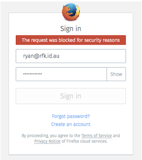
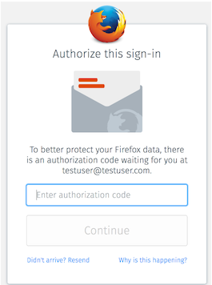
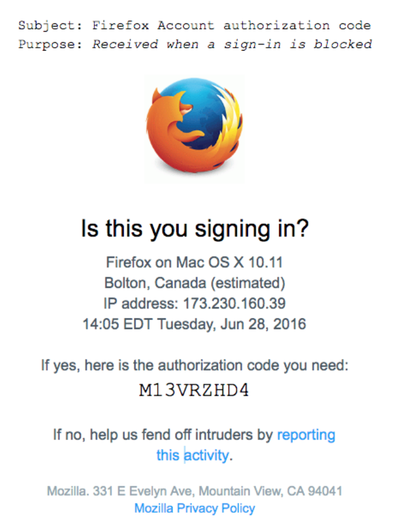
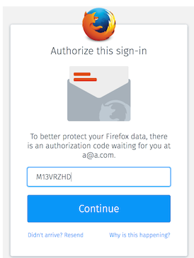
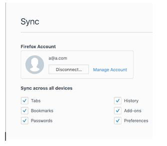
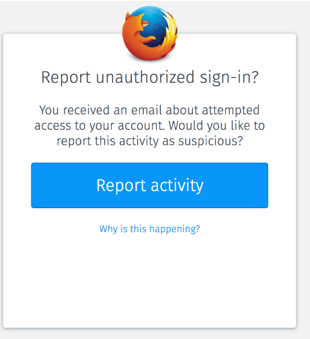
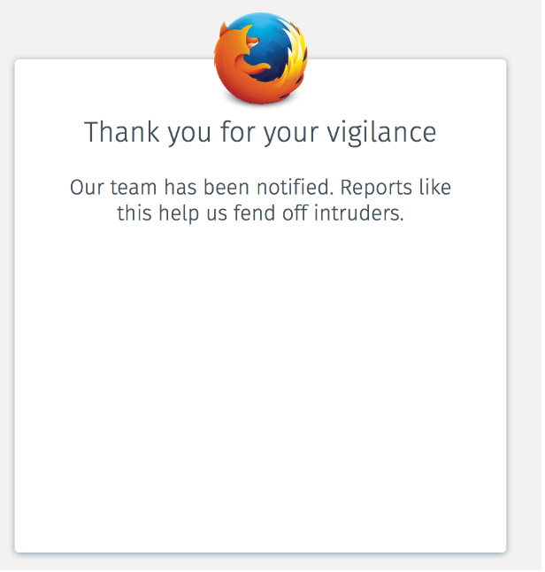

# Signin unblock

## Problem Summary

When our fraud-and-abuse system generates a false positive and blocks a legitimate user request, it currently results in a dead-end error message and a bad user experience. This makes us hesitant to increase the sensitivity of our security rules.

When our fraud-and-abuse system generates a false negative and allows a malicious login attempt with a guessed or breached password, we have to rely on the sign-in confirmation feature as additional security for the user's sync data. The attacker still learns whether their login attempt succeeded, meaning they still learn whether they have the correct account password and can still access other FxA relying services.

With this feature, we aim to lower the impact of false positives when blocking login attempts, by providing clearer messaging to the user about what's happening and why, and by allowing legitimate users to unblock their requests by proving ownership of the account. These measures will give us more confidence to tighten the security rules and thus reduce the rate of false negatives, improving overall security of the system.

## Outcomes

Users whose login attempts are blocked by our fraud-and-abuse system will be able to unblock themselves by doing an email verification loop to prove ownership of the account. As a result we will be able to:

* Implement stricter rules to detect fraudulent access, and simultaneously
* Decrease the number of legitimate login flows abandoned due to security measures.

## Hypothesis

If we send emails that allow users to unblock themselves after being flagged as suspicious by security measures, then we will increase the completion rate of legitimate login attempts without allowing significantly more fraudulent logins, because users will be able to immediately continue without waiting for a time period to elapse.

We will know this to be true when we see an increase in the completion rate of login attempts that triggered a security measures, as a percentage of all login attempts
that trigger a security measure.
Metrics

As a high-level success metric, we want to know the following:

> Of all login attempts that were blocked a security measure, what percentage are subsequently completed successfully?

We expect the starting value of this metric to be close to zero, since it is not obvious to users whether and how they can complete the flow after being blocked by a security measure. They currently can, in some cases, by waiting for a rate-limiting ban to expire, but this is not explained in the UI and users are unlikely to do so in practice.

TODO: mock graph here

As a detailed metric of the effectiveness of the technical details of this feature, we want to know how many users...:

* Had login requests blocked for security reasons?
* Chose to verify their account to unblock themselves?
* Successfully logged in after verifying ownership of the account?
* Chose to report the login?

Taken together, these metrics form a success funnel for the email authorization feature.

TODO: mock graph here

## Assumptions

If an attacker has the ability to read the user's primary email account, then the user has bigger problems than we're willing to tackle in this feature…

## Constraints

* Users that verify a signin authorization should only authorize the device for which the authorization was sent.
* Users that successfully complete signin authorization must not trigger signin confirmation.
* This feature will only be made available to the /account/login endpoint. Users who run afoul of security blocks on other endpoints will have to continue waiting for the blackout period to expire.

## Detailed design

### UX

We currently have an unfriendly dead-end experience for users whose login attempts trigger our fraud-and-abuse system:

Users who currently receive this error arrive at a dead-end and are unable to proceed. This approach works well to prevent attackers from proceeding but has the unfortunate side effect that legitimate users are also blocked.

Instead, we should explain the situation to the user and ask that the sign-in be authorized via an an email verification loop. Users who authorize the sign-in will side-step the block and are able to attempt to sign in again.

When a login attempt is prevented due to a “blocked for security reasons (errno 125), but it’s possible to unblock” error, the user is redirected to a screen explaining the situation and a sign-in authorization email will be automatically sent.

For legacy devices that provide their own UI rather than relying on our web content, we cannot display the explanatory messaging. Instead, their device will show a generic error message, but they'll receive an email that they can click through and then try the login again. It's not ideal, but it's about the best we can do for them.

They will receive an email asking them to authorize the sign-in attempt:

The user has 3 choices - ignore the email, enter the authorization code, or report to us.

If the user ignores the email, nothing happens. The sign-in remains blocked.

By clicking on the “please report it to us” link, a user is able to report if they believe someone is attempting to gain unauthorized access to their account.

If the user chooses to unblock the sign-in, they must enter the code from the email into the “Enter authorization code” input box on the content server.

A user that successfully enters the code will be signed in. If the user is signing in for Sync, the signin-confirmation step will be skipped since the user will have just verified their email address. For Sync users, the flow will complete at about:preferences#sync

A user that clicks the “report it to us” link will see a screen that allows them to submit a report:

The extra step is intended to minimize false reports by users that accidentally click the email link. Users that submit the report will see a confirmation screen that thanks them for the report.

### High Level Implementation Plan

The auth-server will have to grow some new APIs in order to support this feature, and the content-server some new UI. Here's a sketch of one way it could be put together.

First, the auth-server grows a new "login_authorizations" table whose rows contain the userid, ip address, user-agent string, a timestamp, an authorization code. This table records pending login authorizations. Upon first use of them, they are purged from the table.

When an incoming login attempt is received, it is processed as follows:

* Pass the request to customs-server for analysis.
* If customs-server returns `{block: true}` then lookup if `unblock` code is valid.
  * If `unblock` is valid, and the customs server hasn’t explicitly blocked `unblock`:
    * Mark the `unblock` code as used/invalid in the `login_authorizations` table.
    * Ignore the customs-server block and continue processing the login attempt.
  * If the customs server has rate-limited `unblocking`, return errno=125
    * Do not include `verificationMethod`/`verificationReason`, as unblocking is currently rate-limited
  * If `unblock` is not a valid code, return errno=125
    * verificationMethod: `email`
    * verificationReason: `blocked`
    * When 2FA is implemented, these two fields can be used to offer alternative methods of authorizing the signin
* Process the login request normally.
  * If the login succeeds:
    * Delete any rows from the login_authorizations table that match the parameters of this request. This step should happen even if the customs-server never told us to block the request because its judgement of what constitutes a suspicious request can change over time and we don’t want to leave junk in the table.
If the login was processed as a result of an authorization record, ensure that the sessionToken is created as "verified" in order to avoid the sign-in confirmation loop.
  * If the login fails:
    * Increment or decrement some count to ensure a signin-authorization does not open a single-account brute force attack vector.

To manage the authorization email loop, the auth-server will add a new yet familiar send_code endpoint:

* `/account/login/send_unblock_code` -> sends (or re-sends) an authorization code email for the device making this request.

We can also have an additional endpoint for reporting invalid logins:

* `/account/login/reject_unblock_code` -> takes an authorization code, deletes the corresponding row in the login_authorizations table, logs some metrics, flags the IP address with customs-server, and whatever other justice we want to mete out as a result of this.

The content-server uses these new endpoints to construct the UX described in the previous section, including:

* New error message in response to errno=125 "blocked for security reasons"
* A screen that polls to check whether the authorization has been granted, and redirects back to the sign-in page once it has. This page would also have "resend" and "back" links as normal.
* A landing screen for the "authorize now" link, that submits the authorization code and shows appropriate success messaging.

### Auth-server HTTP API

#### POST /account/login (update)

##### Parameters

* …
* unblockCode - unblock code from the unblock email.

##### Response

* ...

###### Failing requests may be due to the following errors:

* …
* status code 429, errno 125: request blocked for security reasons
  * If response contains `verificationReason` and `verificationMethod`, signin can be unblocked using the given `verificationMethod`. Until 2FA is introduced, `verificationMethod` will always be `email-captcha`. `verificationReason` will be `login`
  * If the response does not contain `verificationReason` or `verificationMethod`, signin cannot be unblocked.

#### POST /account/login/send_unblock_code

Sends (or re-sends) an authorization code email for the device making this request.

##### Parameters

* email - the primary email for the account

##### Request

> curl -v \
-X POST \
-H "Host: api-accounts.dev.lcip.org" \
-H "Content-Type: application/json" \
https://api-accounts.dev.lcip.org/v1/account/login/send_unblock_code \
-d '{
  "email": "me@example.com"
}'

##### Response

Successful requests will produce a "200 OK" response with an empty JSON body:

> {}

Failing requests may be due to the following errors:

* status code 400, errno 102: attempt to access an account that does not exist
* status code 400, errno 106: request body was not valid json
* status code 400, errno 107: request body contains invalid parameters
* status code 400, errno 108: request body missing required parameters
* status code 411, errno 112: content-length header was not provided
* status code 413, errno 113: request body too large
* status code 429, errno 114: too many requests

#### POST /account/login/reject_unblock_code

Invalidates an authorization code, deletes the corresponding row in the login_authorizations table, and flags the IP address with customs-server. Rejection will be logged to notify Ops.

##### Parameters

* uid - account identifier
* unblockCode - the unblock code

##### Request

> curl -v \
-X POST \
-H "Host: api-accounts.dev.lcip.org" \
-H "Content-Type: application/json" \
https://api-accounts.dev.lcip.org/v1/account/login/reject_unblock_code \
-d '{
  "uid": "4c352927cd4f4a4aa03d7d1893d950b8",
  "unblockCode": "e3c5b0e3"
}'

##### Response

Successful requests will produce a "200 OK" response with an empty JSON body:

> {}

Failing requests may be due to the following errors:

* status code 400, errno 102: attempt to access an account that does not exist
* status code 400, errno 105: invalid verification code
* status code 400, errno 106: request body was not valid json
* status code 400, errno 107: request body contains invalid parameters
* status code 400, errno 108: request body missing required parameters
* status code 411, errno 112: content-length header was not provided
* status code 413, errno 113: request body too large

## Risks

## Results / Measurements

### Login Success Rate of Blocked Users

Formula: Successful logins of blocked users / blocked users

[add chart here]

### Block Rate of Logins

Formula: Blocked users that try to login / All users that try to login

[add chart here]

### Report Login Rate

Formula: # of submits on the `/report_signin` screen / # of unblock emails sent.

[add chart here]

## Conclusion

Our hypothesis was proven to be [true/false] because we observed….

Based on this conclusion, our next steps will be to... [make iteration, increase roll-out, deploy at 100%, improve metrics, etc.]

