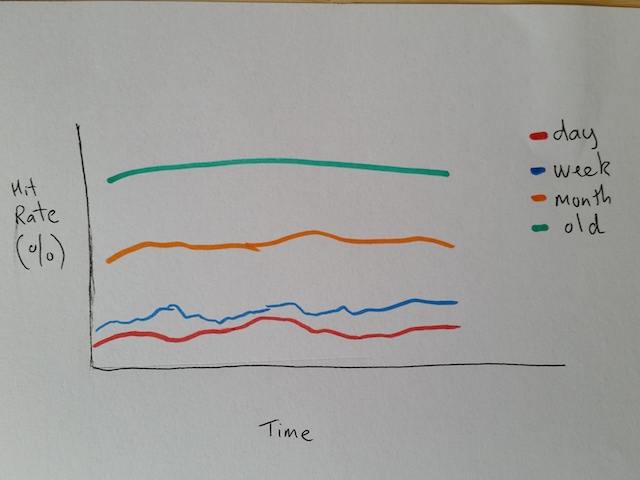
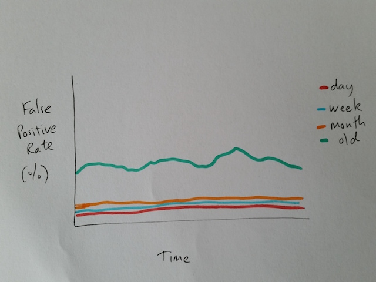
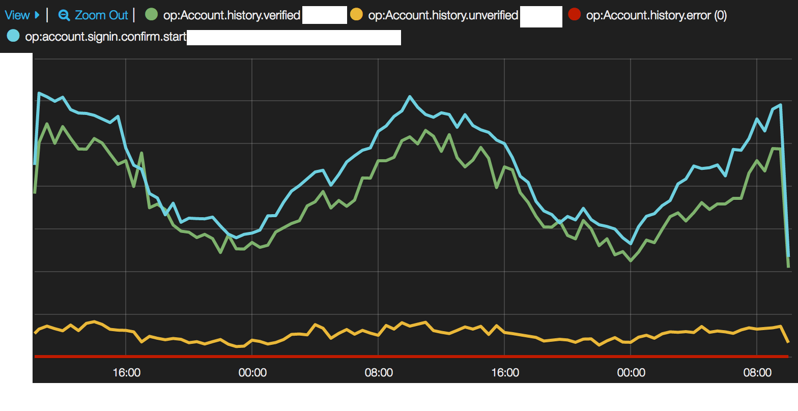
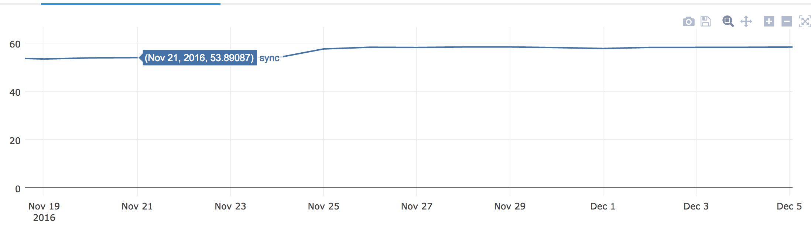
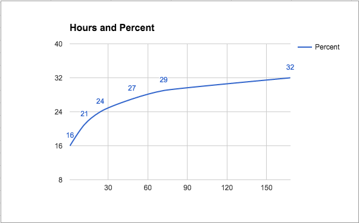
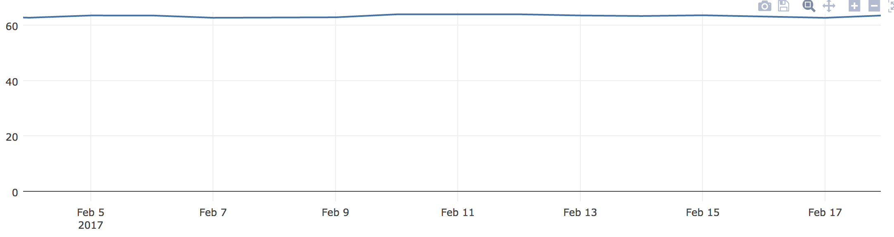

# Security Events History

## Problem Summary

As a Firefox Accounts user, I want to reduce the amount of sign-in
confirmations I must make, especially when I am logging in from the same
locations each time (my office and/or home).

### Assumptions

* The probability that an attacker knows a user's password
  *and* is attempting to login from an IP previously used by
  that user, is negligible.

--------

## Outcomes

This feature aims to use IP address history
as a reliable heuristic for detecting legitimate login requests,
and to use that to avoid sending a sign-in confirmation email.

We will initial focus on gathering metrics
on the reliability of this heuristic,
and will only proceed with skipping the confirmation email
if the metrics prove promising.

## Hypothesis

We believe that skipping the sign-in confirmation email
for users who are logging in from an IP address they have previously used,
will remove friction from the login process
for legitimate users,
without increasing the potential for fraudulent logins.

We will know this is true when we see
an increase in the sign-in success rate
and a reduction in the median time to successful login,
that are not accompanied by a noticeable increase
in the rate at which fradulent logins are reported.

## Metrics

### Key Success Metrics

The key success metrics for this feature
are the following existing KPIs:

* sign-in success rate
* median time to successful sign-in
* rate of logins reported as fraudulent

These will tell us whether the feature
is impacting the things we care about.

### Secondary Success Metrics

The operation of this feature will be monitored
in more detail by emitting the following metrics:

* `Account.history.verified`
  * Emitted when a successful login is made from an IP
    address used for a previous, verified login by that user.
    Includes a `recency` field with the following values:
    * `day` - the IP was used less than 1 day ago
    * `week` - the IP was used less than 1 week ago
    * `month` - the IP was used less than 1 month ago
    * `old` - the IP was used more than 1 month ago
* `Account.history.unverified`
  * Emitted when a successful login is made from an IP
    address used for a previous, unverified login by that user.
* `Account.history.false_positive`
  * Emitted when a login matched `Account.history.verified`,
    but was later reported to have been fraudulent.
    Includes a `recency` field in the same manner as
    the `Account.history.verified` event.
* `Account.history.error`
  * Emitted whenever there is an error processing the
    IP history

We'll graph the following to judge the ongoing performance
of this feature:

* Hit rate: `Account.history.verified`
  as a percentage of all successful logins.
  This verifies whether the feature is providing value
  to a significant number of our users.
* False-positive rate: `Account.history.false_positive`
  as a percentage of `Account.history.verified`.
  This verifies whether the feature is indeed
  having a minimal impact on the potential for fraudulent logins.

Each graph will be split by
the different values of `recency`
on the events, like this:

--------

## Implementation Plan

### Phase 1

The first phase of development
will validate whether this approach
has a sufficiently high hit-rate
to justify further investment.

We will deploy code to track a history of logins
and other security-related events on the account,
along with the IP address used for each.
This history will be used to emit the
`Account.history.verified` event
and generate a graph of the hit-rate.

Once the code is running in production
we will review the hit-rate
and decide whether to proceed to Phase 2.

Acceptance Criteria:

* [ ] The fxa-auth-server records a security event
      with IP address when the user creates an account,
      logs in, or resets their password.
* [ ] When the user completes an email verification loop
      in response to creation, login, or reset, the
      corresponding security event is marked as "verified".
* [ ] When a user successfully signs in,
      and their IP address matches a verified security event,
      then an `Account.history.verified` event is logged.
* [ ] When a user successfully signs in,
      and their IP address matches an unverified security event,
      then an `Account.history.unverified` event is logged.
* [ ] There is a graph showing the hit-rate over time,
      for each different value of `recency`.

### Phase 2

The second phase of development
will validate whether this feature
would allow noticeably more fraudulent logins,

We will deploy code to track whether matching login attempts
are subsequently reported as fraudulent,
without actually skipping the sign-in confirmation email.
This will be used to emit the
`Account.history.false_positive` event
and generate a graph of the false-positive rate.

Once the code is running in production
we will review the false-positive rate
and decide whether to proceed to Phase 3.

Acceptance Criteria:

* [ ] The sign-in confirmation email includes a link
      to report a fraudulent login, which
      destroys the corresponding sessionToken.
* [ ] If an `Account.history.verified` event was emitted
      for a login, and that login is reported as fradulent,
      then an `Accont.history.false_positive` event is
      emitted with the same `recency` as reported
      in the original event.
* [ ] There is a graph showing the false-positive rate over time,
      for each different value of `recency`.

### Phase 3

In the final phase of development,
we will start using the security event history
to actually avoid sending the sign-in confirmation email.
We will use the results from previous phases
to select an appropriate `recency` threshold
for this decision.

Acceptance Criteria:

* [ ] If a login matches the security-event history
      within the selected recency threshold,
      the corresponding tokens are created verified
      and a sign-in confirmation email is not sent.
* [ ] If a login matches the security-event history
      but outside of the selected recency threshold,
      the corresponding tokens are created unverified
      and the user must do sign-in confirmation as before.
* [ ] The "new sync login" notification email includes
      a link to report a fraudulent login, which
      destroys the corresponding sessionToken.
* [ ] If a login for which we avoided sending a confirmation email
      is reported as fraudulent, an `Account.history.false_positive`
      event is still emitted as before.
* [ ] There is a simple way for Operations to disable this feature,
      in response to e.g. a sudden increase in fraudulent logins.

## Detailed design

Keep a history of "security" events that occur for a user. A record in
this history would contain these details:

- `uid` - user ID from FxA
- An event name (`account.login`, `account.reset`, `account.confirm`, etc)
- IP Address of user
- Timestamp

With this history in place, we can then look in a user's history when
trying to do some action that we deem as security-important. If the
history contains a relevant event for the user from the same IP address,
we will log the `Account.history.seen` message.

TODO: @seanmonstar to update to latest design.

### Unresolved questions and risks (optional)

- **IP Addresses can "expire"**: ISPs can re-assign IP addresses to
  different buildings at any time. The range that an ISP can even
  allocate for a country or region can change over time.

  This means that we perhaps should only "trust" records from only so
  long ago, where "so long ago" is some scientific calculation involving
  the the tides.

- **Users may wish to revoke an address**: If a user has signed in while
  in a hotel somewhere, they may wish to be able to signal that this
  IP is really **not** something to be trusted.

## Results

Below summarize the results of the security event history and corresponding
ip profiling features for FxA.

### Phase 1

Phase 1 of security event history was released on 9-24-2016. Below is
a graph summarizing the hits of the events that were logged.

This graph omits the raw numbers, however, it shows that users log in 
from a previous IP address almost 7 times as much as they do from 
a new ip address.

Users that login from the same address do so at the recency rates:

* 1 day: 55% of users
* 1 week: 22% of users
* 1 month: 23% of users

Detailed dashboard can be found [here](https://kibana-fxa-us-west-2.prod.mozaws.net/#/dashboard/elasticsearch/FxA%20IP%20History%20Matches).

This result was very surprising and we are still unsure why so many
users login multiple times from the same address. One possible theory
is that they are corporate computers that get formatted every day 
causing the user to login again.

Based on this, we decided to forgo Phase 2 of security events and go 
directly to Phase 3 to help these users.

### Phase 2

~~When Phase 2 is complete,
we will include here
a snapshot of the false-positive-rate graph.~~

~~We will also calculate,
but not share publicly,
the absolute number of false positives per day
at each level of recency.~~

~~If the false-positive rate seems low enough
then we will proceed to Phase 3.~~

Phase 2 was not prioritized because we felt that letting users skip sign-in 
confirmation when they login from a device that they previously logged into 
within a given timeframe, was greater than the impact finding
false positive rates.

### Phase 3 (IP Profiling)

IP Profiling was deploy on 11-24-2016. In this version, users would
get to skip sign-in confirmation if they met the following security
requirements:

* Signing into service the requires account keys.
* Successfully performed a sign-in confirmation from this IP address.
* Logged in within the past day.

Below is a graph of the before and after IP Profiling for sign-in
success rate.

Immediately after deployment our sign-in success rate went from ~54% to
~58%.

After doing additional analysis we found that we could potentially
help more users by extending the time to 3 days. The graph below shows
the average time a user takes to login from the same IP address.

The next version of IP Profiling was released on 2-07-2017, with the
3 day timeframe.

Interestingly, this graph shows roughly the same sign-in success rate
before and after deployment. This result is puzzling because we expected
at least some increase in the sign-in success rate.

~~When Phase 3 is complete,
we will include here a revised summary
of the hit-rate and false-positive-rate.~~

~~We will show a snapshot of
the time-to-successful-signin graph
before and after the deployment,
and comment on any decrease
that it appears to have caused.~~

~~We will show a snapshot of
the overall rate of reported fraudulent logins,
and comment on any change
that it appears to have caused.~~

We did not complete the engineering work necessary
to attribute reports of fraudulent logins back to this specific feature.
However, we did not observe any significant increase
in reports of fraudulent login attempts
after rolling out this feature,
and we are comfortable that it has not adversely affected this metric.

## Conclusions

Considering the overall results of the features implemented in security
events, I would consider it to be a success. This feature helped us
increase of overall sign-in success rate by almost 5%.
