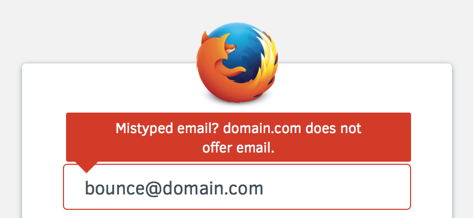
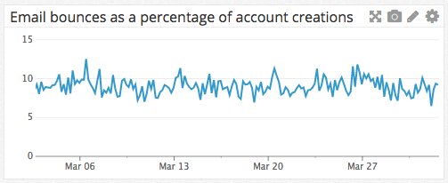

Check Domain MX
===============

As a user signing up for Firefox Accounts,
I want to receive a clear error message
when I mistype my email address,
and the typo'd domain is
obviously not capable of receiving mail.

## UX Mocks

## Success Criteria

We will measure success
by measuring the rate of email bounces
(`fxa.auth.account.email_bounced`)
as a percentage of accounts created
(`fxa.auth.account.created`).
If the feature is providing value
then we would expect to see
a decrease in the proportion of emails that bounce,
since emails that would previously have bounced
will now be rejected up-front.

The bounce-to-verification rate as of March 2016
is around 8%:

A successull outcome for this feature
will be to reduce the bounce rate
by 2% or more.

For an additional measure of usefulness
we will measure the number of times
that the new messaging is shown to users,
as a percentage of
the number of submissions of the sign-up form.
This will provide a simple check
that the feature it working as intended.

## Details

The mail delivery agent used in production
(postfix) has the ability
to reject emails sent to domains
without an A or MX record.
We will leverage this ability
rather than implementing our own logic
to check the entered domain.

Specifically, we will:

* Update our postfix configuration
  to include the `reject_unknown_recipient_domain` option
  in its `smtpd_recipient_restrictions` setting.

* Add an additional error code
  to auth-server endpoints that send email,
  which will be returned when postfix
  synchronously rejects delivery of the email.

* Extend the content-server code
  that calls these endpoints,
  to recognize the new error code
  and display the proposed UX,
  and to log an event when the UX
  is displayed.

