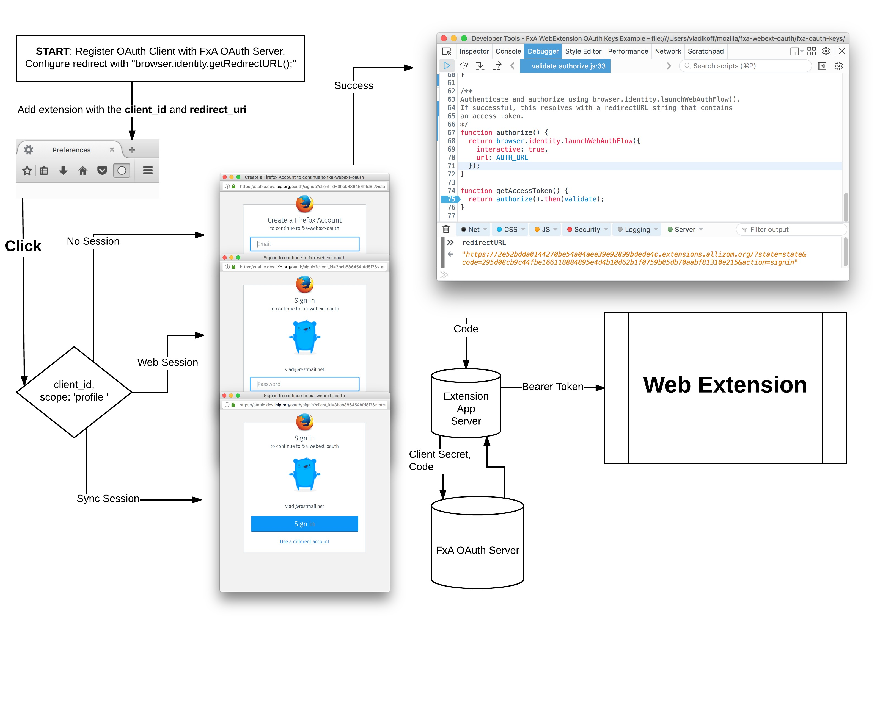
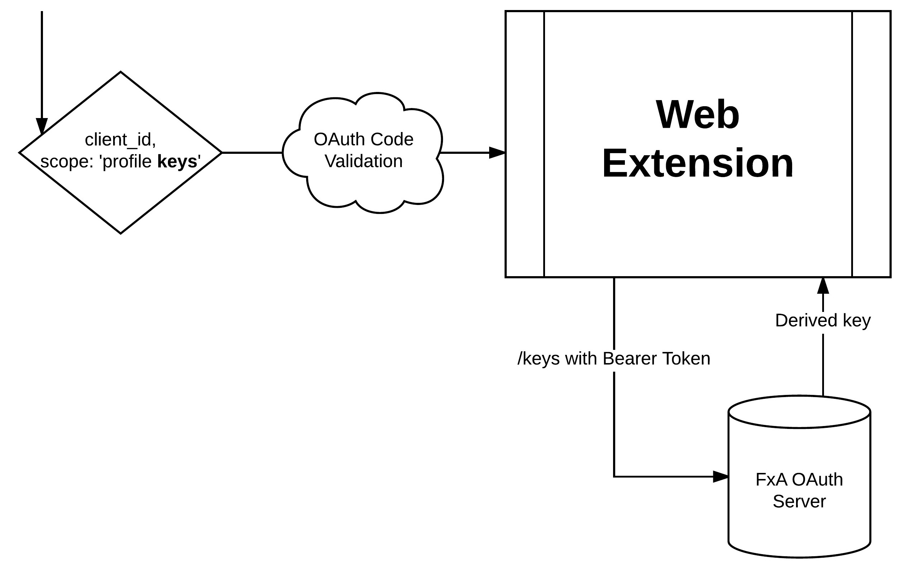

# FxA OAuth support for Web Extensions

## Meta Data

Prepared by: Vlad Filippov

Links: https://github.com/mozilla/fxa-features/issues/121

## Problem Summary

Several internal WebExtension projects want to utilize Firefox Accounts to authorize users, fetch user's profile, 
and use the existing password to encrypt extension data. At this time it is not clear if FxA can function within the Firefox 
WebExtension environment. There is also no way to derive a relier-specific key for encryption purposes.

## Outcomes

* Documentation for internal WebExtension projects that seek to become FxA reliers.
* Improved OAuth testing around the WebExtensions.
* Reliers that login with FxA and can also use the derived key to encrypt their data.

## Hypothesis

Expanding FxA features to WebExtensions, will make the FxA ecosystem more useful to Firefox users 
and developers.

## Metrics

To determine the success of this feature we will measure the following:

* Login funnel and success metrics with WebExtension projects vs regular "web" OAuth reliers. The WebExtension login 
success metrics should at least be equal to existing login metrics. This would mean the feature is working correctly.

* At least 1 external relier is able to integrate with the feature.

## Detailed design

The new internal WebExtension projects would utilize the WebExtension `chrome.identity.*` APIs with existing FxA 
OAuth APIs. 

## Hypothetical Implementation Plan

### Phase 1

* [ ] Documentation that describes FxA OAuth + WebExtension integration.
* [ ] Prototype extension that can serve as an example for FxA + WebExtension functionality.
* [ ] Initial implementation for Hoverpad[0] + FxA OAuth Signin.

### Phase 2

* [ ] Ability for WebExtension reliers to request and consume derived FxA keys
* [ ] A prototype relier that uses a derived key to 
* [ ] Hoverpad[0] support

## Unresolved questions and risks (optional)

* New OAuth / Content Server APIs may take more time to finalize due to required security reviews.

## Results

> TBA

## Conclusion

> TBA

## Next Steps

> TBA

## Appendix 

[0] The [Hoverpad project](https://wiki.mozilla.org/Firefox/Hoverpad) is a TestPilot project that functions as a notepad that syncs.  
