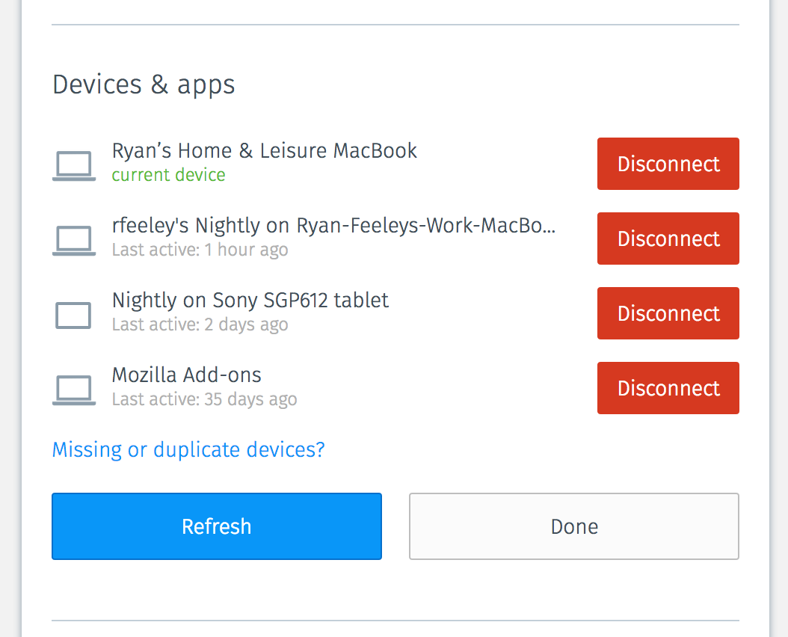
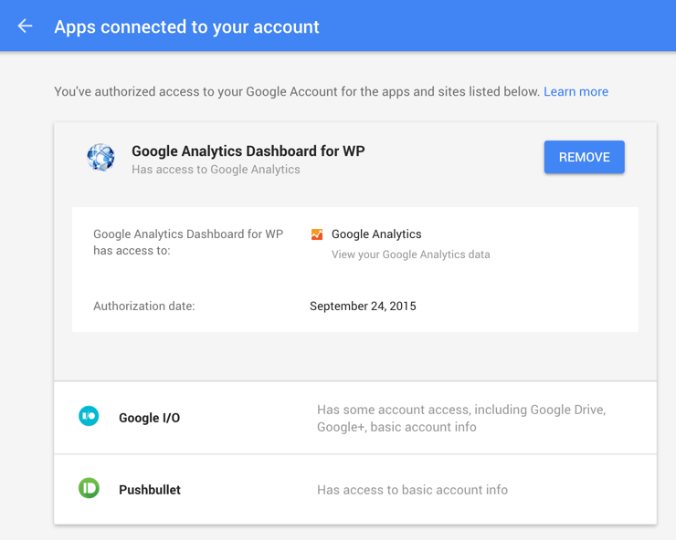
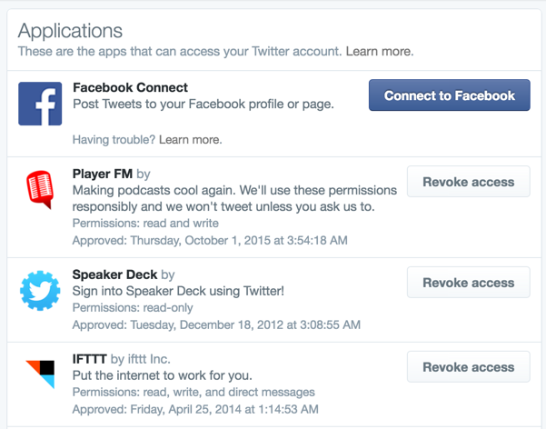
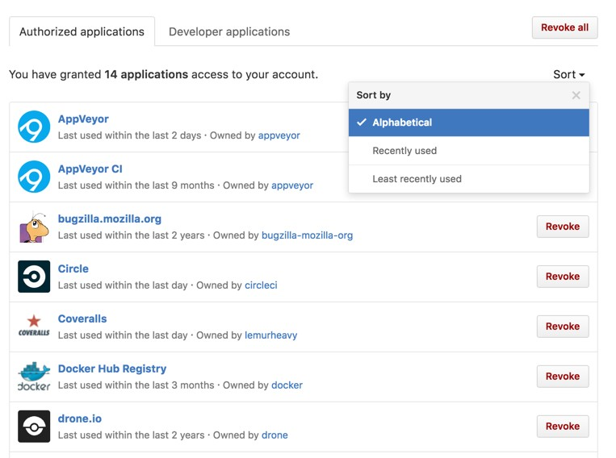

Disconnect OAuth services from FxA
======================

https://mozilla.aha.io/features/FXA-15

## Problem Summary

As a Firefox Accounts user I want to be able to revoke access to the
services that I logged into.  

****

## Outcomes

The success criteria of this feature:
* Being able to view logged in OAuth services in the apps view.
* Being able to revoke access ("disconnect") a service.

See "Detailed Design" below for more details.

## Hypothesis

We believe that by adding OAuth services and functionality to disconnect the services
for Firefox Accounts users will improve the quality and security of FxA
for everybody.
We will know this is true when we see activity in the "Connected apps and devices"

## Metrics

We would collect usage metrics with StatsD:
* number of views of the apps and devices view,
* number of revoke actions for any service.
* number of revoke actions for each service by client id.

Derive a percentage of settings views vs apps view to understand
the popularity of this feature.

****

## Detailed design

The initial OAuth apps list would
revoke the non-expired tokens using the web UI.
It will be displayed to logged in users of FxA
in the "Connected apps and devices" settings view.
This new functionality changes the current devices view and adds to it.

The list will also include the sessions that were created
for the Firefox Accounts website and the Firefox Desktop browser.
This gives users full control over all of their sessions.

* The dashboard will order the services by last login to a given service.
* The button to remove all active sessions will say "Disconnect". To match "devices".
* The dashboard will provide a "last active" date in the same format as the devices view.
* The dashboard's title in settings will be "Connected apps and devices".
* All services will have the same default service icon to improve the visual UX of the feature.
* Revoking Access:
  * OAuth service: will revoke all tokens belonging to a given OAuth service.
  * FxA Settings (content-server): will invalidate all content-server tokens and local session token, log the user out.
    * The content-server will be called "Firefox Accounts Settings" in the dashboard.
  * Firefox Desktop and other browsers clients: will not be listed and their devices records would revoke their tokens.
* Initial version will show the default "Desktop" icon for the connected app.
* The list will be hidden behind the flag in the initial version.

## Prior art

****

## Possible future improvements

These are the items that can be beneficial to add if this feature is popular and useful:

* Support for custom icons for each service.
* Add a visual confirmation as part of revoking the session.
* Detailed information about OAuth scope used.
* [Track last-used-at time for refresh tokens](https://github.com/mozilla/fxa-oauth-server/issues/275).
* Mozilla Support (SUMO) article explaining this feature.
* Only show services that use Refresh Tokens.
