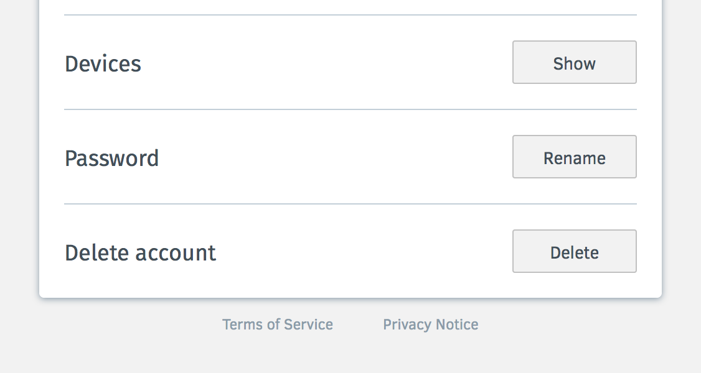
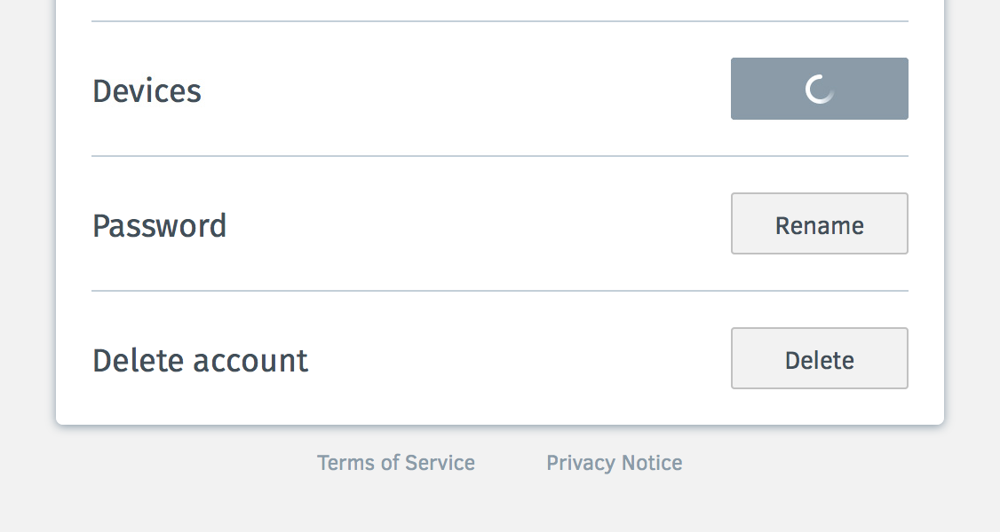
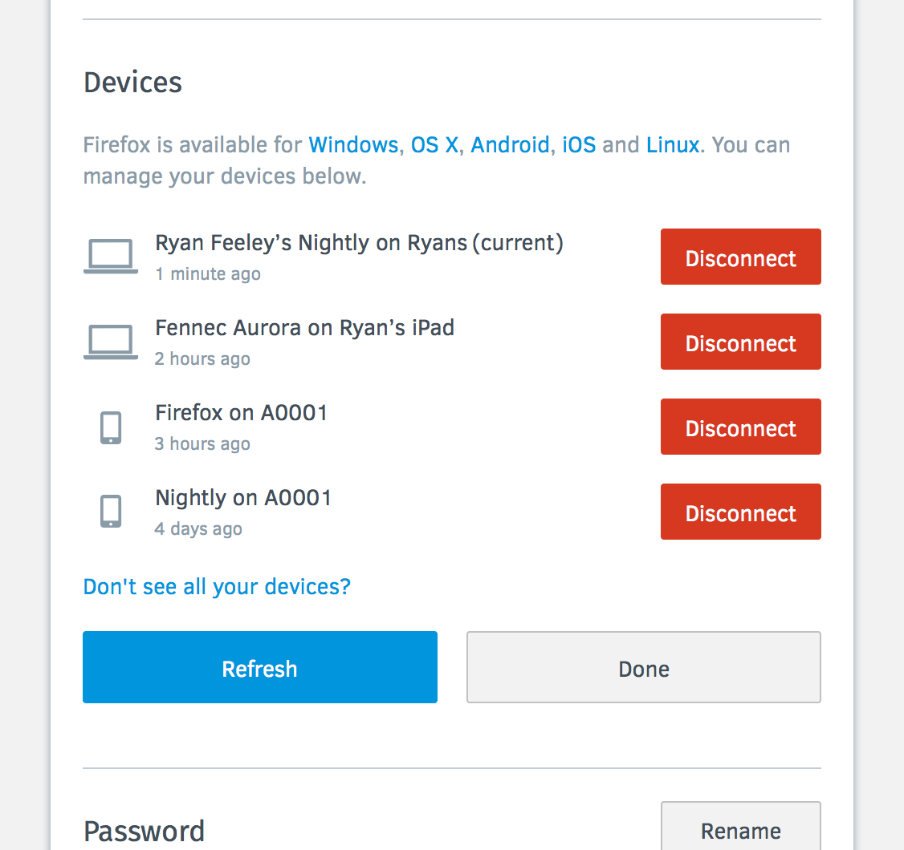
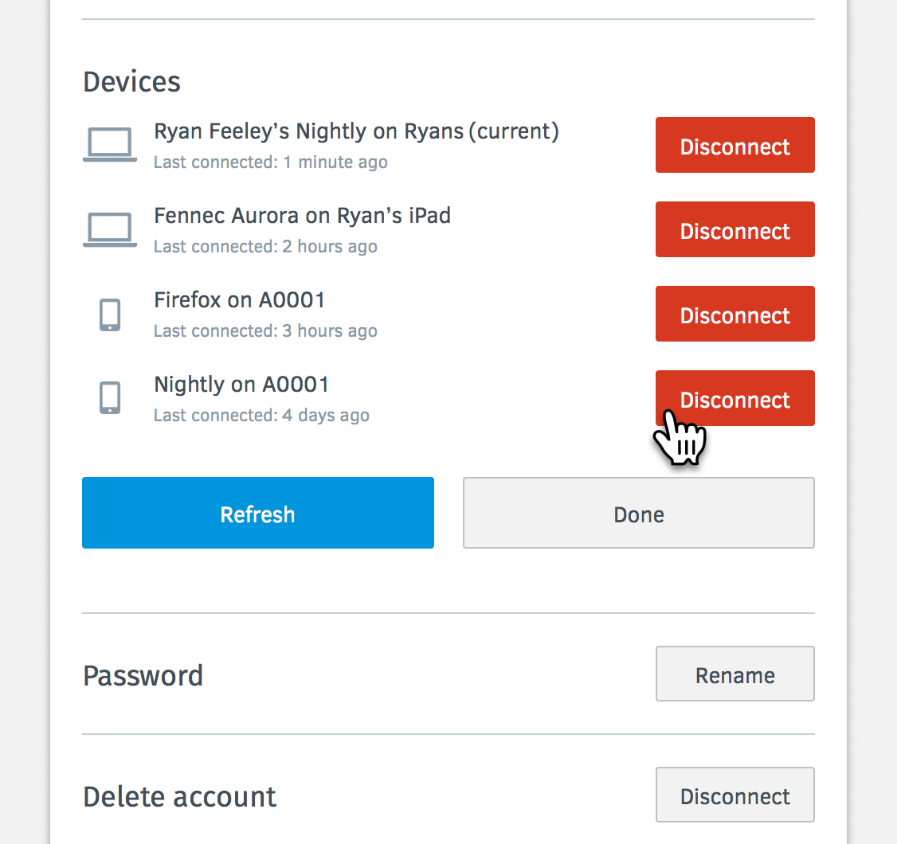

Device View - Basic UI
======================

https://mozilla.aha.io/features/FXA-16

As a Firefox Accounts user when using Firefox, I want to know the devices and services I am connected to via my Firefox Account, and important information about my the status of my services. For devices, this includes last time synced, and optionally data storage size (perhaps an option for self-hosters or others?)

## Assets

## Collapsed View
When the user is syncing one or more devices, a **Devices** section appears in the settings section above the **Password** section.

## Fetching Devices View
When the user clicks the **Show** button, and the server has to fetch the images, the **Show** button becomes disabled and is replaced with a spinning wheel (halved in size from full size spinning wheel).

## Minimal View (no rename)
When the user expands the **Device** section, the Firefox profiles that are syncing through this account are presented with the relative time they last authenticated to sync, with a **Disconnect** button beside each.

## Disconnecting View (no rename)
When the user clicks and releases the **Disconnect** button, the row is overtaken by the area beneath it.

