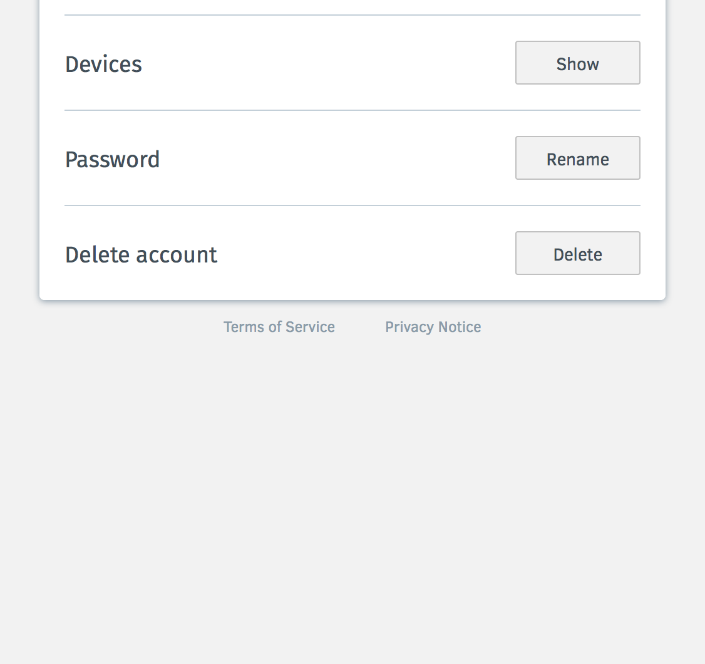
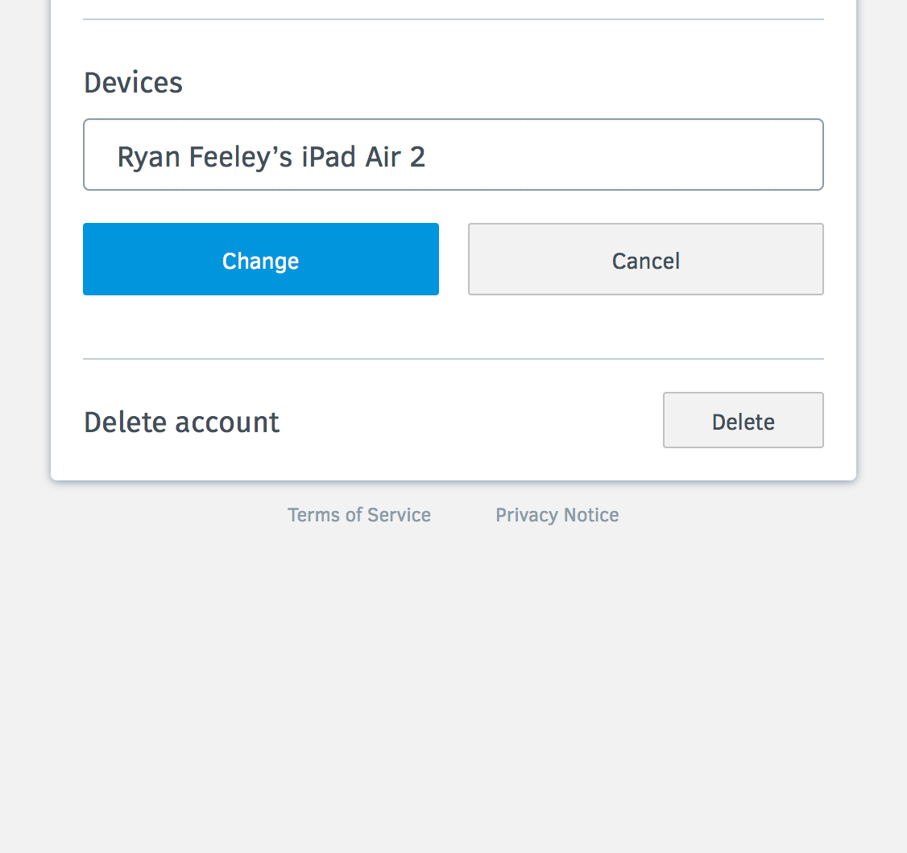

Device View - Basic UI
======================

https://mozilla.aha.io/features/FXA-16

As a Firefox Accounts user when using Firefox, I want to know the devices and services I am connected to via my Firefox Account, and important information about my the status of my services. For devices, this includes last time synced, and optionally data storage size (perhaps an option for self-hosters or others?)

## Collapsed View

## Expanded View

## Refreshing View

## Reviewing View

## Renaming View

