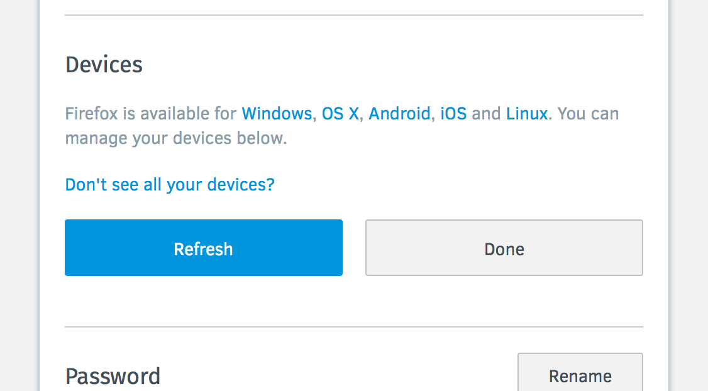

Device View - Basic UI
======================

https://mozilla.aha.io/features/FXA-16

Stories
-------

As a FF user when using Firefox,
I want to know the devices that are connected to my Firefox Account,
and important information about the status of those devices.

I want my FF devices to be logically named
so that I recognize them.
I want to easily see the type and browser details of the each device,
and to be able to identify the device I am currently using.

I want a place to go when I think that something might be wrong with Sync,
to see when each device last checked in with the Mozilla servers.

I want a place to go when I think that my account
may have been used without my permission,
to check what devices are connected
and to disconnect devices that I do not recognize.

UI Mocks
--------

## Assets

## Collapsed View
A **Devices** section appears in the settings section above the **Password** section.

## Fetching Devices View
When the user clicks the **Show** button, and the server has to fetch the images, the **Show** button becomes disabled and is replaced with a spinning wheel (halved in size from full size spinning wheel).

## No Devices View (no rename)
When the user expands the **Device** section, and has no devices, they are shown no devices but are able to download Firefox and refresh the list.

## Minimal View (no rename)
When the user expands the **Device** section, the Firefox profiles that are syncing through this account are presented with the relative time they last authenticated to sync, with a **Disconnect** button beside each.

## Disconnecting View (no rename)
When the user clicks and releases the **Disconnect** button, the row is overtaken by the area beneath it.

### UI Details

"Platform URLs" - (See [comment](https://github.com/mozilla/fxa/pull/89#issuecomment-159730048))

> Let's use this URL for all devices. It will work for all OS and all languages.
> Make sure it has these UTM parameters and that it doesn't contain the locale in the URL.
> It will redirect to the right language and also provide a button for desktop, android and iOS.
> `https://www.mozilla.org/firefox/new/?utm_source=accounts.firefox.com&utm_medium=referral&utm_campaign=fxa-devices`

"Don't see all your devices?" -

This links to a SUMO article, see bug [#1228078](https://bugzilla.mozilla.org/show_bug.cgi?id=1228078) for details.

Details
-------

#### What is a "device"?

By "device" here we mean roughly
"a browser with an active FxA session token".
There is no separate notion of having multiple "browsers" on a single "device".
Technically the concept is closer to "sessions" or "profiles"
but these are not good names to present to users.

Newer versions of Firefox
may explicitly register themselves via the devices API
and provide a custom name, push endpoint, etc.
But we have many older devices in the wild
that do not know how to register themselves explicitly,
and we only know about them through their session token.

* When I sign in to Firefox on my desktop machine
  to connect it to sync
  that instance of Firefox will appear in the devices view.

* When I have existing Firefox instances
  that are already connected to sync,
  they will appear in the devices view automatically.

* When I use a desktop machine
  and connect both Firefox Release and Firefox Dev Edition to my account,
  they appear as two separate devices
  because they use two separate local profiles.
  There will be no indication that they're on the same physical machine
  apart from similarity in their auto-generated name and their UA details.

* When I use Firefox for Android or Firefox for iOS,
  it appears in the view as a single device
  since I typically only have one Firefox profile per mobile device.

* When I use a FirefoxOS device,
  it appears in the view as a single device
  since the connection to FxA is managed at the system level.

* When I log in to Marketplace with my Firefox Account,
  using the web-based flow in a browser that is not connected to my account,
  the resulting session appears in the list of devices
  representing the browser from which I logged in.

* When I log in to Pocket with my Firefox Account
  using a non-Firefox web browser,
  the resulting session appears in the list of devices
  and can be identified based on browser and platform data.

#### What details do we show about the device?

For each device we will show:

* A human-readable name for the device,
  either provided by the device itself if it registers a custom name,
  or auto-generated from the device's browser and platform data if not.

* The time it was last seen,
  i.e. the times at which it last used its session token
  to interact with the FxA servers.

* The browser type and version,
  and operating system platform and version,
  where this information is available in the user-agent string
  provided by the device.

* Whether or not the device's login state is still valid
  (it could be  in the "need to re-authenticate" state after password reset).

* Whether it is the device currently viewing the devices view.

#### Device naming and editing

When I connect a new device to my account
and it is running a sufficiently new version of Firefox,
the device may allow me to customize its human-readable name
and register that value with Firefox Accounts.
The devices view will show that custom name.

When I connect a new device to my account
and it is running an older version of Firefox
without support for the FxA device registration API,
it will appear in the devices view
with a generic auto-generated name
based on its browser and platform details.
This name may not match the device name
that it uses to identify itself in the "synced tabs" view,
but still gives me a reasonable chance of identifying it.

Thus, for older devices,
the device name presented in the devices view
may not match the name presented in the browser's native UI
for features such as "synced tabs".
This is an acceptable tradeoff
while we wait for device registration support
to propagate to all clients.

I cannot edit the names of my devices
through the web view
in the initial version of this feature.

#### Disconnecting devices

When I sign out of Firefox Sync through the browser's UI,
the session token belonging to that device is destroyed
and all information about the device is removed from the server.
It no longer appears in the devices view.

When I disconnect a device through the devices view,
the session token belonging to that device is destroyed,
all information about the device is removed from the server,
and if the device has registered a push endpoint
then it receives a push notification from the server.
The device responds by:

* If it is an older version of Firefox,
  it will only discover that it has been disconnected
  when it next attempts to sync
  and finds that its session token is invalid.
  It will enter the "needs to reauthenticate" state.

* If it is a newer version of Firefox,
  it will respond to the push notification of its disconnection
  by immediately returning to the "not connected to sync" state.

If the device that was disconnected
was the current device
then I am logged out of FxA
and redirected to the "sign in to sync" screen
from which I can easily re-connect the device.
I do not have the ability to disconnect that device,

#### Interaction with Password Reset

When I reset my password
it does not cause my devices to be completely removed from the account,
but it does invalidate their session tokens
which will cause them to enter the "needs to reauthenticate" state.

Devices without a session token
will have an affordance in the devices view
to indicate that they are not properly connected.

When I re-authenticate on a device
that had its session token invalidated,
it will appear in the devices view
with the same name and details that it previously had.
It will *not* appear as an additional device.

#### Real-time updates

When I have the devices view open in Firefox
and I change any device-related state through that device,
the devices view updates to reflect the change in realtime,
regardless of whether the change originated in web content
or through the browser's native UI.

When I have the devices view open in Firefox
and I change any device-related state through a different device,
the devices view does not need to update in realtime,
but it can be manually refreshed by the user
in order to view the latest state of the account.

Work Breakdown
------

* [x] Add methods to communicate w/ auth server fxa-js-client - (https://github.com/mozilla/fxa-js-client/issues/176, PR https://github.com/mozilla/fxa-js-client/pull/177)
* [ ] Add "devices" view in the /settings page. ([#3251](https://github.com/mozilla/fxa-content-server/issues/3251), PR [#3274](https://github.com/mozilla/fxa-content-server/issues/3274))
* [ ] Add WebChannel communication to browser if user disconnects or changes the name of the current device. ([#3252](https://github.com/mozilla/fxa-content-server/issues/3252))
  * [ ] Update the WebChannel doc
* [ ] Handshake with browser to determine current device name and ID. ([#3252](https://github.com/mozilla/fxa-content-server/issues/3252))
* [ ] Accept WebChannel messages from the browser to handle current device name change, disconnect. ([#3252](https://github.com/mozilla/fxa-content-server/issues/3252))
