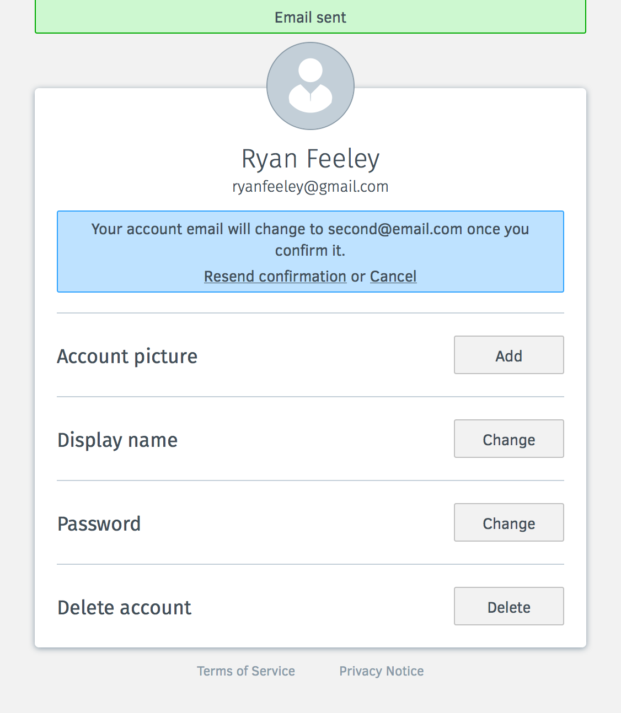

Change Email
======================

https://mozilla.aha.io/features/FXA-28

As an FxA user when I lose control of the email account  that is my username in Firefox Accounts I want to be able to change that FxA email address so that I don't lose access to my data and other FxA-relying services.
* When a user changes their email in Firefox Accounts, it simply updates in other clients and relying services like display name without requiring them to reconnect.

## Settings Collapsed
* When the user visits their account settings, an **Account email** section appears under the **Display name** section.

## Settings Expanded
* When the user clicks on **Change** under **Account email**, the section is expanded revealing the change email form.

## Settings Filled
* When the user fills in a valid-looking email and a password longer than 8 characters, the change button becomes enabled.
* When the user enters in the same email the error message **This email is already the current account email** will be pinned to the **New email** field.
* When the user enters in an email that bounces, the notice will disappear, the **Account email** section will open (if needed), and our standard error **Your verification email was just returned. Mistyped email?** will be pinned to the **New email** field.
* When the user enters in an email that is in use by another account and presses **Change** the error message **This email is already in use by another account** will be pinned to the **New email** field.
* When the user enters in the wrong password the error message **Incorrect password** will appear (pinned to the field or above)

## Settings Submitted
* When the user submits the form, the **Account email** section disappears and a message in the header persists letting them know that they need to confirm the email.
* When the user chooses **Cancel**, the **Account email** section reappears, and the change notice disappears.

## Email Confirm
* When the checks their email, they will an email with the subject **Confirm email change for Firefox Accounts** containing the change confirmation button and fallback link.

## Settings Resent
* When the user chooses **Resend confirmation**, the same confirmation email is sent, and a temporary success message appears above.

## Settings Confirmed & Authenticated
* When the user verifies their email in a browser where they are still logged in, all signed-in or verification-pending tabs are taken to **Settings** where the email is updated, and a temporary success message appears.

## Settings Confirmed & Unauthenticated
* When the user verifies their email in a browser where they are not logged in, they are taken to a FxA login page, and a temporary success message appears.

