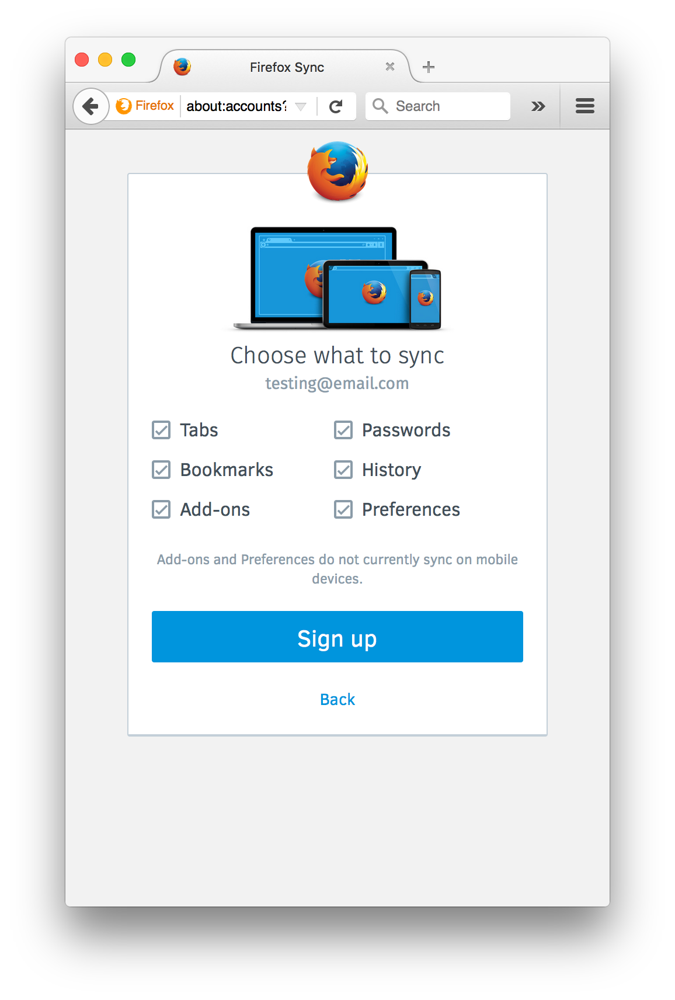
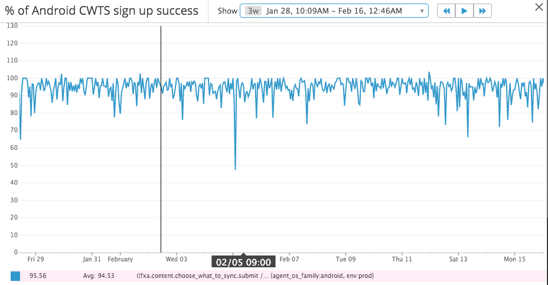
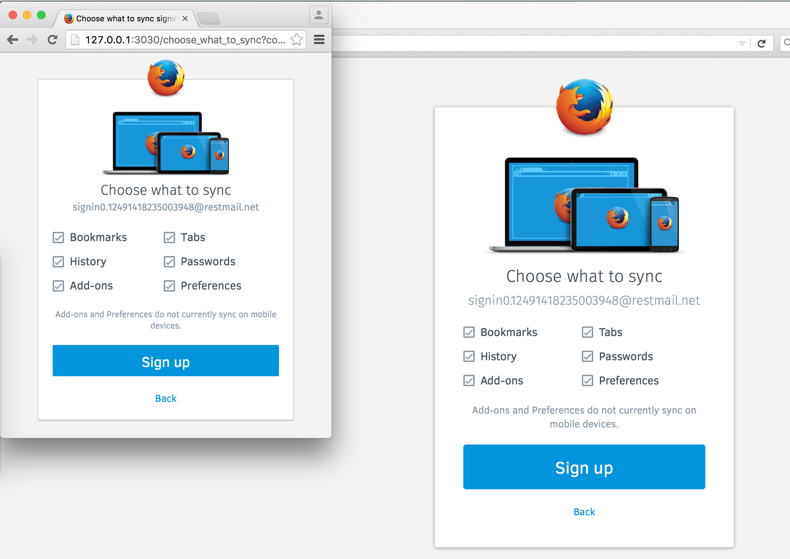
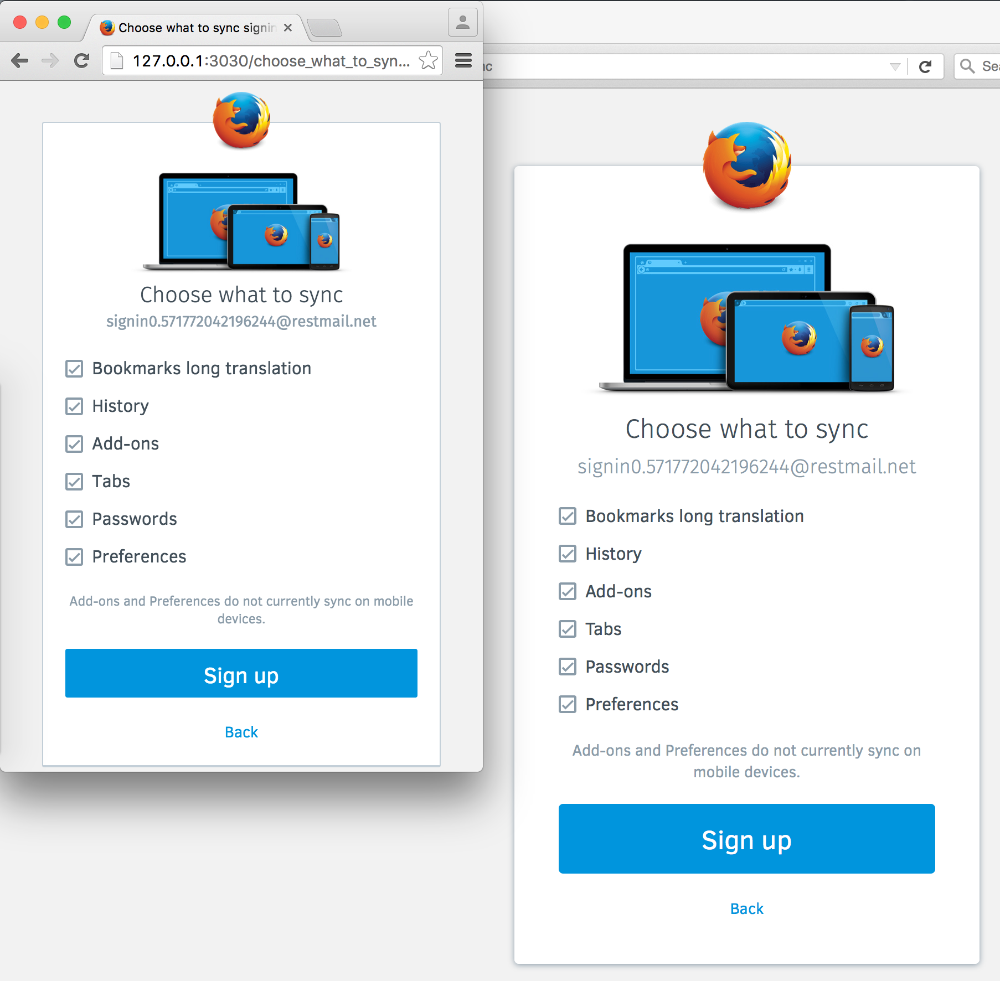

Choose What To Sync
======================

https://mozilla.aha.io/features/FXA-33

As a user, I want to choose what data types to sync as part
 of the account setup process, so that it's more obvious what
 functionality I'm signing up for.

## Outcomes

We first shipped "Choose What to Sync" (CWTS) in Q4 of 2015.
This first release was limited to Firefox Nightly users only.
The CWTS screen helps Firefox users understand what they are signing up for and
which sync types are available. 

We also completed work to support CWTS in future versions of Firefox for iOS v2.

January 2016 - CWTS was enabled in Firefox for Android v44 stable release.

February 2016 - CWTS is available for Firstrun users in Firefox Desktop.

From our early metrics we saw good conversion rate (over 90%) on the CWTS screen.
If possible we will be investigating the bounce rate in future milestones.

> "Choose What to Sync" in Firefox Desktop

> "Choose What to Sync" % of sign ups for those who see the the CWTS screen.

## Choose what to sync view (compact)

## Choose what to sync view (long translations)

This design is suitable for languages that have long translations. 

The data types become a single column. 

### Update 1 - 2015-10-28

The proper 2 column order for the data types: 

Column 1: Tabs, Bookmarks, Passwords 

Column 2: History, Add-ons, Preferences

Ref: https://github.com/mozilla/fxa-content-server/pull/3211#issuecomment-151884730

### Update 2 - 2015-11-04

We decided to show all sync datatypes in all clients as it is a account-level setting.

The "add-ons and preferences do not sync on mobile devices" disclaimer makes this clear for mobile users.
