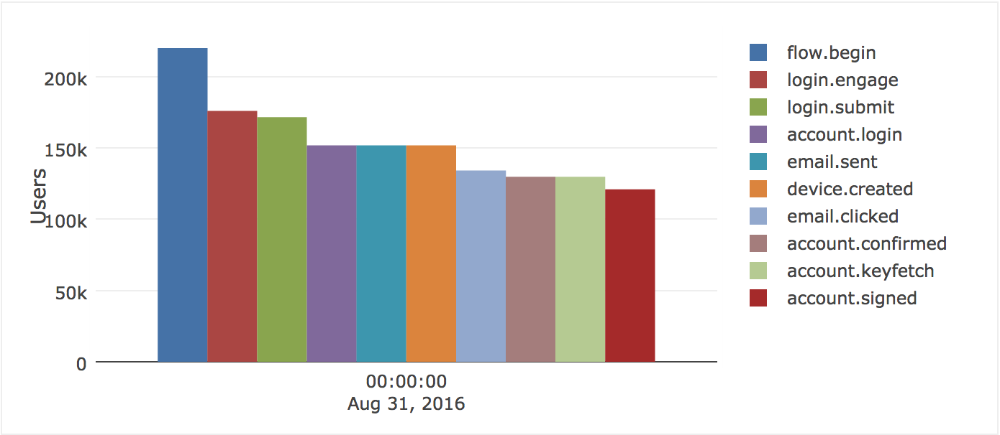
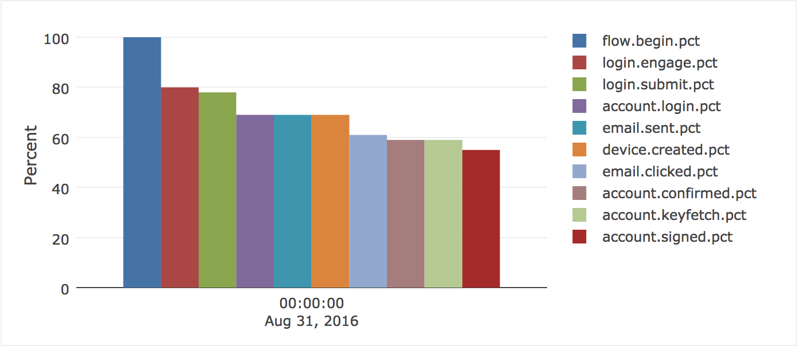
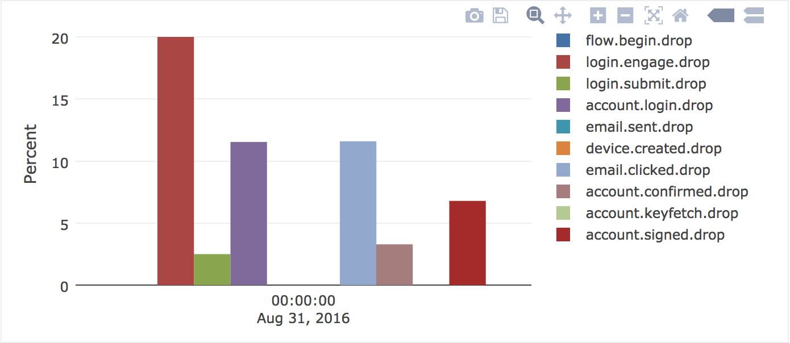
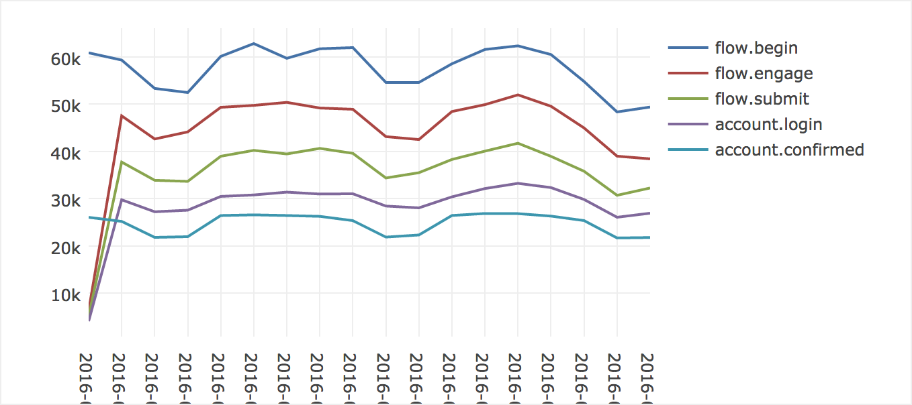
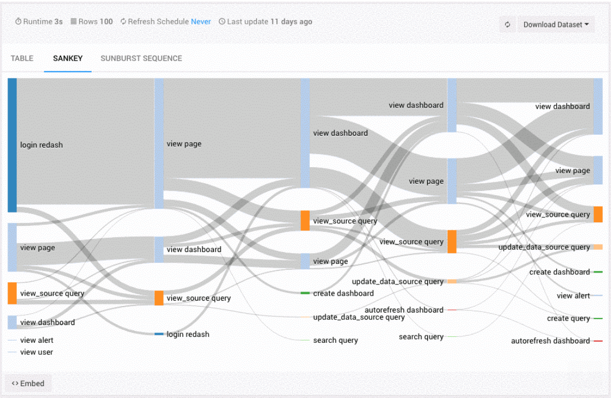

# Sign-in funnel metrics

## Problem Summary

We know that
a significant number of our users
encounter problems when signing in,
but we don't have a way to measure
the causes or impact of those problems.
For example, we know that
many users reset their password when signing in,
but we don't know how many eventually succeed
and how many abandon the entire process.

To help us improve
the experience of signing in to FxA
in a data-driven way,
we need to analyze metrics
about the entire sign-in flow
as an end-to-end experience,
rather than looking at individual events in isolation.

## Outcomes

We want a more accurate understanding
of how real users experience
the sign-in and sign-up flows.
Concretely, this will be delivered
by a set of graphs that render the aggregated flows
as a user-conversion funnel.
Analyzing these graphs will enable us
to better decide
where we should focus future development efforts.

This feature will be successful if
we can confidently identify
the two most common reasons
why users fail to connect to Sync
and propose appropriate changes
to reduce occurrences of them.

## Hypothesis

We believe that
rendering sign-in metrics as a user-conversion funnel
will help us make clearer decisions
on how to increase the success-rate
of users connecting to Sync.

We will know this to be true
when product-level conversations about features
are driven by the information conveyed in these graphs.

## Metrics

The only metrics for this feature
are the binary questions:

* Do the required graphs exist?
* Do they provide the expected value?

## Detailed design

We've found that
the open-ended, exploratory nature of redash
can encourage discovery of unexpected traits and trends in data.
We'll utilize that benefit for this feature
by emitting new "flow events"
from the content and auth servers,
which can be imported to redshift
in a similar fashion to our activity events.
Having data for both types of event
side-by-side in the same database
may also support other analysis
not considered here.

The following flow events
represent discrete stages
in a successful flow:

|Name|Origin|Description|
|----|------|-----------|
|flow.begin|content|User has landed on a page that allows them to log in or sign up.|
|login.engage|content|User has interacted with the login form at `/signin` or `/force_auth`.|
|signup.engage|content|User has interacted with the signup form at `/signup`.|
|login.submit|content|User has submitted the login form at `/signin` or `/force_auth`.|
|signup.submit|content|User has submitted the signup form at `/signup`. It is a valid flow for this event to be followed by `account.login`, because the content server allows users to log in from `/signup`.|
|account.login|auth|User’s credentials are correct.|
|account.created|auth|Account has been created.|
|device.created|auth|Device record has been created.|
|email.sent|auth|Confirmation email has been sent to the user.|
|email.clicked|auth|Request to the URL in the confirmation email has been received.|
|account.confirmed|auth|Login has been confirmed via email.|
|account.verified|auth|Email address for new account has been verified.|
|account.keyfetch|auth|Key-fetch token has been created.|
|account.signed|auth|Client has successfully signed cert (i.e. “device connected”).|

For a typical successful login flow,
the sequence of events would be:

* `flow.begin`
* `flow.engage`
* `flow.submit`
* `account.login`
* `email.sent`
* `device.created`
* `email.clicked`
* `account.confirmed`
* `account.keyfetch`
* `account.signed`

For a typical successful signup flow,
the sequence of events would be:

* `flow.begin`
* `flow.engage`
* `flow.submit`
* `account.created`
* `email.sent`
* `device.created`
* `email.clicked`
* `account.verified`
* `account.keyfetch`
* `account.signed`

We will also emit flow events
for error conditions,
which could be terminal to a flow.
The following list is incomplete
and we plan to add it to it
as we define these events:

|Name|Origin|Description|
|----|------|-----------|
|customs.blocked|auth|Request was blocked by customs server.|

Data from all of the above events
will be plotted as charts in redash.

For a basic funnel
covering a specific period of time
and subset of events,
we could use the bar chart.
Each bar would represent a stage of the funnel,
with the bar height indicating the number of users.
Here's a completely fake example
mocked up in redash:

The same chart type
could also express
numbers as percentages:

To better understand
the relative scale of each drop-off,
they could be plotted on a bar chart
where each bar represents
the percentage drop-off
from the preceding stage.
This fake example
was generated using the same dummy input values
as the previous two graphs:

A simple bar chart would also be useful
for showing the most common reasons
for premature abandonment of a flow.

For a chart showing trends
in each stage of the funnel over time,
we could use the line chart.
Each line would represent a stage of the funnel,
with time on the *x* axis and
count of users on the *y* axis.
Here's another completely fake example
made by changing the labels on an unrelated query:

As with the funnel charts,
we should provide variations of this chart
that plot percentages overall
and for drop-offs individually.

The redash team have also announced
that they will implement Sankey diagrams
in a future release.
When available,
this chart type can be used
to drill down into finer details of the funnel
such as the relative rates
of specific errors at each stage.
This mock-up of a Sankey diagram
is taken from the announcement email:

All of the aforementioned graphs
must be segmentable by
operating system, browser
or any property from the metrics context event data
(`context`, `entrypoint`, `migration`, `service`, `utm_campaign`, `utm_content`, `utm_medium`, `utm_source`, `utm_term`).

The full set of graphs
that we will produce
is as follows:

|Name|Type|Description|
|----|----|-----------|
|Absolute sign-in funnel|Bar chart|Basic funnel showing counts for the sign-in flow events|
|Percentage sign-in funnel|Bar chart|Basic funnel showing percentages for the sign-in flow events|
|Sign-in drop-offs|Bar chart|Percentages for drop-offs at each stage of the sign-in flow|
|Absolute sign-up funnel|Bar chart|Basic funnel showing counts for the sign-up flow events|
|Percentage sign-up funnel|Bar chart|Basic funnel showing counts for the sign-up flow events|
|Sign-up drop-offs|Bar chart|Percentages for drop-offs at each stage of the sign-up flow|
|Absolute sign-in trend|Line chart|Trend lines showing counts for the sign-in flow events over time|
|Percentage sign-in trend|Line chart|Trend lines showing percentages for the sign-in flow events over time|
|Sign-in drop-offs trend|Line chart|Trend lines showing percentages for drop-offs at each stage of the sign-in flow over time|
|Absolute sign-up trend|Line chart|Trend lines showing counts for the sign-up flow events over time|
|Percentage sign-up trend|Line chart|Trend lines showing percentages for the sign-up flow events over time|
|Sign-up drop-offs trend|Line chart|Trend lines showing percentages for drop-offs at each stage of the sign-up flow over time|
|Sign-in abandonment|Bar chart|Top 10 errors from abandoned sign-in flows, in descending order of frequency|
|Sign-up abandonment|Bar chart|Top 10 errors from abandoned sign-up flows, in descending order of frequency|
|Detailed sign-in events flow|Sankey diagram||
|Detailed sign-up events flow|Sankey diagram||

Flow events emitted in the logs
will carry the following properties:

|Property|Description|
|--------|-----------|
|`event`|The event name, e.g. `flow.engage`|
|`time`|Unix timestamp for this event|
|`flow_id`|Unique identifier for a flow, randomly generated by the content server|
|`flow_time`|Offset in milliseconds from the `time` property of the relevant `flow.begin` event|
|`userAgent`|User agent string, parsed by the data pipeline and made available as the properties `useragentbrowser`, `useragentversion`, `useragentos`|
|`context`|Auth-broker context|
|`entrypoint`|Entry-point for the flow|
|`migration`|Sync migration|
|`service`|Service identifier (for Sync it may be empty or `sync`)|
|`utm_campaign`|Marketing campaign identifier|
|`utm_content`|Marketing campaign content identifier|
|`utm_medium`|Marketing campaign medium|
|`utm_source`|Traffic source|
|`utm_term`|Search term|

The event data will be used to populate
two tables in Redshift,
`flow_metadata` and `flow_events`.
`flow_metadata` contains data about the flow as a whole,
whereas `flow_events` stores the individual event names
with their `flow_id` and `flow_time`.

* `flow_metadata`:

  |Column name|Description|
  |-----------|-----------|
  |`flowId`|Set to `flow_id` property from the event data (`UNIQUE`, `SORTKEY`)|
  |`beginTime`|The timestamp of the flow's `flow.begin` event|
  |`duration`|Set to `flow_time` property from the last event (or error) of the flow|
  |`completed`|Boolean indicating whether the flow was successfully completed|
  |`newAccount`|Boolean indicating whether the flow was a sign-up|
  |`uaBrowser`|Browser name|
  |`uaVersion`|Browser version|
  |`uaOS`|Operating system name|
  |`context`|Context parameter|
  |`entrypoint`|Context parameter|
  |`migration`|Migration parameter|
  |`service`|Service identifier (for Sync it may be empty or `sync`)|
  |`utmCampaign`|Marketing campaign identifier|
  |`utmContent`|Marketing campaign content identifier|
  |`utmMedium`|Marketing campaign medium|
  |`utmSource`|Marketing campaign source|
  |`utmTerm`|Marketing campaign search term|

* `flow_events`:

  |Column name|Description|
  |-----------|-----------|
  |`flowTime`|Set to `flow_time` property from the event data (`SORTKEY`)|
  |`flowId`|Set to `flow_id` property from the event data (`DISTKEY`)|
  |`type`|Set to `event` property from the event data|

## Subsequent iterations

* We will add an `email.opened` flow event,
  using a tracking pixel
  that points to a route
  on the auth server.
  The data from this event
  will be unreliable
  due to factors such as
  plain-text emails,
  email clients pre-fetching resources
  or users opening email while offline.
  However it still has value for analysis,
  for instance changes in the trend
  may indicate a problem
  with spam filters.

