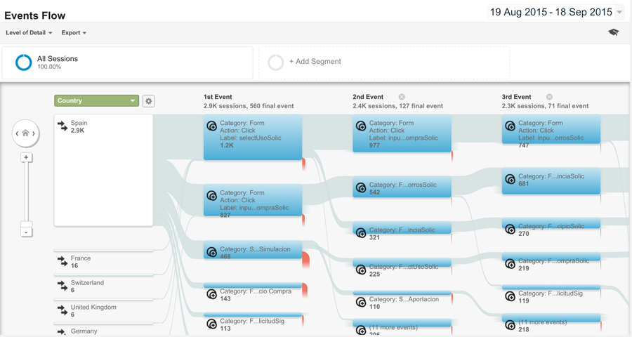

# Sign-in funnel metrics

## Problem Summary

We know that
a significant number of our users
encounter problems when signing in,
but we don't have a way to measure
the causes or impact of these problems.
For example, we know that
many users reset their password when signing in,
but we don't know how many eventually succeed
and how many abandon the entire process.

To help us improve
the experience of signing in to FxA
in a data-driven way,
we need to analyze metrics
about the entire sign-in flow
as an end-to-end experience,
rather than looking at individual events in isolation.

## Outcomes

We want a more accurate understanding
of how real users experience
the sign-in and sign-up flows.
Concretely, this will be delivered
by a set of graphs that render the aggregated flows
as a user-conversion funnel.
Analyzing these graphs will enable us
to better decide
where we should focus future development efforts.

This feature will be successful if
we can confidently identify
the two most common reasons
why users fail to connect to Sync
and propose appropriate changes
to reduce occurrences of them.

## Hypothesis

We believe that
rendering sign-in metrics as a user-conversion funnel
will help us make clearer decisions
on how to increase the success-rate
of users connecting to Sync.

We will know this to be true
when product-level conversations about features
are driven by the information conveyed in these graphs.

## Metrics

The only metrics for this feature
are the binary questions:

* Do the required graphs exist?
* Do they provide the expected value?

## Detailed design

We've found that
the open-ended, exploratory nature of re:dash
can encourage discovery of unexpected traits and trends in data.
We'll utilize that benefit for this feature
by emitting new "flow events"
from the content and auth servers,
which can be imported to redshift
in a similar fashion to our activity events.
Having data for both types of event
side-by-side in the same database
may also support other analysis
not considered here.

The available visualizations in re:dash are limited
but there are two that might be useful for this feature.

1. For a basic funnel
   covering a specific period of time
   and subset of events,
   we could use the bar chart.
   Each bar would represent a stage of the funnel,
   with the bar height indicating the count of users.
   Here's a completely fake example
   made by changing the labels on an unrelated query:

   

   A bar chart would also be useful
   for showing the most common reasons
   for premature abandonment of a flow.

2. For a chart showing trends
   in each stage of the funnel over time,
   we could use the line chart.
   Each line would represent a stage of the funnel,
   with time on the *x* axis and
   count of users on the *y* axis.
   Here's another completely fake example
   made by changing the labels on an unrelated query:

   

These visualizations offer a high-level view of the funnel,
but they can't be used to
drill down into finer details,
such as the relative rates of
specific errors at each stage.
For that reason,
we will also send flow events
to Google Analytics,
which provides a powerful "Events Flow" visualization
for this purpose.
Here is an example of it
taken from the internet,
which bears no relationship to our data:

Using the aforementioned chart types,
we will produce the following charts:

|Name|Type|Description|
|----|----|-----------|
|Sign-in funnel|Bar (re:dash)|Basic funnel showing the events `flow.begin`, `flow.engage`, `account.login`, `device.created`, `email.sent`, `email.opened`, `account.confirmed`, `account.keyfetch`, `account.signed`|
|Sign-up funnel|Bar (re:dash)|Basic funnel showing the events `flow.begin`, `flow.engage`, `account.created`, `device.created`, `email.sent`, `email.opened`, `account.verified`, `account.keyfetch`, `account.signed`|
|Sign-in trend|Line (re:dash)|Sign-in funnel events plotted over time|
|Sign-up trend|Line (re:dash)|Sign-up funnel events plotted over time|
|Sign-in abandonment|Bar (re:dash)|Top 10 errors from abandoned sign-in flows, in descending order of frequency|
|Sign-up abandonment|Bar (re:dash)|Top 10 errors from abandoned sign-up flows, in descending order of frequency|
|Combined events flow|Events flow (GA)|Includes all events for both flows, but we can use event categories to filter the event set|

Flow events in the logs will be emitted
for both Sync and OAuth reliers.
The queries in re:dash
will filter out non-Sync events,
meaning we can easily have another dashboard
to analyze OAuth flows
(either generally or for a specific relier).

Flow events sent to Google Analytics,
on the other hand,
will not include OAuth flows.
This is to make it easier
to ensure that data is segmented
when analyzing the charts in GA
(otherwise we'd need to send the events
using relier-dependent analytics ids/accounts).

Flow events emitted in the logs
will carry the following properties:

|Property|Description|
|--------|-----------|
|`event`|The event name, e.g. `flow.engage`|
|`time`|Unix timestamp for this event|
|`flow_id`|Unique identifier for a flow, randomly generated by the content server|
|`flow_time`|Offset in milliseconds from the `time` property of the relevant `flow.begin` event|
|`context`|Context parameter|
|`entrypoint`|Context parameter|
|`migration`|Migration parameter|
|`service`|Service identifier (for Sync it may be empty or `sync`)|
|`utm_campaign`|Marketing campaign identifier|
|`utm_content`|Marketing campaign content identifier|
|`utm_medium`|Marketing campaign medium|
|`utm_source`|Marketing campaign source|
|`utm_term`|Marketing campaign search term|

The event data will be used to populate
two tables in Redshift,
`flow_metadata` and `flow_events`.
`flow_metadata` contains data about the flow as a whole,
whereas `flow_events` stores the individual event names
with their `flow_id` and `flow_time`.

* `flow_metadata`:

  |Column name|Description|
  |-----------|-----------|
  |`flowId`|Set to `flow_id` property from the event data (`UNIQUE`, `SORTKEY`)|
  |`beginTime`|The timestamp of the flow's `flow.begin` event|
  |`duration`|Set to `flow_time` property from the last event (or error) of the flow|
  |`completed`|Boolean indicating whether the flow was successfully completed|
  |`newAccount`|Boolean indicating whether the flow was a sign-up|
  |`context`|Context parameter|
  |`entrypoint`|Context parameter|
  |`migration`|Migration parameter|
  |`service`|Service identifier (for Sync it may be empty or `sync`)|
  |`utmCampaign`|Marketing campaign identifier|
  |`utmContent`|Marketing campaign content identifier|
  |`utmMedium`|Marketing campaign medium|
  |`utmSource`|Marketing campaign source|
  |`utmTerm`|Marketing campaign search term|

* `flow_events`:

  |Column name|Description|
  |-----------|-----------|
  |`flowTime`|Set to `flow_time` property from the event data (`SORTKEY`)|
  |`flowId`|Set to `flow_id` property from the event data (`DISTKEY`)|
  |`type`|Set to `event` property from the event data|

Flow events sent to Google Analytics
will set the GA standard event properties like so:

|GA event property|Description|
|-----------------|-------------------|
|`action`|`event` property from the flow event|
|`category`|`sign-in` or `sign-up` depending on the flow type|
|`label`|`flow_id` property from the flow event|
|`value`|`flow_time` property from the flow event|

## Unresolved questions and risks

* In the abandonment charts,
  are we interested in all errors
  or only terminal errors?
  By which I mean,
  if a user gets error *a*,
  manages to proceed with the flow,
  then gets error *b*
  and abandons at that point,
  should both errors be registered
  or only error *b*?

