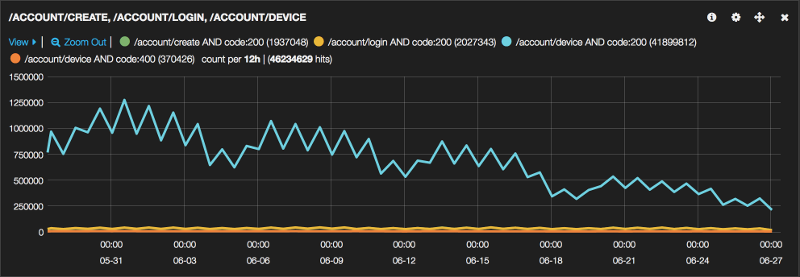

# Device registration for clients

Please read [FX-DESKTOP.md](FX-DESKTOP.md) to learn how Firefox clients
 should behave with the device registration API.

# Device registration API

https://mozilla.aha.io/features/FXA-45

* [Overview](#overview)
* [Stories](#stories)
  * [As a user](#as-a-user)
  * [As an API consumer](#as-an-api-consumer)
* [Data](#data)
* [API](#api)
  * [POST /v1/account/create](#post-v1accountcreate)
  * [POST /v1/account/login](#post-v1accountlogin)
  * [POST /v1/account/device](#post-v1accountdevice)
  * [GET /v1/account/devices](#get-v1accountdevices)
  * [POST /v1/account/device/destroy](#post-v1accountdevicedestroy)
* [Details](#details)
  * [How are unrecognised devices handled?](#how-are-unrecognised-devices-handled)
  * [Coordinating with legacy devices](#coordinating-with-legacy-devices)
* [Outcomes](#outcomes)

## Overview

The current Firefox Sync system
has a notion of "all the devices connected to your account",
but it is maintained in a special encrypted
["clients" collection](https://docs.services.mozilla.com/sync/objectformats.html#clients)
within the sync datastore.

To make this system more robust
and more useful to services other than sync,
we will lift the notion of "connected devices"
out of the user's sync data
and into their core account data.

Each connected device will get a unique device id.
It can register a descriptive name
and a webpush endpoint
that we can use to build more real-time device experiences
in the future.

## Stories

### As a user

* As a new user,
  I want to sign up
  and see the device I signed up with
  when I navigate to the devices view.

* As an existing user,
  I want to sign in on a device
  and see all my signed-in devices
  when I navigate to the devices view.

* As a signed-in user,
  I want to disconnect a device from the devices view
  and be signed out of that device.

* As a signed-in user,
  I want to change my password
  and be signed out of other devices,
  not including the current device.

* As a signed-in user,
  I want to reset my password
  and be signed out of all devices,
  including the current device.

### As an API consumer

* As an API consumer,
  I want to create an account with the auth server
  using new device details
  and receive the newly-registered device id in the response.

* As an API consumer,
  I want to log in to an auth server account
  using new device details
  and receive the newly-registered device id in the response.

* As an API consumer,
  I want to log in to an auth server account
  using a registered device id.

* As a logged-in API consumer,
  I want to register new device details
  and receive the newly-registered device id in the response.

* As a logged-in API consumer,
  I want to update the details for a registered device.

* As a logged-in API consumer,
  I want to get a list of all the registered device details.

* As a logged-in API consumer,
  I want to deregister a registered device
  and remove all of its details from the server.

## Data

The following details will be stored on the server
for each registered device:

```js
{
  // The user this device belongs to
  "uid": "4c352927cd4f4a4aa03d7d1893d950b8",

  // The active session for this device
  "sessionToken": "27cd4f4a4aa03d7d186a2ec81cbf19d5c8a604713362df9ee15c4f4a4aa03d7d",

  // A server-assigned identifier for this device
  "id": "0f7aa00356e5416e82b3bef7bc409eef",

  // A human identifier for this devices. Able to be updated by the user
  "name": "My Phone",

  // General type of device. Useful for device list icons and demographic metrics
  "type": "mobile",

  // Timestamp of when the device was first created, à la Date.now()
  "createdAt": 1442785364807,

  // The push notification endpoint for this device/user
  "pushCallback": "https://updates.push.services.mozilla.com/update/abcdef01234567890abcdefabcdef01234567890abcdef",

  // The public key for encrypting messages to the push endpoint
  "pushPublicKey": "468601214f60f4828b6cd5d51d9d99d212e7c73657978955f0f5a5b7e2fa1370"
}
```

## API

### POST /v1/account/create

#### Request

```
curl -v \
-X POST \
-H "Content-Type: application/json" \
"https://api-accounts.dev.lcip.org/v1/account/create?keys=true" \
-d '{
  "email": "me@example.com",
  "authPW": "996bc6b1aa63cd69856a2ec81cbf19d5c8a604713362df9ee15c2bf07128efab",
  "device": {
    "name": "My Phone",
    "type": "mobile",
    "pushCallback": "https://updates.push.services.mozilla.com/update/abcdef01234567890abcdefabcdef01234567890abcdef",
    "pushPublicKey": "468601214f60f4828b6cd5d51d9d99d212e7c73657978955f0f5a5b7e2fa1370"
  }
}'
```

#### Response

```
{
  "uid": "4c352927cd4f4a4aa03d7d1893d950b8",
  "sessionToken": "27cd4f4a4aa03d7d186a2ec81cbf19d5c8a604713362df9ee15c4f4a4aa03d7d",
  "keyFetchToken": "7d1893d950b8cd69856a2ec81cbfd7d1893d950b3362df9e56a2ec81cbf19d5c",
  "authAt": 1392144866,
  "device": {
    "id": "0f7aa00356e5416e82b3bef7bc409eef",
    "name": "My Phone",
    "type": "mobile",
    "pushCallback": "https://updates.push.services.mozilla.com/update/abcdef01234567890abcdefabcdef01234567890abcdef",
    "pushPublicKey": "468601214f60f4828b6cd5d51d9d99d212e7c73657978955f0f5a5b7e2fa1370"
  }
}
```

### POST /v1/account/login

#### Requests

##### New device

```
curl -v \
-X POST \
-H "Host: api-accounts.dev.lcip.org" \
-H "Content-Type: application/json" \
-H 'Authorization: Hawk id="d4c5b1e3f5791ef83896c27519979b93a45e6d0da34c7509c5632ac35b28b48d", ts="1373391043", nonce="ohQjqb", hash="vBODPWhDhiRWM4tmI9qp+np+3aoqEFzdGuGk0h7bh9w=", mac="LAnpP3P2PXelC6hUoUaHP72nCqY5Iibaa3eeiGBqIIU="' \
https://api-accounts.dev.lcip.org/v1/account/device \
-d '{
  "name": "My Phone",
  "type": "mobile",
  "pushCallback": "https://updates.push.services.mozilla.com/update/abcdef01234567890abcdefabcdef01234567890abcdef",
  "pushPublicKey": "468601214f60f4828b6cd5d51d9d99d212e7c73657978955f0f5a5b7e2fa1370"
}'
```

##### Registered device

```
curl -v \
-X POST \
-H "Host: api-accounts.dev.lcip.org" \
-H "Content-Type: application/json" \
-H 'Authorization: Hawk id="d4c5b1e3f5791ef83896c27519979b93a45e6d0da34c7509c5632ac35b28b48d", ts="1373391043", nonce="ohQjqb", hash="vBODPWhDhiRWM4tmI9qp+np+3aoqEFzdGuGk0h7bh9w=", mac="LAnpP3P2PXelC6hUoUaHP72nCqY5Iibaa3eeiGBqIIU="' \
https://api-accounts.dev.lcip.org/v1/account/device \
-d '{
  "id": "0f7aa00356e5416e82b3bef7bc409eef",
  "name": "My Old Phone"
}'
```

#### Response

```
{
  "uid": "4c352927cd4f4a4aa03d7d1893d950b8",
  "sessionToken": "27cd4f4a4aa03d7d186a2ec81cbf19d5c8a604713362df9ee15c4f4a4aa03d7d",
  "keyFetchToken": "7d1893d950b8cd69856a2ec81cbfd7d1893d950b3362df9e56a2ec81cbf19d5c",
  "verified": true,
  "authAt": 1392144866,
  "device": {
    "id": "3d7d",
    "name": "My Phone",
    "type": "mobile",
    "pushCallback": "https://updates.push.services.mozilla.com/update/abcdef01234567890abcdefabcdef01234567890abcdef"
  }
}
```

### POST /v1/account/device

Authenticated with session token.

#### Requests

##### New device

```
curl -v \
-X POST \
-H "Host: api-accounts.dev.lcip.org" \
-H "Content-Type: application/json" \
-H 'Authorization: Hawk id="d4c5b1e3f5791ef83896c27519979b93a45e6d0da34c7509c5632ac35b28b48d", ts="1373391043", nonce="ohQjqb", hash="vBODPWhDhiRWM4tmI9qp+np+3aoqEFzdGuGk0h7bh9w=", mac="LAnpP3P2PXelC6hUoUaHP72nCqY5Iibaa3eeiGBqIIU="' \
https://api-accounts.dev.lcip.org/v1/account/device \
-d '{
  "name": "My Phone",
  "type": "mobile",
  "pushCallback": "https://updates.push.services.mozilla.com/update/abcdef01234567890abcdefabcdef01234567890abcdef",
  "pushPublicKey": "468601214f60f4828b6cd5d51d9d99d212e7c73657978955f0f5a5b7e2fa1370"
}'
```

##### Registered device

If the session is associated with a different device id,
a 400 error will be returned.
If the device id is associated with a different session,
the device record will be updated with the new session.

```
curl -v \
-X POST \
-H "Host: api-accounts.dev.lcip.org" \
-H "Content-Type: application/json" \
-H 'Authorization: Hawk id="d4c5b1e3f5791ef83896c27519979b93a45e6d0da34c7509c5632ac35b28b48d", ts="1373391043", nonce="ohQjqb", hash="vBODPWhDhiRWM4tmI9qp+np+3aoqEFzdGuGk0h7bh9w=", mac="LAnpP3P2PXelC6hUoUaHP72nCqY5Iibaa3eeiGBqIIU="' \
https://api-accounts.dev.lcip.org/v1/account/device \
-d '{
  "id": "0f7aa00356e5416e82b3bef7bc409eef",
  "name": "My Old Phone"
}'
```

#### Response

```
{
  "id": "0f7aa00356e5416e82b3bef7bc409eef",
  "name": "My Phone",
  "type": "mobile",
  "pushCallback": "https://updates.push.services.mozilla.com/update/abcdef01234567890abcdefabcdef01234567890abcdef",
  "pushPublicKey": "468601214f60f4828b6cd5d51d9d99d212e7c73657978955f0f5a5b7e2fa1370"
}
```

### GET /v1/account/devices

Authenticated with session token.

#### Request

```
curl -v \
-X GET \
-H "Host: api-accounts.dev.lcip.org" \
-H "Content-Type: application/json" \
-H 'Authorization: Hawk id="d4c5b1e3f5791ef83896c27519979b93a45e6d0da34c7509c5632ac35b28b48d", ts="1373391043", nonce="ohQjqb", hash="vBODPWhDhiRWM4tmI9qp+np+3aoqEFzdGuGk0h7bh9w=", mac="LAnpP3P2PXelC6hUoUaHP72nCqY5Iibaa3eeiGBqIIU="' \
https://api-accounts.dev.lcip.org/v1/account/devices
```

#### Response

If the `sessionToken` field is `null`,
it means the device is disconnected.

```
[
  {
    "id": "0f7aa00356e5416e82b3bef7bc409eef",
    "isCurrentDevice": true,
    "lastAccessTime": 1449235471335,
    "name": "My Phone",
    "type": "mobile",
    "pushCallback": "https://updates.push.services.mozilla.com/update/abcdef01234567890abcdefabcdef01234567890abcdef",
    "pushPublicKey": "468601214f60f4828b6cd5d51d9d99d212e7c73657978955f0f5a5b7e2fa1370"
  },
  {
    "id": "0f7aa00356e5416e82b3bef7bc409eef",
    "isCurrentDevice": false,
    "lastAccessTime": 1417699471335,
    "name": "My Desktop",
    "type": null,
    "pushCallback": "https://updates.push.services.mozilla.com/update/d4c5b1e3f5791ef83896c27519979b93a45e6d0da34c75",
    "pushPublicKey": "468601214f60f4828b6cd5d51d9d99d212e7c73657978955f0f5a5b7e2fa1370"
  }
]
```

### POST /v1/account/device/destroy

Authenticated with session token.

If the session is associated with a different device id,
a 400 error will be returned.

#### Request

```
curl -v \
-X POST \
-H "Host: api-accounts.dev.lcip.org" \
-H "Content-Type: application/json" \
-H 'Authorization: Hawk id="d4c5b1e3f5791ef83896c27519979b93a45e6d0da34c7509c5632ac35b28b48d", ts="1373391043", nonce="ohQjqb", hash="vBODPWhDhiRWM4tmI9qp+np+3aoqEFzdGuGk0h7bh9w=", mac="LAnpP3P2PXelC6hUoUaHP72nCqY5Iibaa3eeiGBqIIU="' \
https://api-accounts.dev.lcip.org/v1/account/device/destroy \
-d '{
  "id": "0f7aa00356e5416e82b3bef7bc409eef"
}'
```

#### Response

```
{}
```

## Details

### How are unrecognised devices handled?

If a POST to `/v1/account/login`, `/v1/account/device` or `/v1/account/device/destroy`
specifies an unknown device id,
a 400 error will returned.

### Coordinating with legacy devices

It's important for the user experience
that the list of devices in Firefox Accounts
is consistent with the list of devices
in views such as "about:sync-tabs",
even if some of the user's devices
have not been updated to support FxA device registration.

To ensure this, devices should maintain their details
in both the FxA devices API *and* the sync "clients" collection
and ensure that they are consistently represented in both places.

In practice this will mean:
* Using their FxA device ID as their sync client GUID.
* Updating their name in the sync client record
  when it is changed on the FxA server.
* Writing an additional field into their sync client record
  to indicate that they are device-registration-compatible.

Legacy devices will thus treat them
like any other sync peer,
while newer devices will be able to easily tell
which of their peers are registered
and identify them by ID in both systems.

The set of registered devices in FxA
will be a consistent *subset*
of the client information recorded in sync.

## Outcomes

The feature was shipped in Firefox 46
and users are successfully registering devices:

[](https://kibana.fxa.us-west-2.prod.mozaws.net/index.html#/dashboard/elasticsearch/Device%20registration)

Two things stand out about this graph:

* There are vastly more requests to `/account/device`
  than there are to `/account/create` and `/account/login` combined.

* The number of requests to `/account/device`
  is steadily declining.

These can probably be attributed to existing sessions
registering a device for the first time
and the decline is expected to continue
until the request count for `/account/device` steadies
at a point just greater than
the combined request counts for `/account/create` and `/account/login`.

