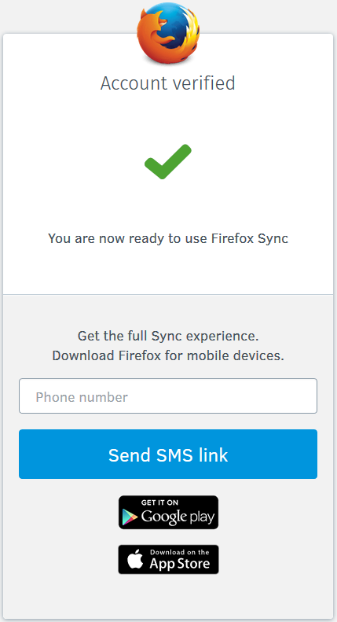

# SMS Install Link

https://mozilla.aha.io/features/FXA-46

## Stories

As a user signing up for a Firefox Account, I may want to easily install
Firefox on my Android or iOS device, removing the friction of searching
by sending me the link in a text message.

## Success Criteria

This feature will be successful if we measurably increase the rate of
Firefox activations for Android and iOS.

A metrics funnel we can use to measure success is:

1. Number of users who submit their number to the form in order to
   receive a SMS
2. Number of users who click the link
3. Number of users who install Firefox from this link (utm_campaign
   thingies?)
4. Number of users who connect a second device after having requested a
   link

## Details

On Firefox Desktop, after a user successfully signs up to a new account,
we will show a small form *embedded in the post verification screen* prompting
the user to enter their telephone number to be texted a link to install
Firefox Mobile.

Based on numbers collected from [metrics][] of February 2016, the post
verification screen is viewed in a 5:3 ratio of desktop:mobile. This implies
that a 62.5% of users could see this and benefit.

The SMS capability currently exists in the [Basket API][], allowing us
to essentially SMS a user via `POST /news/subscribe_sms`. It is used for
the Firefox for Android landing page, and can be viewed here (it does
detect if you're in the US before showing the form):
https://mozilla.org/firefox/android

This form would need to be only shown to those in the US, as our current
provider behind Basket only allows US phone numbers.

- UX design of form to show to user
- Implementation of form in content-server
- UX of text message wording
- Short URL pointing to page that redirects based on OS
  - Play Store for Android
  - App Store for iOS
- Work in Basket repo to customize text message with our link

## Design

[Basket API]: https://github.com/mozilla/basket/blob/d3a284a8f35b4ac9ed0eb3942861be38f2911aa1/news/views.py#L336
[metrics]: https://app.datadoghq.com/dash/54206/fxa-content-server---registration
