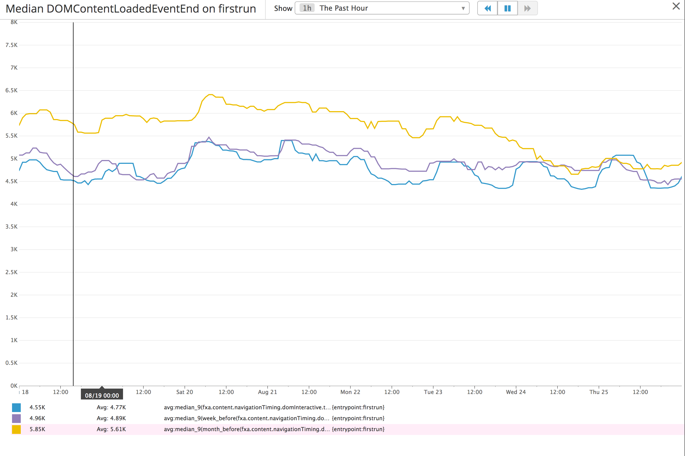
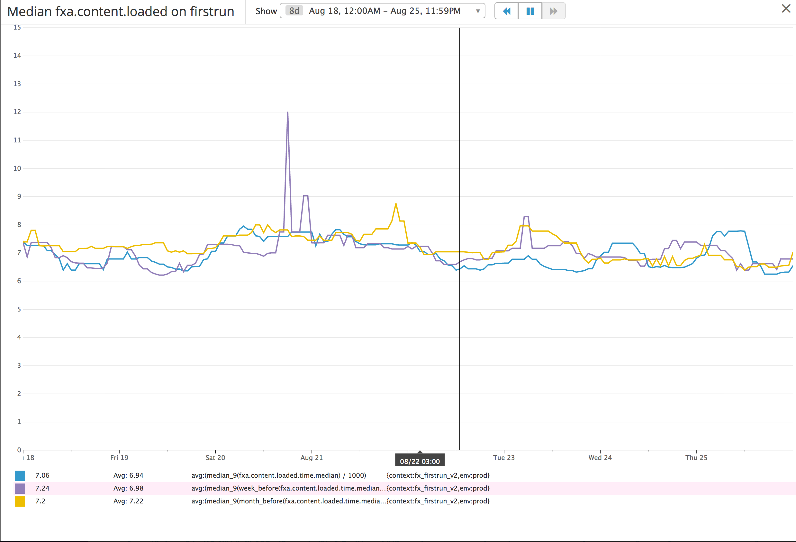

# CDN

https://mozilla.aha.io/features/FXA-49

## Stories

As a user, I want the Firefox Accounts UI to load quickly
so that can get on with what I'm doing.

## Details

Firefox Accounts serves all content from datacenters located
on the west coast of the US. The time it takes to download
static resources is a major contributor to overall application
start time, especially for users located in geographically
distant regions of the globe. By pushing static resources
closer to the user, the hope is users experience a faster
Firefox Accounts start time.

### Measuring Success

* [navigationTiming](https://www.w3.org/TR/navigation-timing-2/)
* [resourceTiming](https://www.w3.org/TR/resource-timing/) data of individual resources. The largest static assets is `main.js`
* [internal metrics](https://github.com/mozilla/fxa-content-server/blob/master/docs/client-metrics.md). The `loaded` is the user metric that matters most.

From the user's perspective, the most important metric is how quickly they
can interact with Firefox Accounts. The `loaded` event in internal metrics
measures this time.

The time it takes a user to interact with FxA can be broken down into two
primary components, resource fetching and resource processing.

Before FxA can be shown to the user, the user's browser must first fetch
HTML, JavaScript, CSS, fonts, and images from FxA servers. Only when
resources are fetched can the browser process the resources and display FxA
to the user.

The [W3C's Processing Model diagram](https://www.w3.org/TR/navigation-timing-2/#processing-model) provices a graphical representation of the page load cycle.

A CDN will help with resource fetching, not resource processing. On the diagram, the CDN should reduce up to the `responseEnd` time.

We should track the quartiles (25%, 50%, 75%) and possibly median and 95% of
`responseEnd` from navigationTiming and the `loaded` event from internal
metrics. We can further track individual components up to `responseEnd` to see
if there are any areas of concern.

### CDN service provider

[Amazon CloudFront](https://aws.amazon.com/cloudfront/) will be the
CDN used to deliver static resources.

### CDN domain

All static resources will be served from the domain <XXX>.

### Preventing resource manipulation by 3rd parties

The [Subresource Integrity](https://developer.mozilla.org/docs/Web/Security/Subresource_Integrity) `integrity` attribute will be added to all `script` and `link` tags to ensure static JavaScript and CSS is not manipulated by 3rd parties,

From MDN:

> Subresource Integrity (SRI) is a security feature that enables browsers to
verify that files they fetch (for example, from a CDN) are delivered without
unexpected manipulation. It works by allowing you to provide a cryptographic
hash that a fetched file must match.

#### Subresource Integrity SHA generation

A unique SHA must be generated for each static JavaScript and CSS resource.
The SHAs are then embedded into HTML as the `integrity` attribute of a `script`
or `link` tag.

This can be done using `grunt` in the build step. Since unique JavaScript
and CSS bundles are created for each locale, this must be done
post-l10n processing.

### Updating CDN resources

From the [CloudFront documentation](https://aws.amazon.com/cloudfront/details/):

> When a viewer requests a web page or content using that domain name, Amazon CloudFront determines the best edge location to serve your content. If an edge location doesn’t have a copy of the file requested by the viewer, Amazon CloudFront will pull a copy from the origin server and hold it at the edge location so it’s available for future requests.

Once the initial setup is complete, all user requested resources that
are not yet on the CDN will be pulled from our servers automatically.
No additional work is needed on deployment to seed the CDN.

## Work Breakdown

* [*] Establish baseline metrics for `responseEnd` and `loaded`.
* [*] Generate subresource integrity SHAs for each static JS and CSS resource.
  * [*] Add the `integrity` attribute to all `script` and `link` tags.
* [*] Prepend CDN domain name to all static resource URLs embedded in HTML when run in production mode. FQDNs do not need to be added to resources referenced in CSS because resources are relative to the CSS file's origin.
  * [*] Domin name should be pulled from configuration.
* [*] Update CSP rules to allow resources from CDN.
* [*] Send CORS headers on WOFF/TTF web fonts to allow origin host.
* [*] Decide the domain name to use for the CDN.
  * [*] Purchase any necessary SSL certs.
* [*] Set up a CloudFront CDN account and initial setup.

## Results

Of the two metrics being tracked (median `DOMContentLoaded` and median `loaded`), only
`DOMContentLoaded` shows a significant improvement with the CDN.

The yellow line clearly shows a ~ 1 second improvement when the CDN was deployed. This is clearly a good result, though not as great a difference as expected.

The `loaded` event did not show a corresponding 1 second improvement, it perhaps shows ~ 0.5 second improvement but the results do not look significant.

This is unexpected and difficult to explain. In theory, `loaded` should be the total of 1) resource downloading, 2) resource parsing, and 3) resource running. The first improved, the second and third should have remained constant. It seems to follow the total should have dropped, but this does not appear to be the case.

## Next steps

1. Figure out why the `loaded` event has not dropped as much as expected.
2. Determine where the majority of the start time is spent. Try to minimize the
   areas with the biggest potential gains.
3. Determine whether JavaScript is even needed for the initial render. If page
   can be rendered instantly without JavaScript, the user perceived load
   time will be extremely fast.
4. Determine if enabling HTTP/2 support on the CDN speeds up resource loading

## External Resources

* [Amazon Cloudfront CDN](https://aws.amazon.com/cloudfront/)
* [Subresource Integrity](https://developer.mozilla.org/docs/Web/Security/Subresource_Integrity)
* [navigationTiming](https://www.w3.org/TR/navigation-timing-2/)
* [resourceTiming](https://www.w3.org/TR/resource-timing/)
* [grunt-cdn](https://github.com/tactivos/grunt-cdn)
* [grunt-sri](https://github.com/neftaly/grunt-sri)
* [handlebars-helper-sri](https://github.com/neftaly/handlebars-helper-sri)

