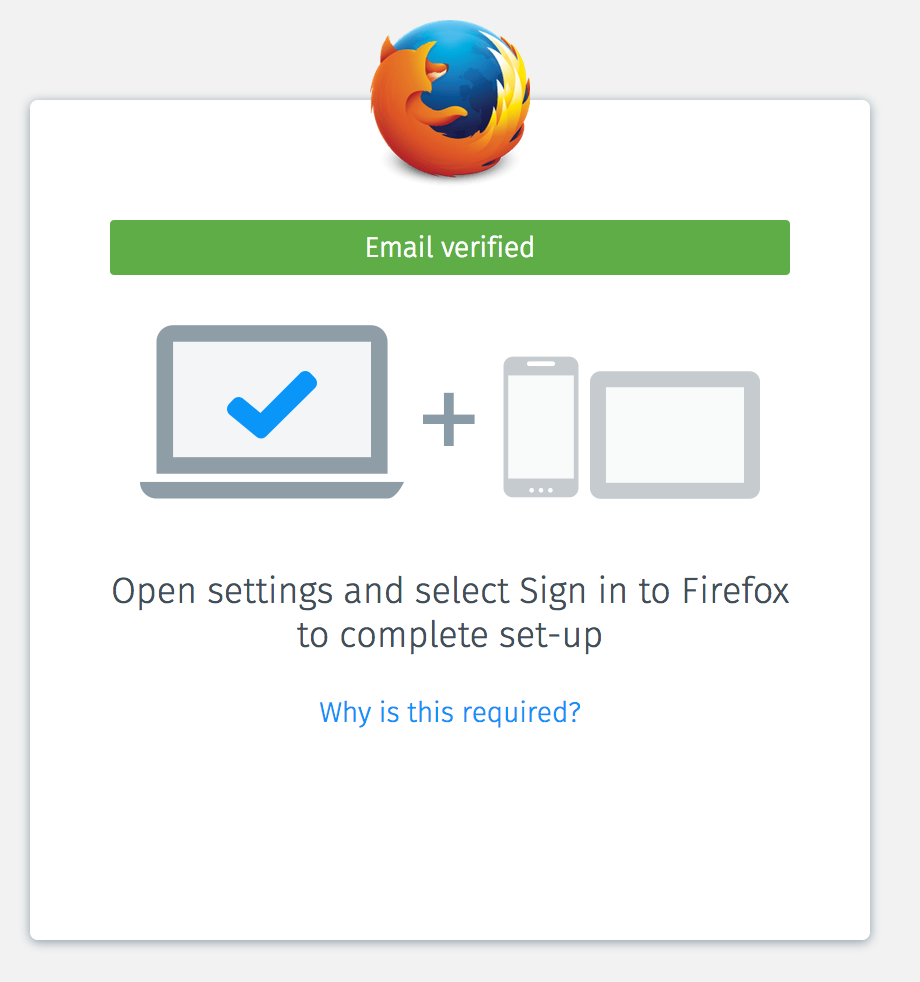
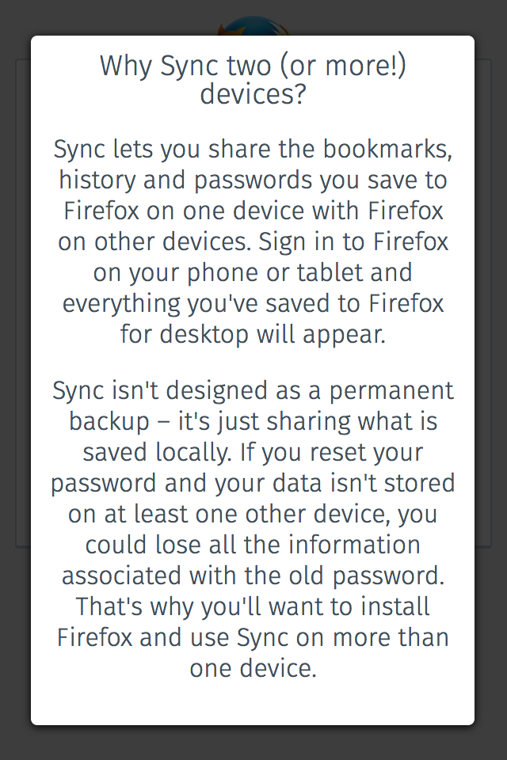

# FxA-51 - Email confirmation flow, connect another device

## Meta Data

* Date: November 10th, 2016
* Document prepared by: Alex Davis
* Start date of test: ~ Jan 9th, 2017
* End date of test:  
* Feature card: https://waffle.io/mozilla/fxa-features/cards/5820a9739ca711d4005a5408
* Other:
  * This feature document is the result of our work week in Toronto to increase multi-device adoption from firstrun sign-up. The email confirmation we envisioned during the workweek will be divided into 4 phases
  * Phase 2: https://docs.google.com/document/d/133_Cu0TlWQZIw-ihMH1s-U_80I12MXZcvHQEuFhWbPg/edit#heading=h.qrbb2drvq5dg (WIP)
  * Proposed new firstrun user flow in Invision: https://mozilla.invisionapp.com/share/ZX8RK05G7#/screens/191829453
  * Graph of multi-device adoption within 48h and within 7 days: https://sql.telemetry.mozilla.org/queries/1254#2173
  * Single vs multi-device MAU: https://sql.telemetry.mozilla.org/queries/256#486

## Problem Summary and Context
Sync setup via FxA serves the purpose of helping users setup multiple devices and to ensure their data syncs across their devices.

Unfortunately, within the first 48h of registering for Sync, only 6.4% of users setup a second device and approximately only 8% after 7 days (as of October 30th).

Additionally, only approximately 15% of FxA MAU use their account on two different devices. This value is dropping every month as the number of single device users keep growing. (as of September 30th)

We observed that our sign-up flow does little to encourage users to connect a second device.

We also observed that the sign-up flow usually ends when a user confirms their email address. Mobile download is only passively promoted.  We have observed that less than 30% of registration (65k clicks / 210k registration / month) engage with our mobile download buttons and at best 26% (8% 7d md / 30% ctr) of them follow through to an install within 7 days after clicking.

We need to better guide the user through the setup of two devices while removing as much friction as possible. Next steps should always be clear to users.

### Assumptions
We assume that users signing up for Sync have an understanding of why they are setting up an account so we should merely be facilitating setup after email confirmation.

(edit: we have observed through user testing that new users do not understand the firstrun page very well. This will be the subject of one of our next tests.)

## Outcomes
We want to present a slick user flow that makes it obvious that in order to complete the setup of Sync, users need to add another device after email confirmation.

## Hypothesis
If we refine our UI/UX during sign up to remove friction around setting up a second device, then we will see an increase in multi-device users within the first 7 days of registration.

## Metrics
We will know our hypothesis to be true when we see the proportion of multi-device users increase after 48h and 7d of registration to FxA+Sync on firstrun.

From: https://sql.telemetry.mozilla.org/queries/1254#2173

We are unable to directly compare the success metric of users through the new flow versus users of the existing flow. Reasons are explained further below, until we have this capability we will rely on 2 proxy metrics to determine success.

### Click rate of app store buttons

#### For Android

Control
> experiment.control.connectAnotherDevice.marketing.click.android / experiment.control.connectAnotherDevice.marketing.impression.android

vs treatment

> experiment.treatment.connectAnotherDevice.marketing.click.android / experiment.treatment.connectAnotherDevice.marketing.impression.android

#### For iOS

Control
> experiment.control.connectAnotherDevice.marketing.click.ios / experiment.control.connectAnotherDevice.marketing.impression.ios

vs treatment

> experiment.treatment.connectAnotherDevice.marketing.click.ios / experiment.treatment.connectAnotherDevice.marketing.impression.ios

### Signin success rate

Users who verify in a 2nd Firefox instance are displayed a "sign in &rarr;" button that sends the user to the sign-in page with an `entrypoint=connect_another_device` query parameter. Are these users more motivated to sign in than users who are not displayed the new material, e.g., users who arrive at signin from the firstrun page?

signin from firstrun
> signin.signin.success w/ service=sync & entrypoint=firstrun

vs signin from connect_another_device
> signin.signin.success w/ service=sync & entrypoint=connect_another_device

We will also want to keep an eye out for:
* Email confirmation rate: we should not impact this negatively in any way.
* Measured with flow events and visualized in re:dash
* Install rate from confirmation page on mobile: If users confirmed their email on mobile, we will drive users to install via smart banner.
* Whether "Why is this required?" provides value.

## Detailed design
### Audience
This experiment will target new account users signing up or signing in to Sync. The experiment will be rolled out as an A/B test to ~2.5% of users. Of these 2.5%, half of the users will be considered part of the "control" group and will go through the existing flow, the other half will go through the new flow and are considered the "treatment" group.

### Current flow (control)

### New flow (treatment)
Once a user verifies their email address, the updated flow nudges users to connect another device using the most appropriate method for the context (detailed in dashed outline box).

#### Screenshots

1. User is asked to confirm email address

 
2. Email prepares the user for next steps

 
3. Depending on where the user confirms their email address, they will see one of the following screens:
  1. User confirms on same device or in a non-Firefox browser

   
  2. User confirms in a second instance of Firefox for Android

   
  3. User confirms in Firefox for iOS

   
  4. User confirms email in Safari for iOS

   
4. Users who click on the "Why is this required" link are displayed content that explains why Sync depends upon two or more devices

### Hypothetical Implementation Plan
The majority of this phase is straightforward front-end web development - no new backend APIs are required, and no new services are being integrated.

There are two tricky portions dealing with metrics that need to be addressed.

First, we have we have not yet surfaced A/B test grouping data to redshift and re:dash. Without this data, it is impossible to independently view "control" and "treatment" groups within re:dash, which precludes any direct comparisons of % of users with two or more devices between the two.

Second, for users that click on one of the two app store icons, we are unable to propagate click source information through Adjust through the app store, back to FxA.

These two limitations force us to use the previously discussed proxy measurements to determine success.

### Acceptance Criteria/Testing

The feature is currently being A/B tested, only members of the "treatment" group see the new UI. For testing purposes, it is possible to force being a member of the "treatment" group by opening the verification link with the following additional query parameters:
`&forceExperiment=connectAnotherDevice&forceExperimentGroup=treatment`

The UI presented to the user changes depending on where the user verifies their email address. Testing of each of the possible combinations is needed.

The convention used below is section headings indicate where the user signs up, section sub-headings indicate where the user opens the verification link.

#### Signup in Firefox Desktop

##### Verify in the same Firefox Desktop.
When verification is complete:
  * A green status message should appear that says "This Firefox is connected".
  * User should see text that says "Complete set-up by connecting Firefox for your smartphone"
  * Links to both Apple and Google app stores are available.
  * Clicking on "Why is this required" should show the help text.

##### Verify in Firefox Desktop on another device.
When verification is complete:
  * A green status message should appear that says "Email confirmed"
  * User should see text that says "Complete set-up by signing in to this Firefox."
  * Clicking on "Why is this required" should show the help text.
  * Clicking on the "Sign in" button redirects the user to the /signin screen.
    * The email should be prefilled.
    * Signing in should connect Firefox to Sync.

##### Verify in Firefox for Android.
Same as [Sign up for Sync on Firefox Desktop, verify in Firefox Desktop on another device.](#verify-in-firefox-desktop-on-another-device)

##### Verify in Firefox for iOS.
When verification is complete:
  * A green status message should appear that says "Email confirmed"
  * User should see text that says "Open settings and select Sign in to Firefox to complete set-up".
  * No "Sign in" button should appear.
  * Clicking on "Why is this required" should show the help text.

##### Verify in a non Firefox for desktop browser.
Same as [Sign up for Sync on Firefox Desktop, verify in the same Firefox Desktop.](#verify-in-the-same-firefox-desktop)

##### Verify in Chrome for Android.
When verification is complete:
  * A green status message should appear that says "Email confirmed"
  * User should see text that says "Sign in to Firefox for Android to complete set-up"
  * A link is available for the Google app store. Clicking the link allows the user to install or open Firefox.
  * Clicking on "Why is this required" should show the help text.

##### Verify in Safari for iOS.
When verification is complete:
  * A green status message should appear that says "Email confirmed"
  * User should see text that says "Sign in to Firefox for iOS to complete set-up"
  * A links is available for the Apple app store. Clicking the link allows the user to
    install or open Firefox.
  * Clicking on "Why is this required" should show the help text.

#### Signup in Firefox for Android

##### Verify in the same Firefox for Android.
Same as [Sign up for Sync on Firefox Desktop, verify in the same Firefox Desktop.](#verify-in-the-same-firefox-desktop)

##### Verify in Firefox for Android on another device.
Same as [Sign up for Sync on Firefox Desktop, verify in Firefox Desktop on another device.](#verify-in-firefox-desktop-on-another-device)

##### Verify in Firefox Desktop.
Same as [Sign up for Sync on Firefox Desktop, verify in Firefox Desktop on another device.](#verify-in-firefox-desktop-on-another-device)

##### Verify in Firefox for iOS.
Same as [Sign up for Sync on Firefox Desktop, verify in Firefox for iOS.](#verify-in-firefox-for-ios)

##### Verify in a non Firefox for desktop browser.
Same as [Sign up for Sync on Firefox Desktop, verify in the same Firefox Desktop.](#verify-in-the-same-firefox-desktop)

##### Verify in Chrome for Android.
Same as [Same as "Sign up for Sync on Firefox Desktop, verify in Chrome for Android.](#verify-in-chrome-for-android)

##### Verify in Safari for iOS.
Same as [Same as "Sign up for Sync on Firefox Desktop, verify in Safari for iOS.](#verify-in-safari-for-ios)

#### Signup in Firefox for iOS

##### Verify in the same Firefox for iOS.
Same as [Sign up for Sync on Firefox Desktop, verify in the same Firefox Desktop.](#verify-in-the-same-firefox-desktop)

##### Verify in Firefox for iOS on another device.
Same as [Sign up for Sync on Firefox Desktop, verify in Firefox for iOS.](#verify-in-firefox-for-ios)

##### Verify in Firefox Desktop.
Same as [Sign up for Sync on Firefox Desktop, verify in Firefox Desktop on another device.](#verify-in-firefox-desktop-on-another-device)

##### Verify in Firefox for Android.
Same as [Sign up for Sync on Firefox Desktop, verify in Firefox Desktop on another device.](#verify-in-firefox-desktop-on-another-device)

##### Verify in a non Firefox for desktop browser.
Same as [Sign up for Sync on Firefox Desktop, verify in Firefox Desktop on another device.](#verify-in-firefox-desktop-on-another-device)

##### Verify in Chrome for Android.
Same as [Same as "Sign up for Sync on Firefox Desktop, verify in Chrome for Android.](#verify-in-chrome-for-android)

##### Verify in Safari for iOS.
Same as [Same as "Sign up for Sync on Firefox Desktop, verify in Safari for iOS.](#verify-in-safari-for-ios)

## Results
* Email confirmation rate: we should not impact this negatively in any way.
* Visualized in re:dash
  * Install rate from confirmation page on mobile: If users confirmed their email on mobile, we will drive users to install via smart banner. (install rate)
  * Multi-device rate 48h: what % of users adopted a second device within 48h of registration
  * Multi-device rate 7D: what % of users adopted a second device within 7D of registration
* Visualized in DataDog
  * App store click rate - are users more likely to install Firefox when additional context is presented?
  * Sign in success rate - are users who click "Sign in &rarr;" from connect_another_device more likely to complete sign-in than users from the firstrun page?

## Conclusion
Was our hypothesis true or false and why?
Our hypothesis was true because we observed... [e.g. a 15% increase in account sign-up completions].

We should also address secondary metrics here:
We also observed during this test that…  [e.g. we had an increase in single device sign-ups]

## Next Steps
There no point having a conclusion if you don’t have take-aways with next steps.

Are we releasing? Are we making changes?
