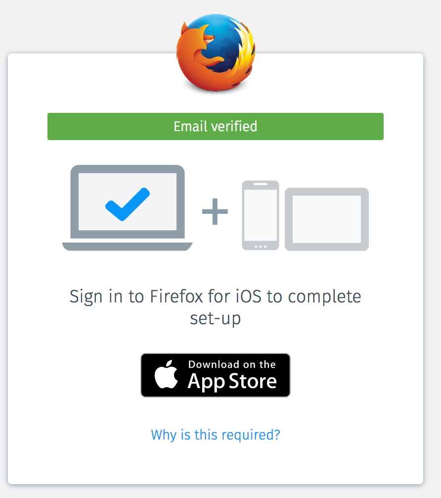

# FxA-51 - Email confirmation flow, connect another device

## Meta Data

* Date: November 10th, 2016
* Document prepared by: Alex Davis
* Start date of test:
* End date of test:  
* Feature card: https://waffle.io/mozilla/fxa-features/cards/5820a9739ca711d4005a5408
* Other:
  * This feature document is the result of our work week in Toronto to increase multi-device adoption from first run sign-up. The email confirmation we envisioned during the workweek will be divided into 4 phases
    * Phase 2: https://docs.google.com/document/d/133_Cu0TlWQZIw-ihMH1s-U_80I12MXZcvHQEuFhWbPg/edit#heading=h.qrbb2drvq5dg (WIP)
  * Proposed new first run user flow in Invision: https://mozilla.invisionapp.com/share/ZX8RK05G7#/screens/191829453
  * Graph of multi-device adoption within 48h and within 7 days: https://sql.telemetry.mozilla.org/queries/1254#2173
  * Single vs multi-device MAU: https://sql.telemetry.mozilla.org/queries/256#486

## Problem Summary and Context
Sync setup through first run via FxA serves the purpose of helping users setup multiple devices and to ensure their data is syncing across their devices.

Unfortunately, within the first 48h of registering for Sync, only 6.4% of users setup a second device and approximately only 8% after 7 days (as of October 30th).

Additionally, approximately only 15% of FxA MAU use their account on two different devices. This value is dropping every month as the number of single device users keep growing. (as of September 30th)

We observed that our sign-up flow does not detect UA to recommend appropriate next steps to complete setup of two devices.

We also observed that the signup flow mostly ends on confirming the user’s email. Mobile download is only very passively promoted.

We need to better guide the user through the setup of two devices while removing as much friction as possible. Next steps should always be clear to users.

### Assumptions
We assume that users signing up for Sync have an understanding of why they are setting up an account so we should merely be facilitating setup after email confirmation.

(edit: we have observed through user testing that new users do not understand the first run page very well. This will be the subject of one of our next tests.)

## Outcomes
The outcome we are looking for is a slick user flow that makes it obvious to users that in order to complete their setup of Sync, they need to add another device after email confirmation.

## Hypothesis
If we refine our UI/UX during sign up to remove friction around setting up a second device for firstrun users on desktop, then we will see an increase in multi-device users within the first 7 days of registration because we have observed that less than 30% of registration (65k clicks / 210k registration / month) engage with our mobile download buttons and at best 26% (8% 7d md / 30% ctr) of them follow through to an install within 7 days after clicking.

## Metrics
We will know our hypothesis to be true when we see the proportion of multi-device users increase after 48h and 7d of registration to FxA+Sync on firstrun.

From: https://sql.telemetry.mozilla.org/queries/1254#2173

We will also want to keep an eye out for:
Email confirmation rate: we should not impact this negatively in any way.
Measured with flow events and visualized in re:dash
Install rate from confirmation page on mobile: If users confirmed their email on mobile, we will drive users to install via smart banner. (install rate)

### Additional AB metrics:
% of users that verify in a second Firefox instance (Desktop or Fennec) that connect that instance. XXX stomlinson to look up existing metrics to see if any match.
% of users that see the app store links that click on a link. XXX we log marketing impressions, and clicks and send this data to GA. stomlinson to figure out how to do this as part of flow events too.

## Detailed design
### Audience
This test will target:
EN-* countries
New account users signing up to Sync (first run, preferences, etc)

Here is the flow of the current version:

### Variation A
Here is the user flow from the moment the user finishes registration via the form (in dashed outline box).

And here are the screenshots

1. User is asked to confirm email address

Email prepares the user for next steps

Depending on where the user confirms their email address, they will see one of the following screens:

Confirmed from same desktop device or different desktop browser brand

Confirmed from Firefox for Android or a different Firefox Desktop

Confirmed email from Safari for iOS

### Hypothetical Implementation Plan
The majority of this phase is straightforward front-end web development - no new backend APIs are required, and no new services are being integrated.

There are two tricky portions that need to [add me]

### Unresolved questions and risks (optional)
What parts of the design are still TBD?
How will we test this vs current flow?

## Results
Email confirmation rate: we should not impact this negatively in any way.
Measured with telemetry and visualized in re:dash
Install rate from confirmation page on mobile: If users confirmed their email on mobile, we will drive users to install via smart banner. (install rate)
Multi-device rate 48h: what % of users adopted a second device within 48h of registration
Multi-device rate 7D: what % of users adopted a second device within 7D of registration

## Conclusion
Was our hypothesis true or false and why?
Our hypothesis was true because we observed... [e.g. a 15% increase in account signup completions].

We should also address secondary metrics here:
We also observed during this test that…  [e.g. we had an increase in single device signups]

## Next Steps
There no point having a conclusion if you don’t have take-aways with next steps.

Are we releasing? Are we making changes?
