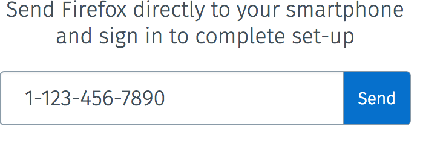
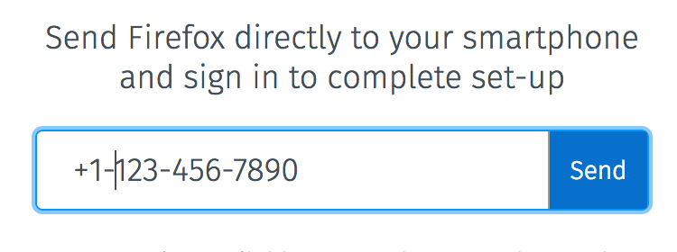
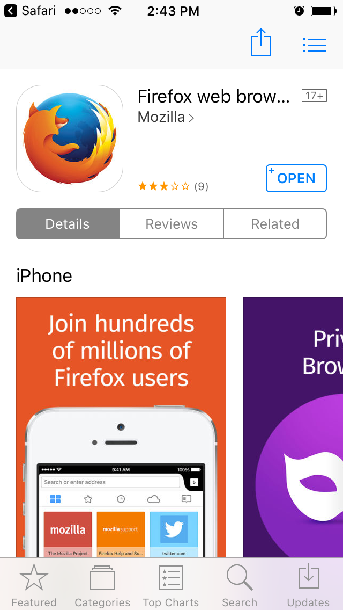

# Send install Firefox link via SMS

## Email confirmation flow to Mobile (Phase 2 of 4)

## Meta Data

* This feature document is the result of our work week in Toronto to increase multi-device adoption from first run sign-up.

* Propose new first run user flow in Invision: [https://mozilla.invisionapp.com/share/ZX8RK05G7#/screens/191829453](https://mozilla.invisionapp.com/share/ZX8RK05G7#/screens/191829453)

* Graph of multi-device adoption within 48h and within 7 days: [https://sql.telemetry.mozilla.org/queries/1254#2173](https://sql.telemetry.mozilla.org/queries/1254#2173)

* Single vs multi-device MAU: [https://sql.telemetry.mozilla.org/queries/256#486](https://sql.telemetry.mozilla.org/queries/256#486)

## Problem Summary and Context

Sync setup through first run via FxA serves the purpose of helping users setup multiple devices and to ensure their data is syncing across their devices.

Unfortunately, within the first 48h of registering for Sync, only 6.4% of users setup a second device and approximately only 8% after 7 days (as of October 30th).

Additionally, approximately only 15% of FxA MAU use their account on two different devices. This value is dropping every month as the number of single device users keep growing. (as of September 30th)

We need to better guide the user through the setup of two devices while removing as much friction as possible. Next steps should always be clear to users.

In order to remove friction, we will provide users with a link to download Firefox via SMS.

Here are the 4 phases we are rolling out in order to resolve this issue:

1. UA detection and smart users flows with no dead ends. We will use download buttons to promote mobile.

2. Integrate SMS download field to email confirmation screen in order when user confirms email on desktop.

3. Deep link the user into the app and pre-populate the email field.

4. Pass a session token or code in the deeplink and avoid any login whatsoever (with a confirmation prompt on originating device)

## Outcomes

The outcome we are looking for is a slick user flow that makes it obvious to users that in order to complete their setup of Sync, they needs to add another device after email confirmation.

## Hypothesis

If we offer to download via SMS to remove friction around setting up a second device for firstrun users on desktop, then we will see an increase in multi-device users within the first 7 days of registration because we have observed that less than [30% of registration](https://next.adjust.com/#/statistics/overview/default/gqrwnbypw28p/hqnqs2?from=2016-10-01&to=2016-10-31&range=last-month&sort=installs&reverse=true) (65k clicks / 210k registration / month) engage with our mobile download buttons and [at best 26%](https://sql.telemetry.mozilla.org/queries/1254#2173) (8% 7d md / 30% ctr) of them follow through to an install within 7 days after clicking.

## Metrics

We will know our hypothesis to be true when we see the proportion of multi-device users increase after 48h and 7d of registration to FxA+Sync on firstrun.


From: https://sql.telemetry.mozilla.org/queries/1254#2173

We will also want to keep an eye out for:

* **Email confirmation rate**: we should not impact this negatively in any way.

    * Measured with telemetry and visualized in re:dash

* **Volume of SMS sent**: Will confirm if users are adopting new mechanism.

    * Measured with SMS provider

* **SMS send rate**: Will confirm if users are adopting new mechanism.

* **Click rate**: Will allow to see if messages are delivered and users are clicking on them.

* **Install rate from SMS**: Will allow to see if users are successfully installing after install click on link in SMS

* **Install rate** from confirmation page on mobile: If users confirmed their email on mobile, we will drive users to install via smart banner. (install rate)

### Flow events

<table>
  <tr>
    <td>flow.sms.view</td>
    <td># of people that see the send_sms screen</td>
  </tr>
  <tr>
    <td>flow.sms.engage</td>
    <td># of people that interact with form.</td>
  </tr>
  <tr>
    <td>flow.sms.submit</td>
    <td># of people that try to send a message.</td>
  </tr>
  <tr>
    <td>sms.1.sent</td>
    <td># of people that we successfully send a message to.</td>
  </tr>
  <tr>
    <td>flow.sms.link.learn_more</td>
    <td># of people that click on "learn more"</td>
  </tr>
  <tr>
    <td>flow.sms.link.why</td>
    <td># of people that click on “why is this required”</td>
  </tr>
  <tr>
    <td>flow.sms.link.maybe_later</td>
    <td># of people that click “maybe later”</td>
  </tr>
</table>


### Formula

<table>
  <tr>
    <td>SMS form submit rate</td>
    <td>flow.sms.submit / flow.sms.view</td>
  </tr>
  <tr>
    <td>SMS form submit success rate</td>
    <td>sms.1.sent / flow.sms.submit </td>
  </tr>
  <tr>
    <td>% of people that sign in that have gone through this flow</td>
    <td></td>
  </tr>
</table>


* * *


## **Detailed design**

### Audience

This test will target:

* USA, Canada have cheap SMS fees via Nexmo.

    * The UK is enabled for testing behind a UI "easter egg".

* Users that sign-up for a new account

### Original Version (Present Day)

Here is the user flow from the moment the user finishes registration via the form.
[(Review the control after phase 1 results come in)](https://docs.google.com/document/d/13AP3rPE4RMKjECBxJzT-OuVyU3DUC1-ggpqUttAJYM4/edit#)

1. User is asked to confirm email address<br />


2. Email prepares the user for next steps<br />


1. Depending on where the user confirms their email address, they will see one of the following screens:

    1. Confirmed from same Firefox desktop<br />


    2. Confirmed from a second disconnect Firefox instance<br />


    3. Confirmed from Firefox for iOS<br />


### Variation A

Here is the user flow from the moment the user finishes registration via the form.

1. User is asked to confirm email address <br />


2. Email prepares the user for next steps <br />


3. Users that confirm on the same desktop device will see the following screen. **This screen is the main difference with the control.**<br />


    * SMS Message: "As requested, here is your link to install Firefox on your mobile device: moz.la/vwxyz “

### Implementation Plan

#### Sending SMSs

The auth server will be responsible for sending SMS. The content server will send a POST request to the auth server with the user’s phone number.

#### auth server (pbooth)

New endpoints are needed on the auth-server to check whether SMS sending is enabled and to send SMS messages.

##### POST /sms

Send SMS message identified by `messageId` to `phoneNumber`.

###### Request POST data

```
sessionToken,
messageId,
phoneNumber,
metricsContext: {
  flowId,
  flowBeginTime
}
```

Locale will be determined from the user’s Accept header.

###### Response

Successful requests will return a 200 OK response with an empty object in the JSON body:

```
{}
```

Failing requests may return the following errors:

* status code 400, errno 129: invalid phone number
* status code 400, errno 130: invalid region
* status code 400, errno 131: invalid message id
* status code 500, errno 132: message rejected
* status code 500, errno 999: unexpected error

##### GET /sms/status

Check whether sending an SMS is enabled for a particular user. Auth-server will determine whether user is in a country to which sending an SMS is enabled as well as whether the SMS provider account has sufficient funds to send a message.

###### Request POST data

```
sessionToken
```

###### Response

Successful requests will return a 200 OK response with an object JSON body:

```json
{
  ok: <boolean>
}
```

#### Auth-mailer (pbooth)

The auth-mailer will be responsible for doing the sending because it already contains the necessary i18n infrastructure to translate messages.

##### mailer.sms.send (phoneNumber, senderId, messageId, acceptLanguage)

Send SMS message identified by `messageId` to `phoneNumber`. Translate using the best available language based on `acceptLanguage`.

#### customs server (vbudhram)

A new check is needed on the customs server to limit the number of SMS messages sent by a single IP address or to a single phone number.

#### fxa-js-client (vbudhram)

Need a new method to call POST /sms

##### fxaClient.sendSms (sessionToken, phoneNumber, messageId, options)

Send SMS message identified by `messageId` to `phoneNumber`. `sessionToken` is used to validate the user’s session and perform rate limiting.

Returns a promise that resolves or rejects when completes.

#### content-server (stomlinson)

The content server will show the UI to the user. To enable UX and QA testing before general release, the new screens will only be available to users that type the `/sms` pathname into the URL bar. When the feature is fully tested and we are confident in the infrastructure, gatekeeping logic will be added to decide which screen to show to the user.

## Acceptance Criteria/Test plan

* To enable UX and QA testing before general release, the new screens will only be available to users that type [https://accounts.firefox.com/sms?service=sync](https://accounts.firefox.com/sms?service=sync) into the URL bar.

Sending an SMS requires a sessionToken.

### Visit /sms without a session

* User is automatically redirected to /signin. No error message is displayed.

### Visit /sms with a session

* The "send SMS screen" is displayed
* Success text: "This Firefox is connected"


#### Click "Learn more" from the legal text

* A new tab is opened to the URL [https://www.mozilla.org/en-US/privacy/websites/#campaigns](https://www.mozilla.org/en-US/privacy/websites/#campaigns), scrolled to the section titled "Produce & Policy Campaigns"


#### Click "Why is this required?"

* The user is taken to `/sms/why`

* A modal dialog appears containing help text that explains why Sync requires two devices.

* Clicking "Got it" or anywhere outside of the modal dialog closes the dialog and returns the user to `/sms`


#### Click "Maybe later"

* Take the user to "/connect_another_device". The text that is displayed depends upon the user’s state. See the [Connect Another Device feature document](https://github.com/mozilla/fxa/blob/master/features/FxA-51-connect-another-device/README.md).

#### Submit with no phone number (click Send or keyboard Enter)

* A tooltip is displayed on the phone number input, "Phone number required"


#### Submit with an invalid phone number

* A tooltip is displayed on the phone number input, "Invalid phone number"


#### Entering a valid phone number

The input field attempts to be as forgiving as possible while still making sense. Spaces, `,`, `.`, `-` are all allowed within the phone number. For the US, the country code prefix is optional and can be either `1` or `+1`. `-` or `.` within the phone number are optional. Note, at this time, wrapping the area code in () is not supported. That has been fixed for the next train. The "Send" button changes from white to blue whenever the phone number is considered valid.

Any of the following are valid:







#### Submitting a valid phone number

* When a valid phone number is submit and an error occurs, the error could be displayed as an error at the top of the screen or as a tooltip attached to the phone number input field. For example, if the phone number passes front end validation but is not actually valid, the server will tell the front end of the error and the front end will display a tooltip.


* A user will be throttled from sending SMSs if they send 5 messages within the span of an hour. The user will have to wait 1 hour from the last request to begin to send additional messages.


* When a valid phone number is submit and an SMS sent, the user is taken to `/sms/sent`. The user’s phone number will be formatted and displayed in the text. Note: The ability to "go back" and correct a mistake and “resend” have both been added for the next train.

* Clicking on either of the app store links will open the corresponding store.


#### The SMS

The SMS should come through with the text "As requested, here is a link to install Firefox on your mobile device" with a link.


* On an iPhone, previewing the link displays the Firefox logo


#### Opening the SMS link

For the initial release, no smarts are built into the link. The link simply opens the correct app store for the device. On an iPhone, the Apple store is opened, on Android devices, the Google Play store is opened.



## Results

* **Email confirmation rate**: we should not impact this negatively in any way.

    * Measured with telemetry and visualized in re:dash

* **Volume of SMS sent**: Will confirm if users are adopting new mechanism.

    * Measured with Nexmo

* **SMS send rate**: Will confirm if users are adopting new mechanism.

* **Click rate**: Will allow to see if messages are delivered and users are clicking on them.

* **Install rate from SMS**: Will allow to see if users are successfully installing after install click on link in SMS

* **Install rate** from confirmation page on mobile: If users confirmed their email on mobile, we will drive users to install via smart banner. (install rate)

<table>
  <tr>
    <td></td>
    <td>A (Control)</td>
    <td>B</td>
  </tr>
  <tr>
    <td>Email confirmations sent</td>
    <td></td>
    <td></td>
  </tr>
  <tr>
    <td>Email confirmations (%)</td>
    <td></td>
    <td></td>
  </tr>
  <tr>
    <td>SMS sent (%)</td>
    <td>-</td>
    <td></td>
  </tr>
  <tr>
    <td>SMS clicks (%)</td>
    <td>-</td>
    <td></td>
  </tr>
  <tr>
    <td>Installs from sms (%)</td>
    <td>-</td>
    <td></td>
  </tr>
  <tr>
    <td>Email confirmation on mobile</td>
    <td></td>
    <td></td>
  </tr>
  <tr>
    <td>Installs mobile banner (%)</td>
    <td></td>
    <td></td>
  </tr>
  <tr>
    <td>Multi-device users 48h (%)</td>
    <td></td>
    <td></td>
  </tr>
  <tr>
    <td>Multi-device users 7d (%)</td>
    <td></td>
    <td></td>
  </tr>
</table>


## Conclusion

Was our hypothesis true or false and why?

Our hypothesis was true because we observed... [e.g. a 15% increase in account signup completions].

We should also address secondary metrics here:

We also observed during this test that…  [e.g. we had an increase in single device signups]

## Next Steps

Phase 3 of 4: Pass data via download link. For example, pre-populate email address.

Phase 4 of 4: Auto-login user to FxA via SMS link.
