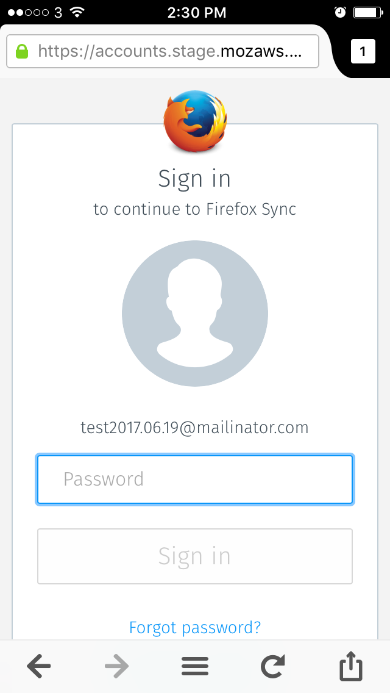

# Connect another device, phase 3: deep link with pre-filled email address

We want to further reduce barriers
to connecting another device after account registration,
by making the Firefox installation link that is sent to users via SMS
open the browser on the FxA sign-in page
with their email address pre-filled.

* [Ubiquitous language](#ubiquitous-language)
* [Hypothesis](#hypothesis)
* [Metrics](#metrics)
* [User flow](#user-flow)
* [Implementation](#implementation)
  * [Content server](#content-server)
  * [Auth server](#auth-server)
  * [Auth database](#auth-database)
  * [Mobile clients](#mobile-clients)
  * [Mock-ups](#mock-ups)
* [Test plan/acceptance criteria](#test-planacceptance-criteria)
* [Open questions](#open-questions)

## Ubiquitous language

* Connect another device:
  The feature whereby,
  after creating an account,
  users are ushered through an expedited flow
  to install Firefox on a mobile device
  and connect it to Sync.

* Deep link:
  An app store link for installing Firefox on a mobile device
  and connecting it to Sync.
  The link redirects through Adjust,
  which is a third-party service that handles
  all of the redirection magic.

* signinCode:
  A single-use, time-limited, URL-safe, base64-encoded 8-byte code,
  which can be exchanged in return for a user's primary email address.

## Hypothesis

More users will sign in to Sync on their mobile device
if we pre-fill the sign-in form with their email address.

## Metrics

We will know our hypothesis to be true
if the percentage of completed flows continued from treatment group flows
is greater than the percentage of completed flows continued from control group flows.
This is measured by the following redash query:

* https://sql.telemetry.mozilla.org/queries/4808

As a secondary signal, we should also see an increase
in the percentage of Sync users who become multi-device
within 2 days of creating an account:

* https://sql.telemetry.mozilla.org/queries/5469

These metrics and any others that are relevant
will be tracked by charts on the following dashboard:

* https://sql.telemetry.mozilla.org/dashboard/fxa-connect-another-device-phase-3

## User flow

1. User signs up for an account in desktop Firefox.

2. If the user is in a supported region,
   they are shown a screen that asks for their mobile phone number
   to continue with setting up Sync on the device.

3. User enters phone number and submits the form.

4. User receives an SMS message
   containing a link of the form
   `https://<server>/m/:signinCode`.

5. User clicks the link
   and is taken to the appropriate app store
   if Firefox is not installed on the device.
   If Firefox is already on the device,
   it is opened instead
   and the installation step is skipped.

6. User installs Firefox on their device.

7. User opens Firefox and is taken to the FxA sign-in screen,
   with their email address pre-filled.

8. User signs in and their device is connected to Sync.

## Implementation

### Content server

* A `features` parameter will be submitted to `POST /sms`,
  containing the value `[ "signinCodes" ]`.

* An endpoint will be added for redirecting users through Adjust
  to the appropriate app store, `GET /m/:signinCode`.

* The sign-in screen will read the `signin` query parameter
  and submit the value to `POST /signinCodes/consume`.
  The email address in the sign-in form will be prefilled
  using the response from that request.
  If the request fails for any reason,
  the user will not see any errors.
  Instead they can just continue signing in
  by typing in their email address themselves.

### Auth server

* If the `signinCodes` feature is specified to `POST /sms`,
  the SMS message will include a different URL
  using the content server's `/m/:signinCode` redirection endpoint
  and a freshly-created signinCode.

* A `POST /signinCodes/consume` endpoint will be added,
  which takes a signinCode and returns an email address.
  If the signinCode is invalid, the request will fail.

### Auth database

* A signinCodes table will be added,
  containing the columns `signinCode`, `uid` and `createdAt`.

* A `PUT /signinCodes/:signinCode` endpoint will be added,
  which writes a signinCode to the database.
  A signinCode will be valid for two days
  from the time at which it is created.

* A `POST /signinCodes/:signinCode/consume` endpoint will be added,
  which removes valid signinCodes from the database
  and returns the appropriate email address.

* As part of the existing token-pruning loop,
  signinCodes that are older than three months
  will be expunged.

### Mobile clients

* Support will be added for deep linking via Adjust.
  This includes all of the special magic
  for redirecting to the app store
  and propagating signinCodes to the FxA sign-in screen.

### Mock-ups

When the `/signin` page is opened with a valid signinCode, the email address
will not be editable.

### Test plan/acceptance criteria

Reference images are below each OS section.

signinCodes are disabled by default and can be enabled by opening the signup
verification link with the `signinCodes=true` query parameter. Note, sending
SMS is only available during the signup flow, signing into an existing account
will not trigger the flow.

#### Android

##### Testing without support for deep links in Firefox for Android

Support for deep linking and signinCodes has not yet landed in the release
channels of Firefox for Android. Until support lands, we have to manually open
the deep link.

###### Sign up in Firefox desktop, send link to Android, Firefox not installed

1. Using Firefox desktop, sign in to Sync by creating a new Firefox Account using a
   mozilla or softvision address.
2. In the same instance of Firefox desktop, open the verification link with
   the `&signinCodes=true&forceExperimentGroup=treatment` query parameters.
3. Enter a valid phone number for an Android device, submit.
4. Open the SMS link on an Android device. The link will be of the form `https://<server>/m/:signinCode`, write down the `signinCode`.
5. The Google Play store will open. Click the `Install` button.
6. Firefox should install. When complete, click `Open`.
7.  Firefox will open to the Firefox for Android firstrun page
6. Open Firefox, open `https://<server>/signin?context=fx_fennec_v1&service=sync&signin=<signinCode from step 4>`
7. When opening Firefox Accounts, email address from step 1 should be filled in.
8. Sign in with the password from step 1.

###### Sign up in Firefox desktop, send link to Android, Firefox already installed.

1. Using Firefox desktop, sign in to Sync by creating a new Firefox Account using
   a mozilla or softvision address.
2. In the same instance of Firefox desktop, open the verification link with
   the `&signinCodes=true&forceExperimentGroup=treatment` query parameters.
3. Enter a valid phone number for an Android device, submit.
4. Open the SMS link on an Android device. The link will be of the form `https://<server>/m/:signinCode`, write down the `signinCode`.
5. Firefox should open.
6. Open a tab to `https://<server>/signin?context=fx_fennec_v1&service=sync&signin=<signinCode from step 4>`
7. When opening Firefox Accounts, email address from step 1 should be filled in.
8. Sign in with the password from step 1.

##### Testing with support for deep links in Firefox for Android

###### Sign up in Firefox desktop, send link to Android, Firefox not installed

1. Using Firefox desktop, sign in to Sync by creating a new Firefox Account using
   a mozilla or softvision address.
2. In the same instance of Firefox desktop, open the verification link with
   the `&signinCodes=true&forceExperimentGroup=treatment` query parameters.
3. Enter a valid phone number for an Android device, submit.
4. Open the SMS link on an Android device.
5. Install Firefox from the Google Play store.
6. Open Firefox, complete the "firstrun flow".
7. Firefox Accounts should open, email address from step 1 should be filled in.
8. Sign in with the password from step 1.

###### Sign up in Firefox desktop, send link to Android, Firefox already installed.

1. Using Firefox desktop, sign in to Sync by creating a new Firefox Account using
   a mozilla or softvision address.
2. In the same instance of Firefox desktop, open the verification link with
   the `&signinCodes=true&forceExperimentGroup=treatment` query parameters.
3. Enter a valid phone number for an Android device, submit.
4. Open the SMS link on an Android device.
5. Firefox should open to the firstrun flow. Complete the "firstrun flow".
6. Firefox Accounts should open, email address from step 1 should be filled in.
7. Sign in with the password from step 1.

##### Reference Images

###### Send SMS

###### SMS received
Image needed

###### Install Firefox

###### Open Firefox

###### Firstrun
Image needed

##### Signin page with valid signinCode

#### iOS

##### Testing without support for deep links in Firefox for iOS

Support for deep linking and signinCodes has not yet landed in the release
channels of Firefox for iOS. Until support lands, we have to
manually open the deep link.

###### Sign up in Firefox desktop, send link to iOS, Firefox not installed

1. Using Firefox desktop, sign in to Sync by creating a new Firefox Account using
   a mozilla or softvision address.
2. In the same instance of Firefox desktop, open the verification link with
   the `&signinCodes=true&forceExperimentGroup=treatment` query parameters.
3. Enter a valid phone number for an iOS device, submit.
4. Open the SMS link on an iOS device. The link will be of the form `https://<server>/m/:signinCode`, write down the `signinCode`.
5. Safari will open and a dialog will ask `Open this page in "App Store"?` Touch `Open`.
6. The Apple app store will open to the Firefox page. Click the install button.
7. Firefox should install. When complete, click `Open`.
8. Firefox will open to the Firefox for iOS firstrun page. Click `Start Browsing`.
9. Open a tab to `https://<server>/signin?context=fx_ios_v1&service=sync&signin=<signinCode from step 4>`
10. When opening Firefox Accounts, email address from step 1 should be filled in.
11. Sign in with the password from step 1.
12. The user will be unable to sign in, even if entering the correct password from
   step 1 because Firefox for iOS will not be listening for messages from FxA.

###### Sign up in Firefox desktop, send link to iOS, Firefox already installed

1. Using Firefox desktop, sign in to Sync by creating a new Firefox Account using
   a mozilla or softvision address.
2. In the same instance of Firefox desktop, open the verification link with
   the `&signinCodes=true&forceExperimentGroup=treatment` query parameters.
3. Enter a valid phone number for an iOS device, submit.
4. Open the SMS link on an iOS device. The link will be of the form `https://<server>/m/:signinCode`, write down the `signinCode`.
5. Safari will open and a dialog will ask `Open this page in "App Store"?` Touch `Open`.
6. The Apple app store will open to the Firefox page. Click `Open`.
7. Firefox should open.
8. Open a tab to `https://<server>/signin?context=fx_ios_v1&service=sync&signin=<signinCode from step 4>`
9. When opening Firefox Accounts, email address from step 1 should be filled in.
10. The user will be unable to sign in, even if entering the correct password from
   step 1 because Firefox for iOS will not be listening for messages from FxA.

##### Testing with support for deep links in Firefox for iOS

###### Sign up in Firefox desktop, send link to iOS, Firefox not installed

1. Using Firefox desktop, sign in to Sync by creating a new Firefox Account using
   a mozilla or softvision address.
2. In the same instance of Firefox desktop, open the verification link with
   the `&signinCodes=true&forceExperimentGroup=treatment` query parameters.
3. Enter a valid phone number for an iOS device, submit.
4. Open the SMS link on an iOS device.
5. Safari will open and a dialog will ask `Open this page in "App Store"?` Touch `Open`.
6. The Apple app store will open to the Firefox page. Click the install button.
7. Firefox should install. When complete, click `Open`.
8. Firefox will open to the Firefox for iOS firstrun page. Complete the firstrun flow.
9. Firefox Accounts should open, email address from step 1 should be filled in.
10. Sign in with the password from step 1.

###### Sign up in Firefox desktop, send link to iOS, Firefox already installed

1. Using Firefox desktop, sign in to Sync by creating a new Firefox Account using
   a mozilla or softvision address.
2. In the same instance of Firefox desktop, open the verification link with
   the `&signinCodes=true&forceExperimentGroup=treatment` query parameters.
3. Enter a valid phone number for an iOS device, submit.
4. Open the SMS link on an iOS device.
5. Safari will open and a dialog will ask `Open this page in "App Store"?` Touch `Open`.
6. The Apple app store will open to the Firefox page. Click `Open`.
7. Firefox will open to the Firefox for iOS firstrun page. Complete the firstrun flow.
8. Firefox Accounts should open, email address from step 1 should be filled in.
9. Sign in with the password from step 1.

##### Reference Images

###### Send SMS

###### SMS received

###### Adjust link in Safari

###### Install Firefox

###### Open Firefox

###### Firstrun

##### Signin page with valid signinCode

#### Invalid signinCodes

If a signinCode is modified in transit, opening the signinCode should not
stop the user from signing in. The user will see no error message, and will
be able to signin by entering their email and password.

#### Opening a link with a signinCode twice

A signinCode is single use. Attempts to re-use a signinCode will be ignored. The
user will see no error message, and will be able to signin by entering their
email and password.

## Open questions

* What happens if a user
  with an old version of Firefox installed on their device,
  without support for deep links,
  dismisses the app store?

