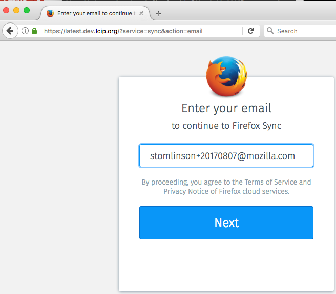

# Email first flow

We want to reduce the cognitive load required
to authenticate with Firefox Accounts by
minimizing the amount of UI presented to
users when FxA is first opened.

* [Problem statement](#problem-statement)
* [Hypothesis](#hypothesis)
* [Metrics](#metrics)
* [User flow](#user-flow)
* [Implementation](#implementation)
  * [Content server](#content-server)
  * [Mock-ups](#mock-ups)
* [Test plan/acceptance criteria](#test-planacceptance-criteria)

## Problem statement

When signing into FxA for Sync, users that do
not have an account are confused when sent to
the /signin page, users that have an account
are confused when sent to the /signup page.

## Hypothesis

By asking the user only for their email address
and redirecting them to the appropriate page
(/signin or /signup), we will see a greater
percentage of users complete both flows.

## Metrics

We will know our hypothesis to be true if the percentage of completed flows from the treatment
group flows is greater than the percentage of
completed flows from the control group flows.
This is measured by the following redash query:

* TODO - redash query needed

## User flow

1. Users that open FxA to authenticate to Sync are
asked to enter their email address.

2. If the email address is not registered, send the
user to /signup. The email address from step `1`
is pre-filled. The user will need to enter a
password, a verification password, and their age
to continue.

3. If the email address is already registered, send
the user to /signin. The user will only need to
enter their password to continue.

Step `1` is the new step in this flow. The control
group is immediately sent to /signin or /signup.

## Implementation

### Content server

This is a content server only feature.

Instead of opening FxA to `/signin` or `/signup`,
users will instead be sent to `/`. On `/`,
UI is displayed for the user to enter their
email address. A call to `/account/status` on
the auth-server determines whether the email
address is registered.

If the address is registered, the user is sent to
`/signin`. This applies to addresses that are
registered but not verified.

If the address is not registered, the user is sent
to `/signup`.

On both `/signin` and `/signup`, the email field is
not editable. Clicking on the email field sends the
user back to `/` where the email address can be
modified. This decision was made to simplify
the logic on both the signin and signup pages. Corner cases such as signing in from the signup page and handling unregistered addresses on the signin page have resulted in a large amount of code complexity for both pages.

### Mock ups

#### Enter email (`/`)

#### Email entered (`/`)

#### Signup (`/signup`)

#### Signin (`/signin`)

### Test plan/acceptance criteria

#### A fresh Firefox profile

##### Signup

1. Using a fresh Firefox 55+ profile, open FxA to `/` with the following query parameters: `?service=sync&context=fx_desktop_v3&action=email`
2. Enter an email address that has not been registered, submit.
3. User should be redirected to `/signup` where the first password field should be focused.
4. Clicking on the email field redirects back to `/`, where the email address should be
  prefilled and the email field focused.
5. Submit again, user is again redirected to `/signup`.
6. Enter the same password, verification password, and an age >= 13, submit.
7. User is taken to `/choose_what_to_sync`. Do not verify (yet).

##### Signin with an unverified address.

1. Using a fresh Firefox 55+ profile, open FxA to `/` with the following query parameters: `?service=sync&context=fx_desktop_v3&action=email`
2. Enter the email address from [signup->step 2](#signup), submit.
3. User should be redirected to `/signin` where the password field should be focused.
4. Clicking on the email field redirects back to `/`, where the email address should be
  prefilled and the email field focused.
5. Submit again, user is again redirected to `/signin`.
6. Enter the same password from [signup->step 6](#signup), submit.
7. User is taken to `/confirm`. Verify the email address.

##### Signin with a verified address.

1. Using a fresh Firefox 55+ profile, open FxA to `/` with the following query parameters: `?service=sync&context=fx_desktop_v3&action=email`
2. Enter the email address from [signup->step 2](#signup), submit.
3. User should be redirected to `/signin` where the password field should be focused.
4. Enter the same password from [signup->step 6](#signup), submit.
5. Complete the signin flow (user may be asked to confirm or unblock signin).

#### A Firefox profile where a user is already signed into Sync.

1. Using a Firefox 55+ profile where a user is already signed into Sync, open FxA
to `/` with the following query parameters: `?service=sync&context=fx_desktop_v3&action=email`
2. User is redirected to `/settings`

## Results

1. **Signup / Registration** Throughout the experiment the treatment group converted at a rate of 17.3% while the control group converted at a rate of 17.0%. This was **not** a statistically significant difference in Sign-up rates. **After** completing the initial email first steps, treatment users did convert at a rate of 35.7% but that was not enough to make a difference in the overall numbers.

2. **Signin** The treatment group logged in with a rate of 41.7% with the control rate at 46.6%. This difference **was** statistically significant, suggesting that the control group had the better login rate. Of treatment users who did complete the email step, 86.5% eventually logged in, however this was not enough to make up for the loss due to the extra step.

**Main Conclusion**: Overall, the experiment had no effect on registration rates and decreased login rates. However, the conversion numbers for treatment users that did complete the email step are encouraging.
If we can find a way to make up for those that drop-off before getting to the password entry, then we there may be a way to salvage this. However for the time being we should stick with the original non-email-first flow.
