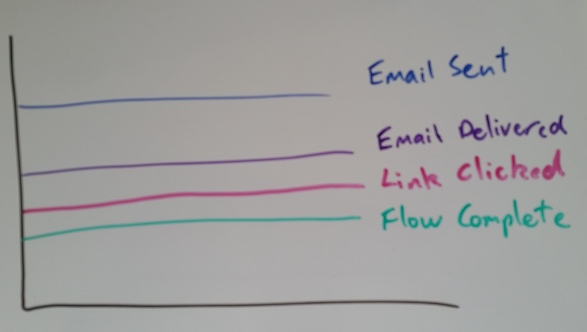
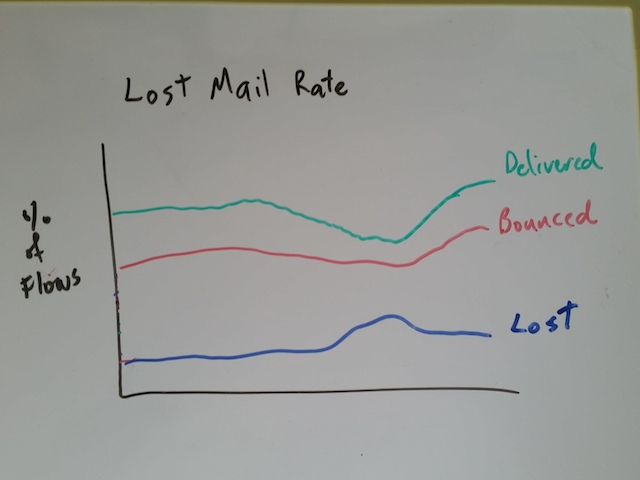
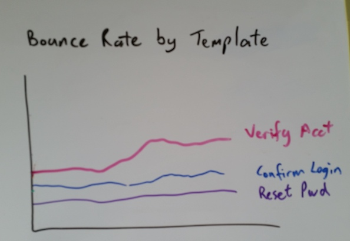
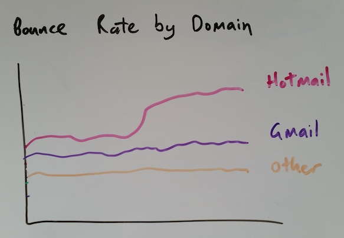

# Email Deliverability (FxA-56)

Feature card: https://github.com/mozilla/fxa-features/issues/56

## Problem Summary

Users regularly report email deliverability issues with Firefox Accounts,
and we do not have sufficient visibility into
the common causes of email bounces
to detect or debug them.

----

## Outcomes

To have better metrics and logging around our email delivery,
so we can judge the effectiveness of any attempts to improve
our delivery rate.

To try one simple tactic for improving email deliverability
and measure whether it is successful.

## Hypothesis

If we add email deliverability metrics to FxA then
**we can take a data-driven approach to improving email deliverability**
of the authentication system.

If we avoid sending additional emails to addresses that are known to bounce then
**our "sender reputation" wth popular email providers will improve**
and hence our email deliverability will improve.

## Metrics

The following metrics will be used
to understand and debug email deliverability:

### Completion Rate for Email Flows

For flows that result in an email being sent,
we will produce a flow funnel graph
showing the rate of dropoff for the following events:

* The email being successfully delivered by SES
* The link in the email being clicked
* The flow completing

The graph will look something like this:

This will help us to know what percentage of flows
fail to due email delivery issues.

Future attempts to improve email deliverability
can be judged successful
if they improve this completion rate.

### Lost Mail Rate for Email Flows

For flows that result in an email being sent,
we will produce a graph showing the percentage for which:

* We receive a successful delivery notification from SES
* We receive a bounce notification from SES
* we receive no further information about delivery

The graph will look something like this:

This will help us to know whether deliverability issues
are caused by issues downstream, upstream, or inside of SES.

### Bounce and complaint rate by template

We will produce a graph showing the number of bounce notifications per day,
as a percentage of the number of emails sent that day,
broken down by email template name.
It will look something like this:

We will produce a similar graph for complaint notifications.

This will help us to determine if any particular type of email
is more likely to be rejected, which may indicate some sort of
email-content-related issue.

### Bounce and complaint rate by domain

We will produce a graph showing the number of bounce notifications per day,
as a percentage of the number of emails sent that day,
broken down by email domain.
It will look something like this:

We will produce a similar graph for complaint notifications.

This will help us to determine if we're having deliverability issues
with a specific provider, which will aid in debugging.

----

## Detailed design

We will implement the following different parts 
to help us debug our email deliverability problems:

* [ ] Add flow events for email bounce notifications from SES
* [ ] Add flow events for email complaint notifications from SES
* [ ] Add flow events for email delivery notifications from SES
* [ ] Add top-N domain bucketing to email bounce and complaint event logs
* [ ] Create the "completion rate for email flows" dashboard
* [ ] Create the "lost mail rate for email flows" dashboard
* [ ] Create the "bounce rate by template" dashboard
* [ ] Create the "complaint rate by template" dashboard
* [ ] Create the "bounce rate by domain" dashboard
* [ ] Create the "complaint rate by domain" dashboard

To support reporting of bounce rate by domain
while respecting user privacy,
we will identify a short list of the most popular domains.
Events for email addresses outside of this list
will be grouped together as an "other" category.

With these metrics in place we will try
one simple tactic for improving deliverability -
rejecting further emails to addresses that have recently bounced.
This should improve our sender reputation
and also give the user more opportunity
to correct an incorrectly-entered email address.

We will implement this by:

* [ ] Maintain a database table of all bounce and complain notifications,
      keyed by email address.
* [ ] Expire entries from the bounced-emails table after 1 week.
* [ ] When a user requests email be sent to an address that had a soft
      bounce notification in the last 5 minutes, return a new "soft failure"
      error code and show appropriate messaging.
* [ ] When a user requests email be sent to an address that had a hard
      bounce notification in the last 24 hours, return a new "hard failure"
      error code and show appropriate messaging.
* [ ] When a user requests email be sent to an address that had a complaint
      notification in the last 24 hours, return a new "complaint received"
      error code and show appropriate messaging.
* [ ] Add a new "status" field to the output of `/v1/recovery_email/status`
      to reflect the soft-bounce, hard-bounce, and complain states above,
      along with the existing implicit "verified" and "unverified" states.
* [ ] Update client logic that polls for email status, to detect the new
      status field and show appropriate messaging.

----

## Results

(TBA: Added after the metrics phase)

## Conclusion

(TBA: Added after the metrics phase)

## Next Steps

(TBA: Added after the metrics phase)
