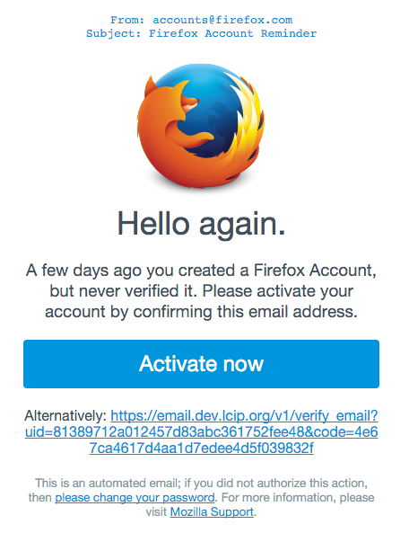

Verification Reminder Email Specification
======================

https://mozilla.aha.io/features/FXA-57

As a new Firefox Accounts user,
 I have signed up for an FxA account when **setting up sync**, but did not verify my email.
 
 I should get 2 email reminders that will ask me to verify my email.
 
 The first email arrives after 48 hours since sign up.
 
 The second email arrives after 168 hours since sign up.

## Success criteria

We are planning to get the results from the following metrics:

- Measure number of people that verify using the first email and second email.
We would use the total number of emails sent vs verified.
We will calculate success based on the verification percentage from number of emails we sent as part of
 verification reminders.

- The ultimate measure of success for this feature is if the user connects to sync.
We will use the retention metrics pipeline to measure "account.signed" events that happened
 after the user **acted on**  "verification reminder" emails.

## Basic Email Template

> This is just a visual guide, please see detailed email content below

## Email 1

### Subject: Firefox Account Reminder
### Header: Hello again.

### Content:

A few days ago you created a Firefox Account, but never verified it.
A verified account lets you access your tabs, bookmarks, passwords and
 history on any device connected to it.
Simply confirm this email address to activate your account.

## Email 2

### Subject: Firefox Account Verification Required
### Header: Still there?

### Content:

A week ago you created a Firefox Account, but never verified it. We’re worried about you.
Firefox is available for Windows, Mac, Linux, Android and iOS.
You can sync your Firefox passwords, bookmarks and history across all of them.
Confirm this email address to activate your account and let us know you're okay.

## Updates

### Update 1 - February 16, 2016

- Added subject lines into the spec.
