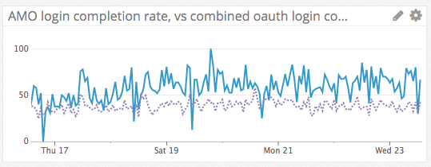
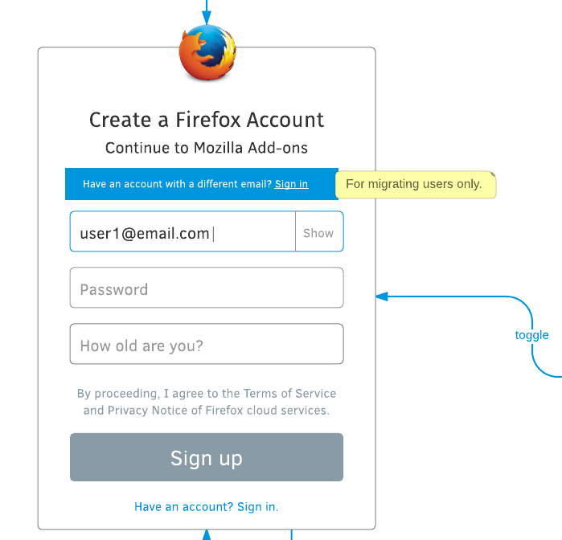

Migration support for [AMO](https://addons.mozilla.org/)
========================================================

https://mozilla.aha.io/features/FXA-71

## Stories

As a developer of addons.mozilla.org,
I want to migrate user logins from site-specific passwords
to Firefox Accounts,
so that users have fewer credentials to remember
across Mozilla's online properties.

As an existing user of addons.mozilla.org,
I want to clearly understand how and why
I should migrate to a Firefox Account,
so I can continue using the site
with minimal interruption.

## Measuring Success

We will measure success of this feature
by tracking whether users are successful
at completing the migration.
The key metric will be
the number of users who successfully sign in or sign up,
as a percentage of the number of users
who enter the FxA login flow from AMO.

These metrics are already available
since we track them for other reliers.
The specific query in datadog will be:

* `login-attempts` = `fxa.content.screen.oauth.signin` + `fxa.content.screen.oauth.signup`
* `successful-logins` = `fxa.content.screen.oauth.signin.success` + `fxa.content.screen.oauth.signup.success`
* `completion-rate` = 100 * `successful-logins` / `login-attempts`

## Outcomes

We shipped all outstanding work for this feature
as of FxA train-58,
which was shipped to production on 15 March 2016.
As of the 23rd of March
the completion rate for AMO logins is around 60%,
while the combined completion rate for all oauth reliers
is around 40%:

Ongoing metrics can be viewed at the
[datadog dashboard](https://app.datadoghq.com/dash/110231/fxa-content-server---amo)
for the AMO integration.

## UX Mocks

The overall UX for the migration flow
was originally specified in https://github.com/mozilla/addons/pull/9.
This feature captures the FxA-specific components
so that we can properly manage and track their implementation.

Three changes to our existing flows are required.

### Migration indicator

For users landing on the signup page
from the AMO migration flow,
we should show a highlight to inform them
that they can use an existing account
if they have one:

### Permission prompt

As part of the OAuth login flow,
we should prompt the user for permission
to share their display-name and/or avatar with AMO,
if they have that information in their profile:

If the user has not set a display name or avatar,
then that item should not appear in the prompt.

### Smart signin/signup chooser

AMO will provide the email address of an existing user
when redirecting to Firefox Accounts
for the migration flow.
We should show the sign-in page
when there is an existing account for that email,
and the sign-up page when there is not.

The provided email address
should be pre-filled in the form
in both cases.

## Implementation details

### Migration indicator

In order to trigger the additional migration indicator,
AMO should include `migration=amo` as a query parameter
when beginning the OAuth login flow.

In fxa-content-server,
we will generalize the existing handling
of the `migration` query parameter
from the sync relier model,
so that all reliers can import and report
the source of a migration.
We will also change the migration messaging
from its current sync-specific text
to the more generic version in the UX mocks above.

### Permission prompt

Since AMO is a trusted relier,
and fxa-content-server does not show the permissions prompt
to trusted reliers by default,
AMO will need to explicitly request that the prompt be shown.

We will adopt the `prompt=consent` query parameter
from [OpenID Connect](http://openid.net/specs/openid-connect-core-1_0.html#AuthRequest)
to allow them to request it explicitly.

AMO should include `prompt=consent` as a query parameter
when beginning the OAuth login flow.
This will trigger fxa-content-server to show the permission prompt
regardless of the trusted status of the relier.

When showing the permission prompt
the content-server should follow the steps below
to determine what scopes to grant.
The steps do not apply
if the permission prompt will not be displayed.

* Check and normalize the requested scope:
  * If it is "profile" then replace it with
    "profile:uid profile:email profile:display_name profile:avatar".
  * If it contains some subset of the above profile sub-scopes
    then leave it as is.
  * If it contains any other value then error out,
    as we cannot yet prompt for consent for other scopes.
* If the request includes `access_type=offline` in the query parameters
  then error out,
  as we cannot yet prompt for consent to offline access.
* If this is a new user signup,
  they cannot yet have set any profile data,
  so remove "profile:display_name" and "profile:avatar"
  from the requested scope.
* If this is an existing user signin,
  query fxa-profile-server to determine
  what profile data the user has available.
  * If they have not set a display name,
    remove "profile:display_name" from the requested scopes.
  * If they have not set a profile picture,
    remove "profile:avatar" from the requested scopes.
* Display the permission prompt
  as shown in the UX mocks above,
  including all and only the items that are
  still referenced by the requested scope.

This process will ensure that
the user is not prompted to share information
that the relier has not requested,
or that they have not made available in their profile.
It will also ensure that the granted token
does not include any permissions
that were not explicitly consented to by the user.

### Smart signin/signup chooser

To intelligently choose whether to show
the sign-up or sign-in page,
we must expose an endpoint on fxa-auth-server
that will indicate whether an account exists
for a given email.

We will expand the existing `/v1/account/status` endpoint for this purpose.
Requesting `/v1/account/status?email=<email>`
will return a JSON response
with `{"exists": true}` if an account exists for that email
and `{"exists: false}` otherwise.

Unfortunately this API leaks information
about what accounts exist on the server,
but this is a tradeoff we've already made
in exchange for better usability
in other parts of the system.
We will depend on rate-limiting
and other operational security measures
to guard against large-scale crawling
of our accounts database.

When fxa-content-server receives a request
for the root `/oauth/` view with an `email=` query parameter,
it will first check browser local state
to see whether that user exists on the current machine.
If not, if will call the above API on fxa-auth-server
to determine whether an account already exists,
and show the sign-in page if so
or the sign-up page if not.

## Work breakdown

* [x] Implement generalized migration indicator in fxa-content-server.
* [x] Add support and tests for `prompt=consent`
      in fxa-oauth-server redirection endpoint.
* [x] Implement UX for `profile:display_name`
      and `profile:avatar` permission prompt.
* [x] Implement `prompt=consent` and scope restriction support
      in fxa-content-server.
* [x] Add support for query by email address in `/v1/account/status`
      in fxa-auth-server.
* [x] Enhance rate-limiting support for `/v1/account/status`
      in fxa-customs-server.
* [x] Add logic to fxa-content-server to query account status
      when no signup/signin action is explicitly requested.
* [x] Coordinate with AMO developers to send appropriate query params
      once the features are in production.
