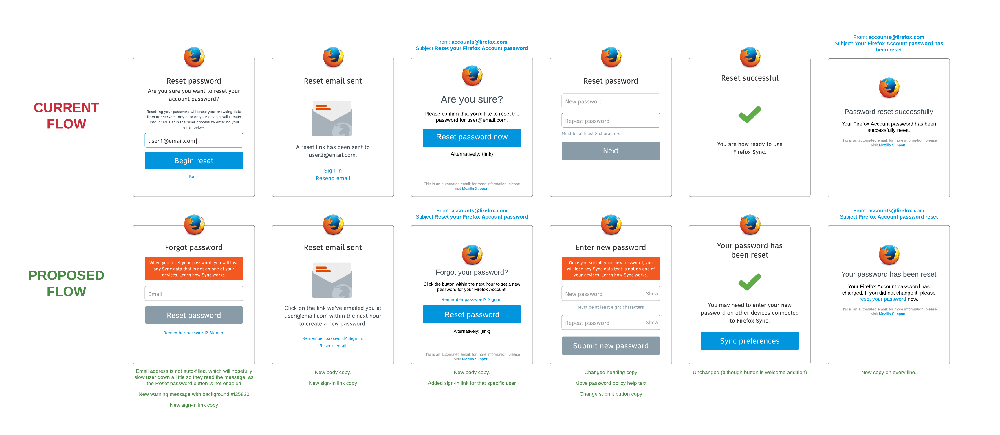
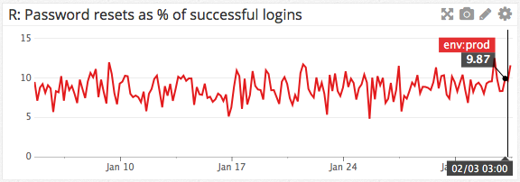

Reset Password
==============

https://mozilla.aha.io/features/FXA-72

So that I can avoid inadvertently losing all my Sync data, as a forgetful Firefox Accounts user, I want to understand more clearly what will happen when I reset my password.

## Current/Proposed UX

([Static](https://cloud.githubusercontent.com/assets/68213/12796515/2cec6c90-ca8d-11e5-99da-4d511062c61c.png))

## Success Criteria

We will measure whether this messaging is successful
though a qualitative decrease in user support requests/complaints
related to data loss after password reset.

We will also monitor for any change in
the number of password resets as a percentage of successful logins
[as tracked in datadog](https://app.datadoghq.com/dash/92125/fxa-content-server---password-resets?live=true&page=0&is_auto=false&from_ts=1451695460137&to_ts=1454287460137&tile_size=m).
As at end of January 2016 this rate is around 10%:

If some users are encouraged to "try harder" to remember their password
as a result of this improved messaging,
then we may observe a decrease in this percentage.

