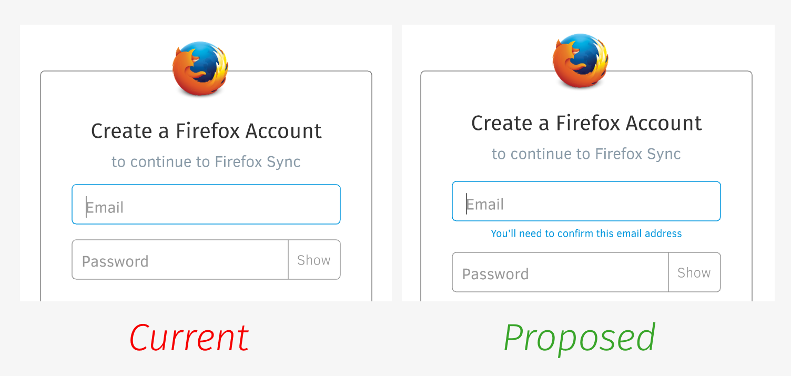
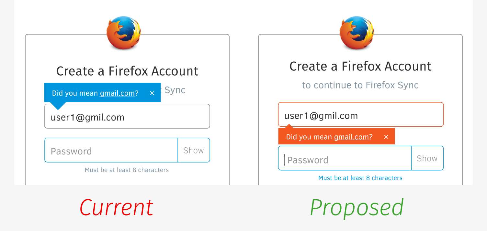
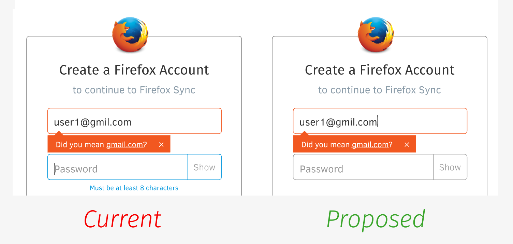

Mailcheck Experiment, Part 2
============================

https://mozilla.aha.io/features/FXA-79

So that I can avoid wasting my time,
as a confusable Firefox Accounts registrant,
I want it to be obvious that
the email I enter needs to be
one that I own and check.

## UX Mocks

This feature will be developed as an experiment
consisting of three UX treatments.

### Treatment 1: Helper Label

Beneath the email entry field,
display a small label informing the user
that they will need to confirm their address:

### Treatment 2: Improved warning label

Change the mailcheck warning label
to use an oragne "alert" colour
rather than the current blue "info" colour,
and move it beneath the email entry field
so that the user is more likely to see it:

### Treatment 3: Check before blur

Trigger the mailcheck logic
once the user has finished typing their email,
without waiting for them to change focus
to the password field.

Specifically, the check should trigger
under the following circumstances:

* When the value in the email field
  contains an "@" symbol
  and ends with a well-known TLD
  like ".com", ".net" or ".org".
* When the user removes focus
  from the input field.

## Metrics and Success Criteria

We will measure the performance
of each treament
against the existing signup experience
according to the following metrics:

* rate of successful verifications
  as a percentage of signups.
* rate of bounced emails
  as a percentage of signup attempts.
* number of users who interact with the mailcheck widget
  as a percentage of users for whom it is displayed.

## Open Questions

* Will we run each of these as an independent treatment,
  comparing each to the basline
  of the current experience?
  Or will we combine them for a given user?
* Does out metrics infrastructure
  support gather the data
  that we'll need to analyze for this experiment?
* Over what time period will we run the experiment?

## Work Breakdown

We'll need to:

* [ ] flesh out this feature card a little more :-)
* [ ] gather baseline metrics and snapshot them in this card
* [ ] implement each of the three treatments
* [ ] configure the able experiment to choose between them
* [ ] gather and review metrics at the end of the experiment

