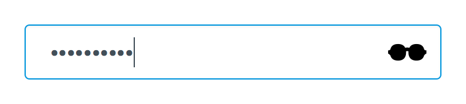
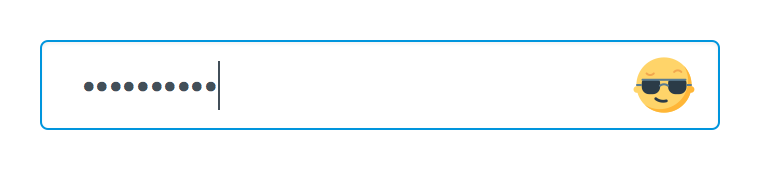
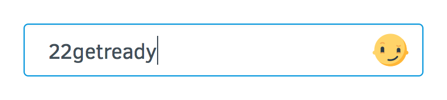
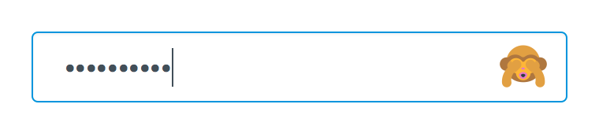
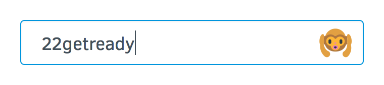
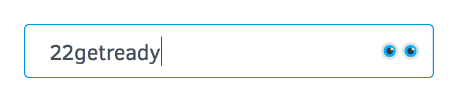

Eye Password Experiment
========================

https://mozilla.aha.io/features/FXA-80

Firefox Account users are struggling immensely when changing their passwords.


We would like to learn how we can help them struggle less by experimenting with different password unmasking treatments. We may use these results to inform a choice about unmasking passwords in platform.

# Control
Currently we use a simple “show” toggle. Both password field toggles are synchronized which we should remove this for the experiment (and permanently as filed in [#3600](https://github.com/mozilla/fxa-content-server/issues/3600)).


# Treatments
## No Show

Remove the unmasking functionality from both new and old password fields.


## Toggle

Likely more usable, but more revealing, is the toggle treatment. We should run this interaction with all of the available designs. Deprecated eye in animation for position only.


### Acceptance Criteria

* When the user hovers over the control and the password is masked, there should be a tooltip that says "Show password"
* When the user hovers over the control and the password is unmasked, there should be a (more subtle) link title on the control that says "Hide password"
* When the user clicks the control and the password is masked, the password becomes unmasked.
* When the user clicks the control and the password is unmasked, the password becomes masked.

## Press & Hold Down

Possibly more familiar to Windows users, we can only show the password when the user presses and holds down on the icon (deprecated eye in animation for position only)


### Acceptance Criteria

* When the user hovers over the control and the password is masked, there should be a tooltip on the eye that says "Show password".
* Windows-style: Only while the user is clicking the eye, does the password become unmasked.

# Affordances
### Checkbox


### Eyeball


The eye color matches our current smokey grey and blue colors.

### Shades




### Smiley






### Monkey





### Sunglasses





# Success Criteria

We will measure the show and hide actions as well as these errors (or create new ones) for both control and treatment groups.

```
Incorrect password
fxa.content.error.settings.change_password.auth.103

Your account has been locked for security reasons
fxa.content.error.settings.change_password.auth.121

UNEXPECTED_ERROR_MESSAGE
fxa.content.error.settings.change_password.auth.999

Working…
fxa.content.error.settings.change_password.auth.1005

Your new password must be different
fxa.content.error.settings.change_password.auth.1008

Must be at least 8 characters
fxa.content.error.settings.change_password.auth.1009

Valid password required
fxa.content.error.settings.change_password.auth.1010

Change Password section in Settings
fxa.content.screen.settings.change_password
```

# Assets
[Download password_svgs.zip](password_svgs.zip)
