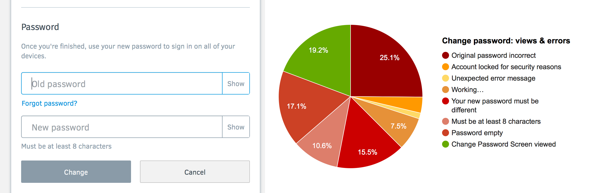
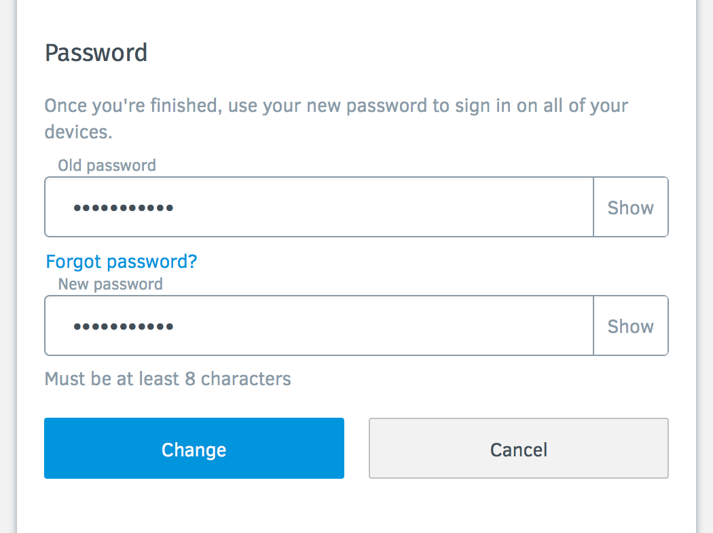
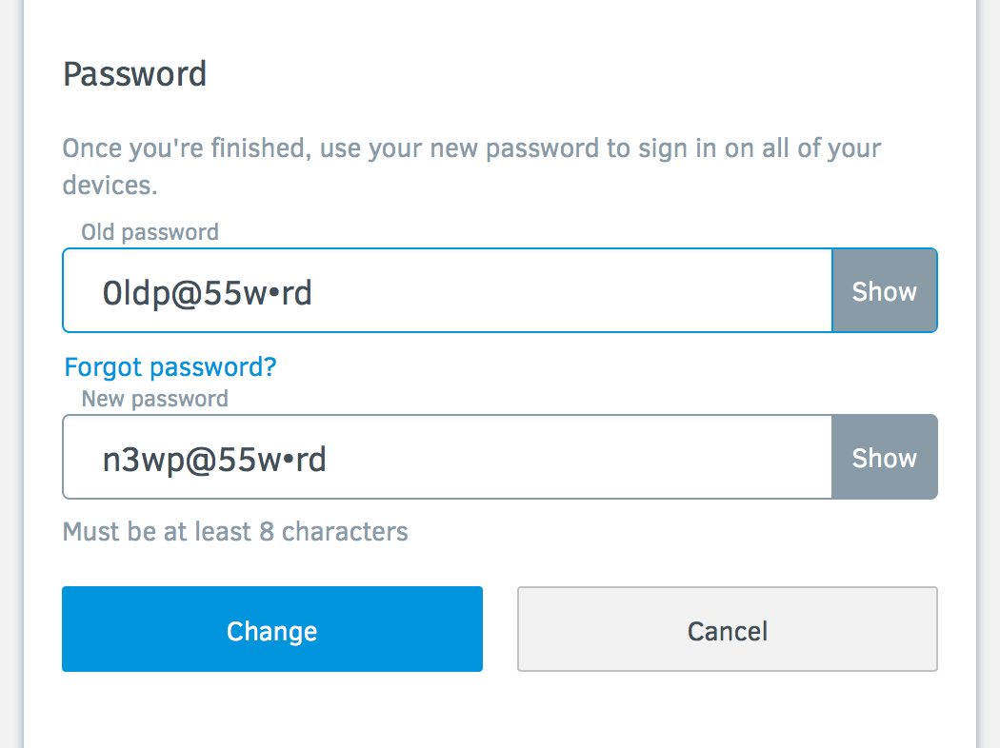
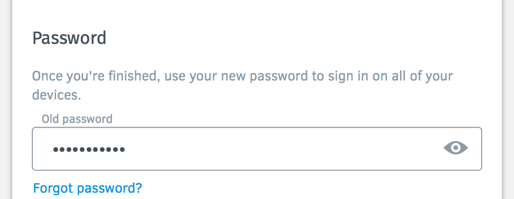
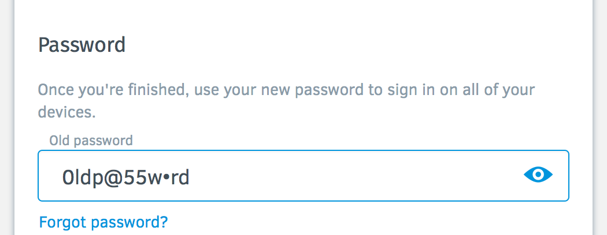

Eye Password Experiment
========================

https://mozilla.aha.io/features/FXA-80

Firefox Account users are struggling immensely when changing their passwords.



We would like to learn if users who show the password field are struggling less, and also learn if a new toggle style is more successful. We may use results to inform a choice about show password in platform.

## Control UX
Currently the show password toggles are synchronized. We should remove this for the experiment.





## Treatment UX

* When the user hovers over the eye icon and the password is masked, there should be a link title on the eye that says "Show password"
* When the user hovers over the eye icon and the password is unmasked, there should be a link title on the eye that says "Hide password"
* The eye color matches our current smokey grey and blue colors.
* When the user clicks the eye and the password is masked, the password becomes unmasked.
* When the user clicks the eye and the password is unmasked, the password becomes masked.





## Success Criteria

We will measure the show and hide actions as well as these errors (or create new ones) for both control and treatment groups.

```
Incorrect password
fxa.content.error.settings.change_password.auth.103

Your account has been locked for security reasons
fxa.content.error.settings.change_password.auth.121

UNEXPECTED_ERROR_MESSAGE
fxa.content.error.settings.change_password.auth.999

Working…
fxa.content.error.settings.change_password.auth.1005

Your new password must be different
fxa.content.error.settings.change_password.auth.1008

Must be at least 8 characters
fxa.content.error.settings.change_password.auth.1009

Valid password required
fxa.content.error.settings.change_password.auth.1010

Change Password section in Settings
fxa.content.screen.settings.change_password
```
