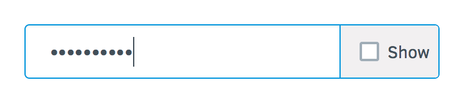
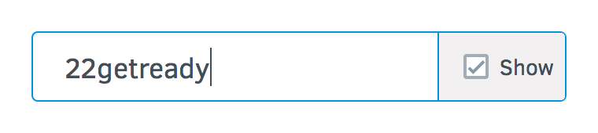
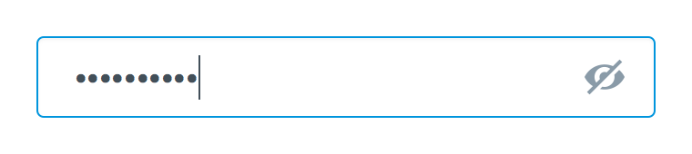
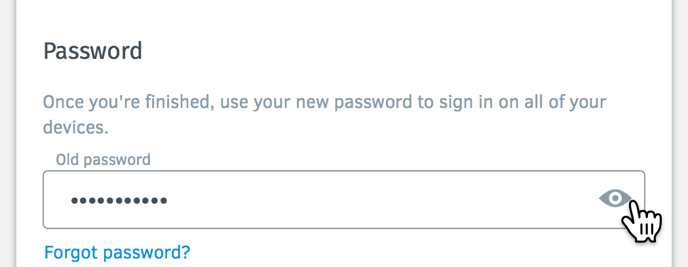

Eye Password Experiment
========================

https://mozilla.aha.io/features/FXA-80

Firefox Account users are struggling immensely when changing their passwords.


[View Live Chart](https://app.datadoghq.com/graph/embed?token=f39f21f7fb65ebbd224d49e88dd365b817e869d68d2a9e384f56e908e0df666b&height=500&width=1000&legend=true)

We would like to learn how we can help them struggle less by experimenting with different password unmasking treatments. We may use these results to inform a choice about unmasking passwords in platform.

# Control
Currently we use a simple “show” toggle. Both password field toggles are synchronized which we should remove this for the experiment (and permanently as filed in [#3600](https://github.com/mozilla/fxa-content-server/issues/3600)).


# Treatments
## Match 1 - Control vs. No Show

We believe that removing the unmasking functionality from both new and old password fields for people changing their passwords will achieve more errors and bounces. We will know this is true when we see an increase in bounces to the section, and Task Success errors outlined below.


## Match 2 - Control vs. Checkbox

We believe that adding a checkbox to the Show control for users changing their password
will achieve greater engagement. We will know this is true when we see this greater amounts of unmasking, entering a password, optionally hiding and then submitting the form.





## Match 3 - Checkbox vs. Eyeball

We believe that using an Eye icon with a tooltip to the Show control for users changing their password will achieve greater engagement. We will know this is true when we see this greater amounts of unmasking, entering a password, optionally hiding and then submitting the form.




The eye color matches our current smokey grey and blue colors. We should use use a tooltip so that users know what the eye does. The deprecated eye in animation for position only.


### Acceptance Criteria

* When the user hovers over the control and the password is masked, there should be a tooltip that says "Show password"
* When the user hovers over the control and the password is unmasked, there should be a (more subtle) link title on the control that says "Hide password"
* When the user clicks the control and the password is masked, the password becomes unmasked.
* When the user clicks the control and the password is unmasked, the password becomes masked.

## Match 4 - Toggle Eyeball vs. Press & Hold Down Eyeball

We believe that only showing the password on press à la Windows will achieve greater security without sacrificing performance. We will know this is true when the Task Success metrics below are the same or better as with Toggle. Deprecated eye in animation for position only.



### Acceptance Criteria

* When the user hovers over the control and the password is masked, there should be a tooltip on the eye that says "Show password".
* Windows-style: Only while the user is clicking the eye, does the password become unmasked.

## Match 5 - Checkbox vs. Unmasked Checkbox by Default

We believe that unmasking the Checkbox design by default for users changing their password will achieve greater task success and increased happiness. We will know this is true when we see an increase in bounces to the section, and Task Success errors outlined below. A radical proposal that we should probably only test with the **Checkbox** design.

### Acceptance Criteria

* The password fields are unmasked by default
* When the user hovers over the control and the password is unmasked, there should be a tooltip that says "Hide password"
* When the user hovers over the control and the password is unmasked, there should be a tooltip that says "Hide password"
* When the user clicks the control and the password is masked, the password becomes unmasked.
* When the user clicks the control and the password is unmasked, the password becomes masked.

# Success Criteria

We will measure the events relative to the views of the Change Password section.
```
Settings › Change Password
fxa.content.screen.settings.change_password
```

## Happiness
Our goal is for users to not be weirded out by unmasking passwords. A signal of them being weirded out is an increased bounce rate on the Change Password section (i.e. closed without any user interaction).

## Engagement
Our goal is for users to realize they can unmask their passwords. A signal for this is counting which design is used as intended most (unmasking, entering a password, optionally hiding and then submitting the form).

## Retention
Our goal is for users to better remember their password on subsequent visits. A signal for this is new users remembering their passwords more when logging in the first time.

## Task Success
Our goal is for users to better notice the password field. A signal for this is relatively fewer instances of the following error.
```
Valid password required
fxa.content.error.settings.change_password.auth.1010
```
Our goal is for users to enter the passwords correctly. A signal for this is fewer of the following errors:
```
Your new password must be different
fxa.content.error.settings.change_password.auth.1008

Must be at least 8 characters
fxa.content.error.settings.change_password.auth.1009

Incorrect password
fxa.content.error.settings.change_password.auth.103

Your account has been locked for security reasons
fxa.content.error.settings.change_password.auth.121
```

# Assets
[Download password_svgs.zip](password_svgs.zip)
