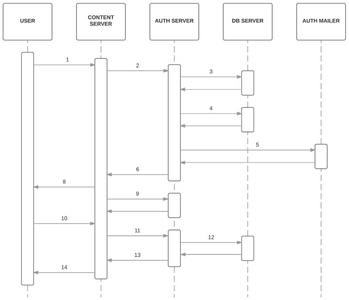

# Sign-in confirmation email

## Problem statement

It is possible for attackers
armed with a list of known email/password pairs
to maliciously access users’ Firefox Accounts.
In such cases,
attackers would have full access
to the user’s Sync data,
including passwords, history, bookmarks and
the ability to force-install malicious add-ons.

## Outcomes

If an attack occurs,
we would like fewer accounts to be compromised
without negatively impacting
the number of signed-in users
or our overall FxA engagement rate.

## Hypothesis

If we introduce an additional email confirmation step
for Sync sign-ins,
fewer accounts will be compromised.

We will know this to be true if,
in the event of an attack,
the number of successful sign-ins remains constant
and the count of 104 (unverified account) errors
from protected endpoints
increases in line with any wider increase in traffic.
Further, we can measure that
the confirmation step is not affecting
legitimate users
by monitoring the success rate
of connecting to Sync
before and after deployment.

## Constraints

* In light of the recent attack,
  the solution should be quick to implement.

* The solution must work across all clients,
  without patches landing in client code.

* The solution must not affect existing sessions
  from the user's point of view.

* The solution must work from
  regular Sync sign-in,
  `/force_auth` and
  when signing-in to Sync from `/signup`.

## Proposed solution

Add a notion of “verified”
to sessionTokens and keyFetchTokens.
Tokens that are unverified have reduced powers.
Token verification is achieved
by following a link sent by email.

### What happens when a user signs in?



1. User submits form.

2. Content server requests `POST /account/login?keys=true`.

3. Auth server generates `tokenVerificationId`
   and sends it with `tokenVerified:false`
   in request to `PUT /sessionToken/:tokenId`.

4. Auth server sends same `tokenVerificationId`
   and `tokenVerified:false`
   in request to `PUT /keyFetchToken/:tokenId`.

5. Auth server invokes the mailer
   to send a confirmation email,
   which includes `tokenVerificationId` in the URL.

6. Auth server sends response back to content server,
   including in the data:
   ```
   {
     "sessionToken": sessionTokenId,
     "keyFetchToken": keyFetchTokenId,
     "tokenVerified": false,
     "challengeReason": "signin",
     "challengeMethod": "email"
   }
   ```

7. Content server navigates to confirm-signin view.

8. Content server starts polling
   on `GET /token/:tokenId/status`.

9. User clicks link in confirmation email.

10. Content server requests `POST /token/verify`.

11. Auth server requests `POST /token/:tokenVerificationId/verify`.
    Both keys are verified in the database.

12. Concurrently:

    * Auth server responds to verification request,
      including verified tokens in the data.

    * Auth server changes polling request responses,
      including verified tokens in the data.

13. Content server navigates to settings view.

## User stories

* As a Sync user,
  when signing in to my Firefox Account,
  I want my identity confirmed
  via my email account.

* As a user of an OAuth relier,
  when signing in to my Firefox Account,
  I do not want an extra confirmation step.

## Work breakdown

### fxa-content-server

- [ ] Add strings to `strings.js`
  to get localization done quicker.
  This task is the highest immediate priority.
- [ ] Implement "confirm your email" screen.
- [ ] Implement confirmation landing screen.
- [ ] Add handling for `verified` and `challenge` fields
  in `/account/login` response.
- [ ] Add handling for 102 errors
  from `/certificate/sign`
  and `/account/keys` endpoints.

### fxa-auth-server

- [ ] Add method to `mailer.js`
  for sending confirmation email.
- [ ] Modify `/account/login`
  to send appropriate verification status to db,
  initiate verification email
  and set `challenge` on response.
- [ ] Modify `/account/create`, `/account/openid/login` and `/password/change/start`
  to always create their keys in the verified state.
- [ ] Create a `verifiedSessionToken`
  auth strategy for Hapi
  that fails with 102 (unverified user) error
  if sessionToken is not verified.
- [ ] Create a `verifiedKeyFetchToken`
  auth strategy for Hapi
  that fails with 102 (unverified user) error
  if keyFetchToken is not verified.
- [ ] In `/certificate/sign`,
  use new `verifiedSessionToken` auth strategy.
- [ ] In `/account/keys`,
  use new `verifiedKeyFetchToken` auth strategy.
- [ ] Add a `/token/verify` endpoint for token verification.
  The `tokenVerificationId` should be sent in the payload
  as `code`, for consistency with `/recovery_email/verify_code`.
- [ ] Modify the `/recovery_email/verify_code` endpoint
  to also verify tokens.
  This is in case an unverified user signs in,
  we need their comfirmation to verify everything.
- [ ] Modify the `/recovery_email/resend_status` endpoint
  to handle both account verification and token verification emails
  (and know the difference).

### fxa-auth-db-mysql

- [ ] Create `tokenVerifications` table
  and associated stored procedures.
- [ ] Update token-creation stored procedures
  to also insert into `tokenVerifications`
  as part of the same transaction.
- [ ] Update `PUT /sessionToken/:id` endpoint
  to accept verification state.
- [ ] Update `PUT /keyFetchToken/:id` endpoint
  to always create token unverified.
- [ ] Add `/token/:id/verify` endpoint for verifying tokens.
- [ ] Add stored procedure and endpoint
  that returns token joined to its `tokenVerifications` row
  for callers that need to check token verification state.

### fxa-auth-mailer

- [ ] Add confirmation email templates and methods

## Mock-ups

### Confirm this sign-in screen


### Confirmation email


### Sign-in confirmed screen

#### On the signed-in device


#### Off the signed-in device


