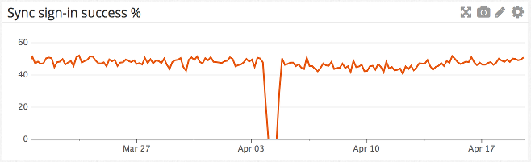
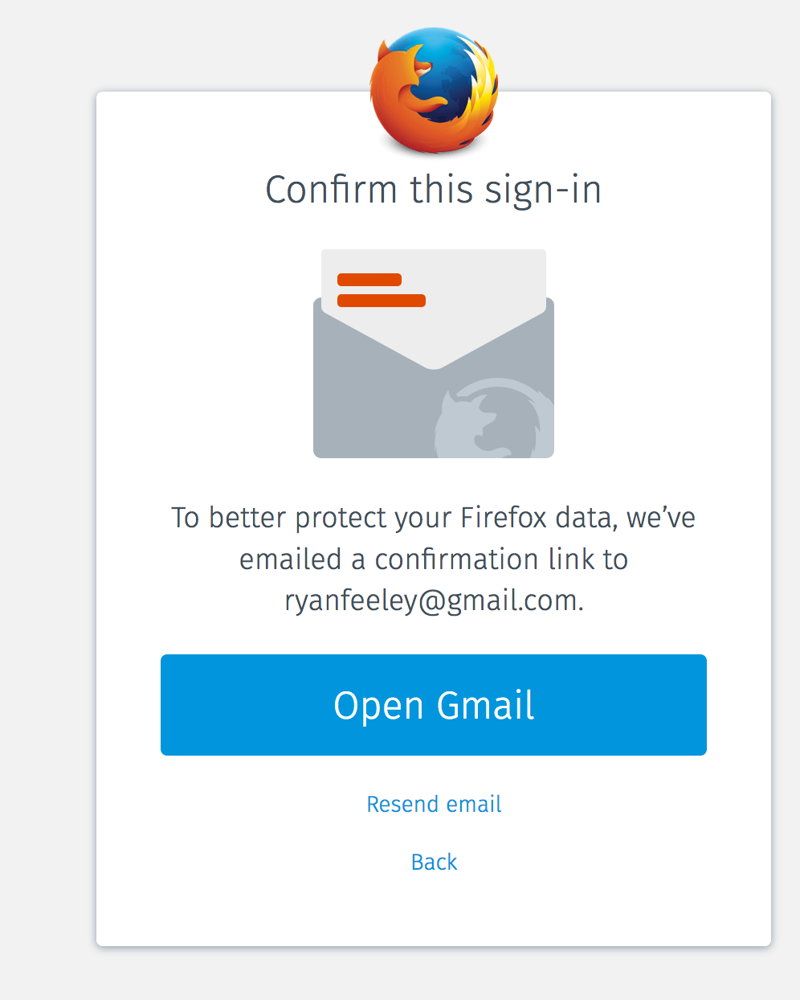
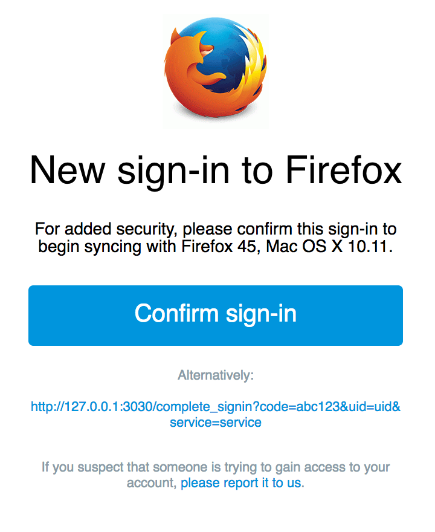
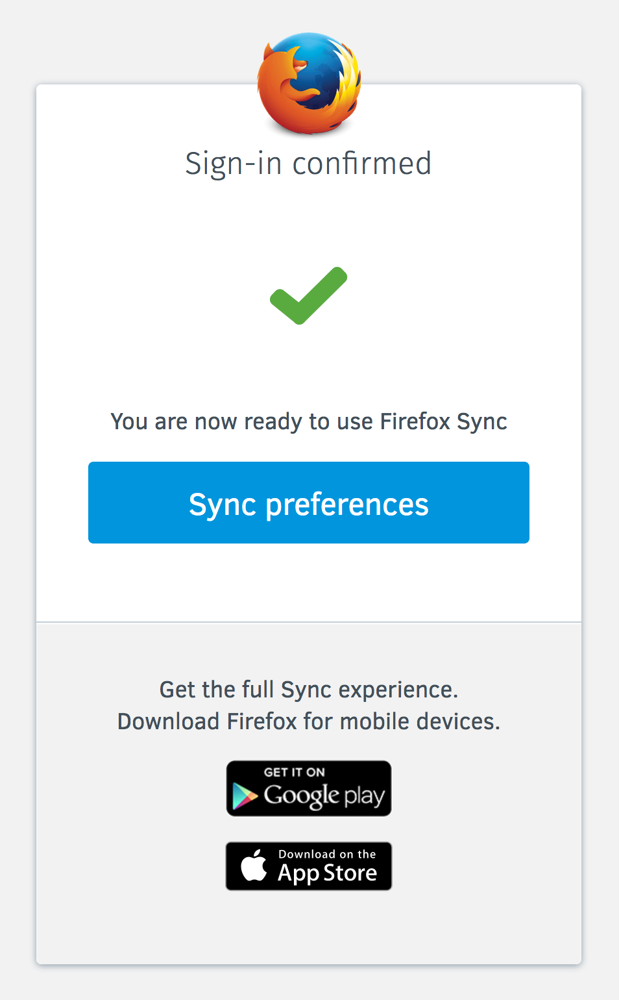
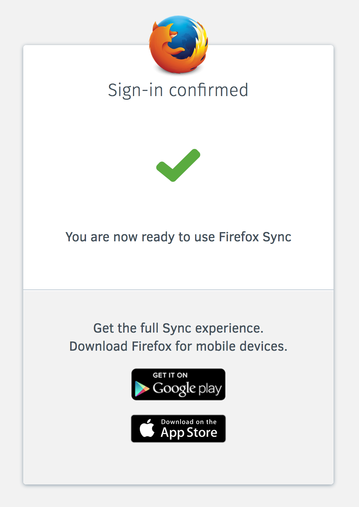
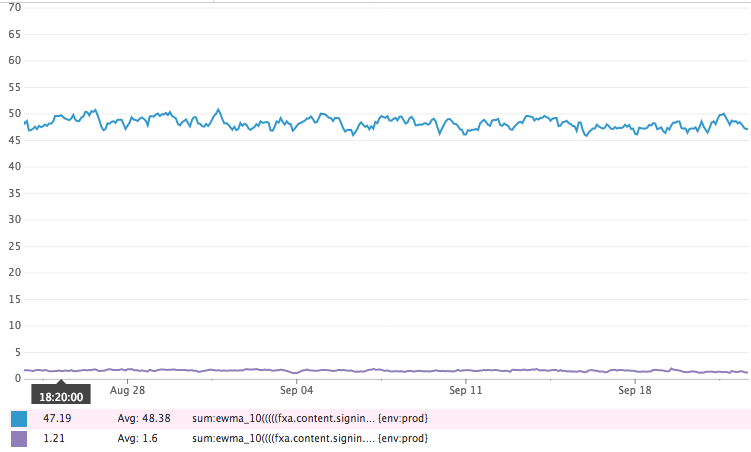
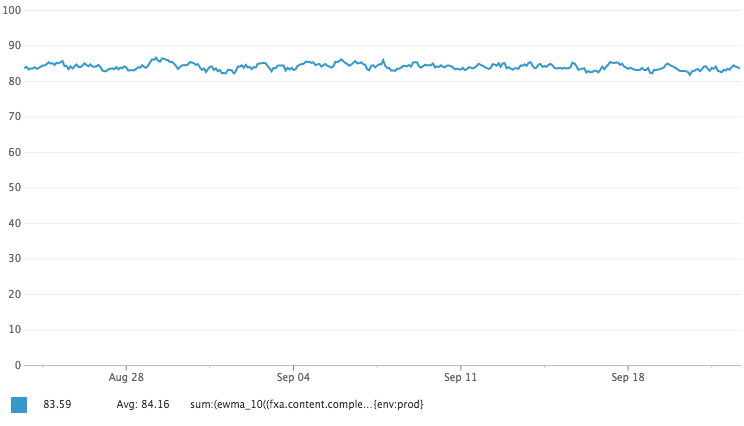
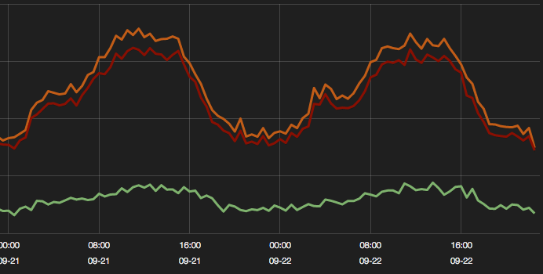
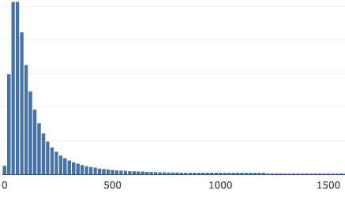
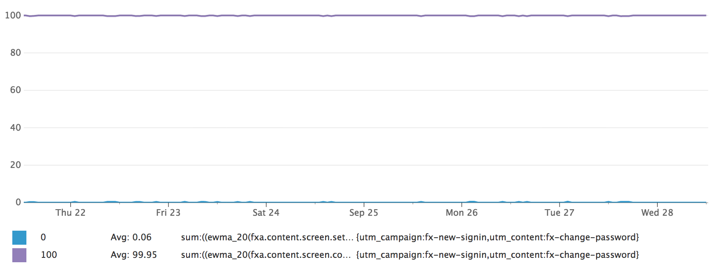

# Sign-in confirmation email

* [Problem statement](#problem-statement)
* [Outcomes](#outcomes)
* [Hypothesis](#hypothesis)
* [User stories](#user-stories)
* [Constraints](#constraints)
* [Proposed solution](#proposed-solution)
  * [What happens when a Sync user signs in?](#what-happens-when-a-sync-user-signs-in)
  * [What happens when an OAuth user signs in?](#what-happens-when-an-oauth-user-signs-in)
  * [What happens when an unverified client requests `/certificate/sign`?](#what-happens-when-an-unverified-client-requests-certificatesign)
  * [What happens when an unverified client requests `/account/keys`?](#what-happens-when-an-unverified-client-requests-accountkeys)
  * [How does this affect users on legacy clients?](#how-does-this-affect-users-on-legacy-clients)
* [Mock-ups](#mock-ups)
  * [Confirm this sign-in screen](#confirm-this-sign-in-screen)
  * [Confirmation email](#confirmation-email)
  * [Sign-in confirmed screen](#sign-in-confirmed-screen)
    * [On the signed-in device](#on-the-signed-in-device)
    * [Off the signed-in device](#off-the-signed-in-device)

## Problem statement

It is possible for attackers
armed with a list of known email/password pairs
to maliciously access users’ Firefox Accounts.
In such cases,
attackers would have full access
to the user’s Sync data,
including passwords, history, bookmarks and
the ability to force-install malicious add-ons.

## Outcomes

If an attack occurs,
we would like fewer accounts to be compromised
without negatively impacting
the number of signed-in users
or our overall FxA engagement rate.

## Hypothesis

If we introduce an additional email confirmation step
for Sync sign-ins,
fewer accounts will be compromised.

We will know this to be true if,
in the event of an attack,
the number of successful sign-ins remains constant
and the count of 104 (unverified account) errors
from protected endpoints
increases in line with any wider increase in traffic.
Further, we can measure that
the confirmation step is not affecting
legitimate users
by monitoring the success rate
of connecting to Sync
before and after deployment.

Sync sign-in success rate
for the last month
at time of writing
is shown in the following graph:



Prior to the attack
at the start of April,
the success rate
was in the range
of 42% to 52%.
The exponential moving average
with a span of 10 (`ewma_10`)
was in the range
of 46% to 50%.

## User stories

* As a Sync user,
  when signing in to my Firefox Account,
  I want to confirm my identity
  via my email account
  and I want my account access to be limited
  until my identity has been confirmed.

* As a user of an OAuth relier,
  when signing in to my Firefox Account,
  I do not want an extra confirmation step.

## Constraints

* In light of the recent attack,
  the solution should be quick to implement.

* The solution must work across all clients,
  without patches landing in client code.

* The solution must not affect existing sessions
  from the user's point of view.

* The solution must work from
  regular Sync sign-in,
  `/force_auth` and
  when signing-in to Sync from `/signup`.

## Proposed solution

Add a notion of verification
to session tokens.
Session tokens that are unverified
have reduced powers
(see [below](#what-happens-when-an-unverified-client-requests-accountkeys)).
Token verification is achieved
by following a link sent by email.

### What happens when a Sync user signs in?

1. User submits form.

2. Content server requests `POST /account/login?keys=true`.

3. Auth server generates `tokenVerificationId`
   and sends it in request to `PUT /sessionToken/:tokenId`.

4. Auth server invokes the mailer
   to send a confirmation email,
   which includes `tokenVerificationId` in the URL.

5. Auth server sends response back to content server,
   including in the data:
   ```
   {
     "sessionToken": sessionToken.data,
     "verified" false,
     "verificationReason": "login",
     "verificationMethod": "email"
   }
   ```

6. Content server sends web channel message
   notifying the browser of successful sign-in.

7. Content server navigates to confirm-signin view.

8. Content server starts polling
   on `GET /recovery_email/status`.

9. User clicks link in confirmation email.

10. Content server requests `POST /recovery_email/verify_code`.

11. Auth server requests `POST /token/:tokenVerificationId/verify`.
    The session token is verified in the database.
    If the account is unverified,
    that also gets verified here.

12. Concurrently:

    * Auth server responds to verification request,
      including verified tokens in the data.

    * Auth server changes polling request responses,
      including verified tokens in the data.

13. Content server navigates to about:accounts.

### What happens when an OAuth user signs in?

1. User submits form.

2. Content server requests `POST /account/login`.

3. Auth server generates `tokenVerificationId`
   and sends it in request to `PUT /sessionToken/:tokenId`.

4. Auth server sends response back to content server.

5. Content server redirects to OAuth relier.

### What happens when an unverified client requests `/certificate/sign`?

If the sessionToken is unverified,
the request will succeed.
However, the verification status is stored
in the certificate as `fxa-tokenVerified`,
alongside other `fxa-` properties.
The token server will reject assertions
where `fxa-tokenVerified` is `false`.

### How does this affect users on legacy clients?

The proposal should work smoothly for them.

Because the `/account/login` endpoint
returns `"verified":false` in the response,
legacy users will receive the confirmation email
and be redirected to the existing
"confirm your email" screen.
The legacy code for polling
and account verification
will work the same way
against unverified tokens.

## Mock-ups

### Confirm this sign-in screen



### Confirmation email



### Sign-in confirmed screen

#### On the signed-in device



#### Off the signed-in device



## Results

Sign-in confirmation was deployed over several
train cycles. The feature was turned on at 6-24-2016
for 2% of our users and gradually increased to 100%.
During the deployment we monitored the sign-in success
and error rates to ensure that users were not negatively
impacted.

To help gauge the success of the feature, several dashboards
were created.

### Sync sign-in success rate

Pre sign-in confirmation metrics show that we had
between a 42% to 52% sync sign-in success rate.
From [first dashboard](https://app.datadoghq.com/dash/163668/fxa-content---signin-confirmation), with sign-in confirmation, we have maintained this sign-in rate.



This meets our original goal of not affecting this metric.

### Sign-in success rate

Pre sign-in confirmation, if a user entered their
password correctly, they were able to login and therefore
had a 100% sign-in rate. After deployment this rate
dropped to 84%.



To help further confirm this feature, we created a [second dashboard](https://kibana.fxa.us-west-2.prod.mozaws.net/#/dashboard/elasticsearch/FxA%20Sign-in%20Confirmation)
based on server-side metrics. Looking
at the raw counts, this is roughly
a sign-in success rate of 91.7%. Orange line (sign-in start) / Red (sign-in complete)



The difference between these two metrics was significant
enough to warrant further investigation. Using some of
the new flow metrics, we were able to create a chart
showing the average time a user takes to perform a
sign-in confirmation.



This chart shows that most users complete sign-in
confirmation within an hour. This is important because if
user's were taking greater than a day to confirm sign-in,
it could skew metrics.

The another thing that could account for the difference
in these metrics is that one method might not be emitting
or emitting twice, for different scenarios. The true
sign-in confirmation success rate could possibly be a
mix of these metrics.

Something to note was that sign-in confirmation was enabled
for 100% of users because of a security incident. Once the
feature was fully enabled, the security incident stopped.
Unfortunately, all of the metrics were not fully in
place before the feature went to 100%, which makes it
difficult to get a clear idea of what a baseline sign-in success
rate looks like.

The chart below shows that roughly,  less than 0.5% of our
users click change password button from the sign-in confirmation
email. Sign-in confirmation helps to provide these users
with some protection on their accounts.



## Conclusion and Next Steps

Overall, the sign-in confirmation feature has provided
FxA users with an extra layer of security. However, this feature
has introduced some friction in the overall sign-in
process that can't fully be explain with our
current metrics. That being said, we now have a reasonable
baseline for sign-in success and new features that
follow a similar type of pattern (sign-in unblock).

Moving forward, next step for this feature is to increase
the sign-in success rate. Introducing some additional
logic into the sign-in process (geolocation) can help
reduce the need to perform a confirmation.
