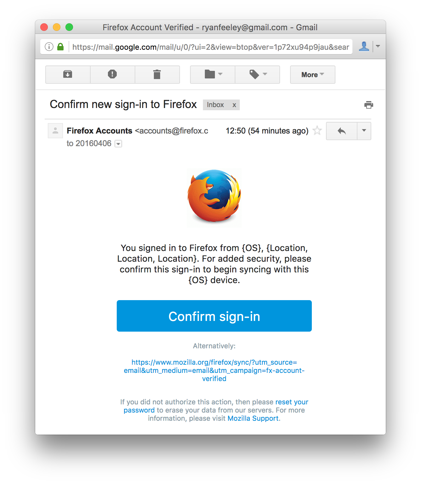

# Sign-in confirmation email

* [Problem statement](#problem-statement)
* [Outcomes](#outcomes)
* [Hypothesis](#hypothesis)
* [User stories](#user-stories)
* [Constraints](#constraints)
* [Proposed solution](#proposed-solution)
  * [What happens when a Sync user signs in?](#what-happens-when-a-sync-user-signs-in)
  * [What happens when an OAuth user signs in?](#what-happens-when-an-oauth-user-signs-in)
  * [What happens when an unverified client requests `/certificate/sign`?](#what-happens-when-an-unverified-client-requests-certificatesign)
  * [What happens when an unverified client requests `/account/keys`?](#what-happens-when-an-unverified-client-requests-accountkeys)
  * [How does this affect users on legacy clients?](#how-does-this-affect-users-on-legacy-clients)
* [Work breakdown](#work-breakdown)
  * [fxa-content-server](#fxa-content-server)
  * [fxa-auth-server](#fxa-auth-server)
  * [fxa-auth-db-mysql](#fxa-auth-db-mysql)
  * [fxa-auth-mailer](#fxa-auth-mailer)
* [Mock-ups](#mock-ups)
  * [Confirm this sign-in screen](#confirm-this-sign-in-screen)
  * [Confirmation email](#confirmation-email)
  * [Sign-in confirmed screen](#sign-in-confirmed-screen)
    * [On the signed-in device](#on-the-signed-in-device)
    * [Off the signed-in device](#off-the-signed-in-device)

## Problem statement

It is possible for attackers
armed with a list of known email/password pairs
to maliciously access users’ Firefox Accounts.
In such cases,
attackers would have full access
to the user’s Sync data,
including passwords, history, bookmarks and
the ability to force-install malicious add-ons.

## Outcomes

If an attack occurs,
we would like fewer accounts to be compromised
without negatively impacting
the number of signed-in users
or our overall FxA engagement rate.

## Hypothesis

If we introduce an additional email confirmation step
for Sync sign-ins,
fewer accounts will be compromised.

We will know this to be true if,
in the event of an attack,
the number of successful sign-ins remains constant
and the count of 104 (unverified account) errors
from protected endpoints
increases in line with any wider increase in traffic.
Further, we can measure that
the confirmation step is not affecting
legitimate users
by monitoring the success rate
of connecting to Sync
before and after deployment.

Sync sign-in success rate
for the last month
at time of writing
is shown in the following graph:


Prior to the attack
at the start of April,
the success rate
was in the range
of 42% to 52%.
The 10-day moving average
was in the range
of 46% to 50%.

## User stories

* As a Sync user,
  when signing in to my Firefox Account,
  I want to confirm my identity
  via my email account
  and I want my account access to be limited
  until my identity has been confirmed.

* As a user of an OAuth relier,
  when signing in to my Firefox Account,
  I do not want an extra confirmation step.

## Constraints

* In light of the recent attack,
  the solution should be quick to implement.

* The solution must work across all clients,
  without patches landing in client code.

* The solution must not affect existing sessions
  from the user's point of view.

* The solution must work from
  regular Sync sign-in,
  `/force_auth` and
  when signing-in to Sync from `/signup`.

## Proposed solution

Add a notion of verification
to sessionTokens and keyFetchTokens.
Tokens that are unverified
have reduced powers (see below).
Token verification is achieved
by following a link sent by email.

### What happens when a Sync user signs in?

1. User submits form.

2. Content server requests `POST /account/login?keys=true`.

3. Auth server generates `tokenVerificationId`
   and sends it in request to `PUT /sessionToken/:tokenId`.

4. Auth server sends same `tokenVerificationId`
   in request to `PUT /keyFetchToken/:tokenId`.

5. Auth server invokes the mailer
   to send a confirmation email,
   which includes `tokenVerificationId` in the URL.

6. Auth server sends response back to content server,
   including in the data:
   ```
   {
     "sessionToken": sessionTokenId,
     "keyFetchToken": keyFetchTokenId,
     "verified" false,
     "challengeReason": "signin",
     "challengeMethod": "email"
   }
   ```

7. Content server sends web channel message
   notifying the browser of successful sign-in.

8. Content server navigates to confirm-signin view.

9. Content server starts polling
   on `GET /token/:tokenId/status`.

10. User clicks link in confirmation email.

11. Content server requests `POST /token/verify`.

12. Auth server requests `POST /token/:tokenVerificationId/verify`.
    Both tokens are verified in the database.
    If the account is unverified,
    that also gets verified here.

13. Concurrently:

    * Auth server responds to verification request,
      including verified tokens in the data.

    * Auth server changes polling request responses,
      including verified tokens in the data.

14. Content server navigates to about:accounts.

### What happens when an OAuth user signs in?

1. User submits form.

2. Content server requests `POST /account/login`.

3. Auth server generates `tokenVerificationId`
   and sends it in request to `PUT /sessionToken/:tokenId`.

4. Auth server sends same `tokenVerificationId`
   in request to `PUT /keyFetchToken/:tokenId`.

5. Auth server sends response back to content server.

6. Content server redirects to OAuth relier.

### What happens when an unverified client requests `/certificate/sign`?

If the sessionToken is unverified,
the request will succeed.
However, the verification status is stored
in the certificate as `fxa-tokenVerified`,
alongside other `fxa-` properties.
The Sync server can subsequently reject assertions
where `fxa-tokenVerified` is `false`.

### What happens when an unverified client requests `/account/keys`?

If the keyFetchToken is unverified,
the request will fail with errno 102.

### How does this affect users on legacy clients?

The proposal should work smoothly for them.

Because the `/account/login` endpoint
returns `"verified":false` in the response,
legacy users will receive the confirmation email
and be redirected to the existing
"confirm your email" screen.
The legacy code for polling
and account verification
will work the same way
against unverified tokens.

## Work breakdown

### fxa-content-server

- [x] Add strings to `strings.js`
  to get localization done quicker.
  This task is the highest immediate priority.
- [ ] Update `/signin`, `/force_auth`, `/signup` to redirect to
  `/confirm_signin` if response to `/account/login` contains
  `challengeType: 'signin'` and `challengeMethod: 'email'`.
- [ ] Update `/confirm` to display "Confirm this sign-in"
  instead of signup messaging.
- [ ] Implement `/complete_signin` - Calls verification function
- [ ] Update `/signin_complete` to displays "This sign-in is verified"
  instead of standard message.
- [ ] Add handling for `verified`, `challengeType` and
  `challengeMethod` fields in `/account/login` response.
- [ ] Add handling for 102 errors
  from `/certificate/sign`
  and `/account/keys` endpoints.
- [ ] Update user and account models to call
  existing fxa-client methods to:
  - [ ] resend signin verification email
  - [ ] check session status
  - [ ] verify signin
- [ ] Ensure functional test exist for:
  - [ ] Sync sign in of existing verified account (re-verification required)
  - [ ] Hello sign in of existing verified account (re-verification required)
  - [ ] OAuth sign in of existing verified account (no re-verification required)

### fxa-auth-server

- [ ] Add method to `mailer.js`
  for sending confirmation email.
- [ ] Modify `/account/login`
  to create keys unverified,
  initiate verification email
  and set `challengeType` and `challengeMethod` on response.
- [x] Modify `/account/login`
  to stop sending new device connected emails.
- [x] Create a `sessionTokenVerified`
  auth strategy for Hapi
  that fetches teh sessionToken with verification state.
- [x] Create a `keyFetchTokenVerified`
  auth strategy for Hapi
  that fetches the keyFetchToken with verification state
  and fails with 102 (unverified user) error
  if keyFetchToken is not verified.
- [ ] In `/certificate/sign`,
  use updated `sessionWithDevice` auth strategy and
  encode the sessionToken verification state
  on the certificate as `fxa-tokenVerified`.
- [x] In `/account/keys`,
  use new `keyFetchTokenVerified` auth strategy.
- [ ] Modify the `/recovery_email/verify_code` endpoint
  to also verify tokens.
  This allows legacy clients to work correctly
  and also handles the case of
  unverified users signing in.
- [ ] Modify the `/recovery_email/resend_status` endpoint
  to also return `"verified":false`
  if tokens are unverified.
- [ ] Tests.

### fxa-auth-db-mysql

- [x] Create `tokenVerifications` table
  and associated stored procedures.
- [x] Update token-creation endpoints and stored procedures
  to also insert into `tokenVerifications`
  as part of the same transaction.
- [x] Update token-deletion endpoints and stored procedures
  to also delete from `tokenVerifications`
  as part of the same transaction.
- [x] Add `/token/:id/verify` endpoint and stored procedure
  for verifying tokens.
- [x] Add endpoints and stored procedures
  that return tokens joined to their `tokenVerified` state.
- [x] Tests.

### fxa-auth-mailer

- [x] Add confirmation email templates and methods

## Mock-ups

### Confirm this sign-in screen


### Confirmation email



### Sign-in confirmed screen

#### On the signed-in device


#### Off the signed-in device


