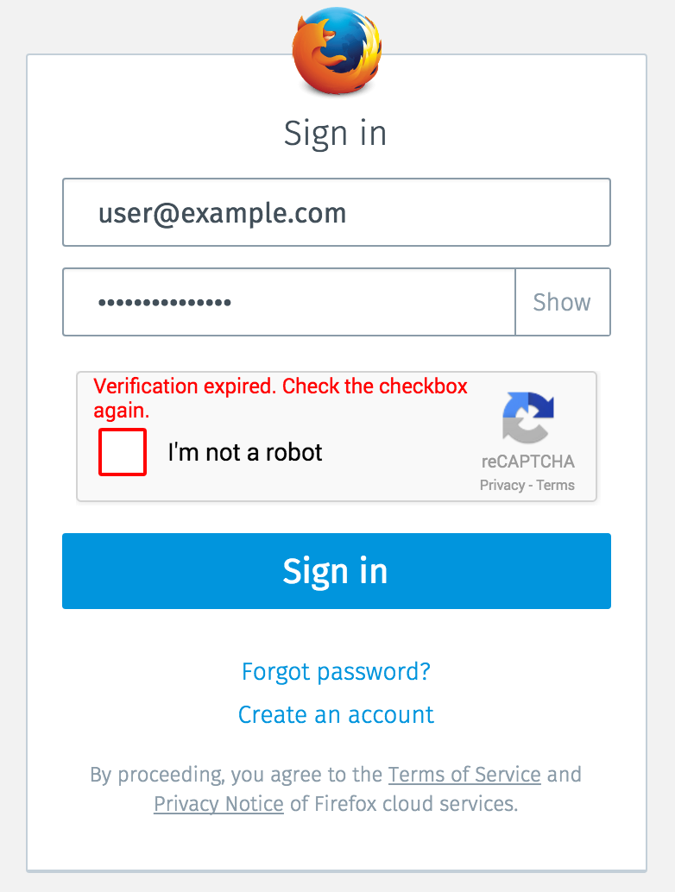
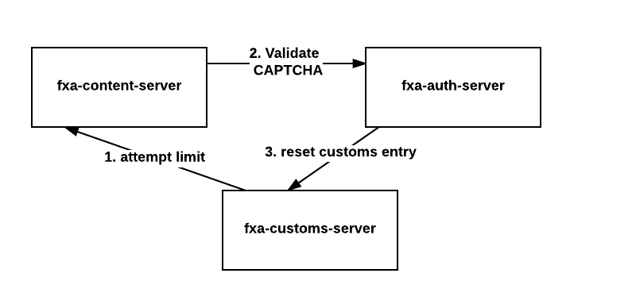
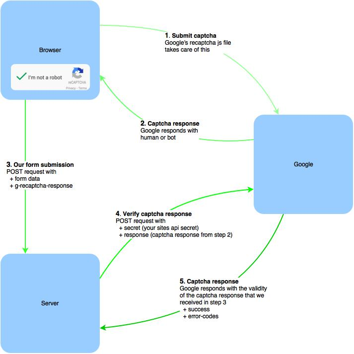

# Re-Captcha: Automated Intervention after Subsequent failed logins
## FXA-84

## Problem Summary

The current system does not have enough
features to detect and prevent fraudulent and malicious logins.
Making blocking rules more strict results in bad UX for legitimate users.

****

## Outcomes

* Reduce the number of "Attempt Limit Exceeded" errors.
* Improved user experience for users who were blocked by
the customs server on the same IP address.
* Better automation / bot detection.

## Hypothesis

This new feature will stop a lot of automated login attempts and allow
legitimate users to still login by filling out the ReCAPTCHA.

## Metrics

* Keep track of CAPTCHA views, submissions, errors and success events.

****

## Detailed design

### ReCAPTCHA View

### Server flow

> [Edit digram document](https://www.lucidchart.com/documents/edit/8386161e-b855-4e2d-90de-42a0c3921960#)

### ReCAPTCHA Validation

> Taken from http://y-designs.com/blog/google-recaptcha-v2-on-a-dynamic-page/

****
