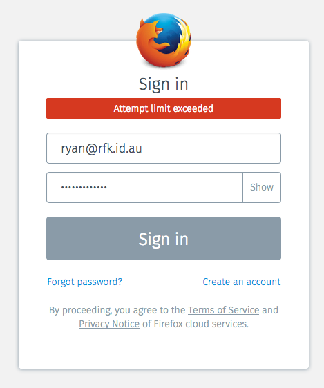
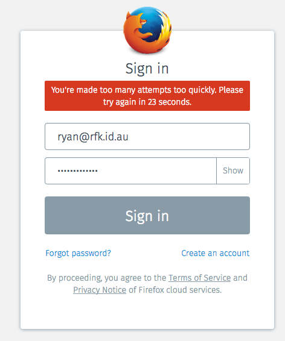
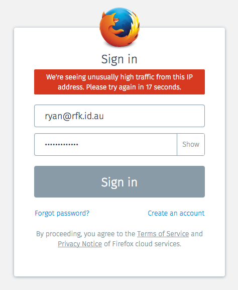
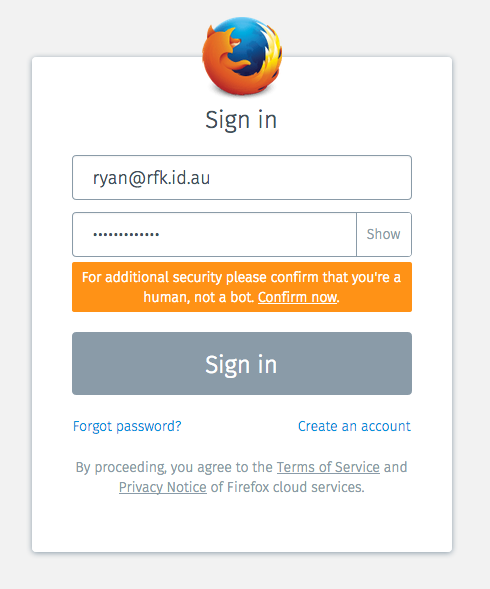
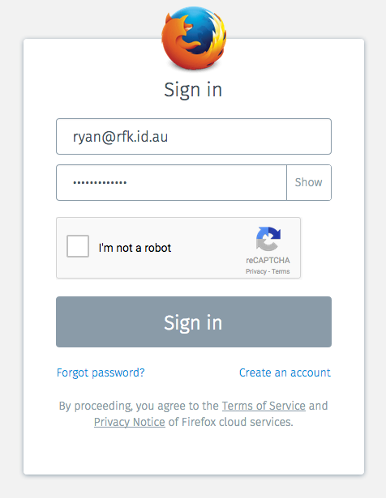

# Re-Captcha: Automated Intervention after Subsequent failed logins
## FXA-84

## Problem Summary

There is currently no way for a legitimate user
to prove their legitimacy
if our fraud-and-abuse system generates a false positive
and blocks one of their requests.
This results in a dead-end error message
and a bad user experience,
making us hesitant to increase the sensitivity
of our security rules.

By lowering the impact of false positives,
we will be more confident in tightening the security rules
and can thus reduce the rate of false negatives,
improving overall security of the system.

****

## Outcomes

Users who are blocked by our fraud-and-abuse system will see:
* More detailed messaging about what has happened
* A clear next step to take to unblock themselves, either by:
  * waiting for a brief period, or
  * completing a captcha

As a result we will be able to:
* Implement stricter rules to detect fradulent access, while
* Decreasing the number of login flows abandoned due to security measures.

## Hypothesis

We believe that allowing users to unblock themselves
when they trigger a security measure,
will increase the completion rate of legitimate login attempts
without allowing significantly more fradulent logins.

We will know this to be true when we see
an increase in the completion rate of login attempts
that triggered a security measures,
as a percentage of all login attempts
that trigger a security measure.

## Metrics

As a high-level success metric,
we want to know the following:

* Of all login attempts that triggered a security measure,
  what percentage of them were subsequently completed successfully?

We expect the starting value of this metric to be close to zero,
since it is not obvious to users that they can compelte the flow
after being blocked by a security measure.
They currently can, if they wait for the rate-limiting to expire,
but this is not explained in the UI
and users are unlikely to do so in practice.

As a detailed metric of the effectiveness
of the technical details of this feature,
we want to know the following:

* How many users:
  * Had requests blocked for security reasons
  * Chose to attempt a CAPTCHA to unblock themselves
  * Submitted a CAPTCHA
  * Successfully completed a CAPTCHA
  * Received an error when submitting the CAPTCHA
  * Successfully logged in after completing a CAPTCH

Taken togther, these metrics can form a success funnel
for the captcha feature.

## Assumptions

* There are certain anti-abuse measures that cannot be bypassed
  with a captcha.  You should not be allowed to make 30 login attempts
  or send 30 emails in the space of five seconds, no matter how 
  human you appear to be.  That's just not cricket.

* Google is better at distinguishing humans from bots than
  we can reasonably hope to be, so using their hosted service
  is overall a better risk/reward proposition than trying
  to implement our own.

* Some of our anti-abuse measures are not based on the number of
  requests, e.g. the planned use of an IP blocklist.  In these cases
  the existing "attempt limit exceeded" message would be inappropriate
  and confusing.

****

## Detailed design

### UX

We currently have a single, unfriendly, dead-end experience
for users that trigger our fraud-and-abuse system:

Instead, we should distinguish three separate cases
and provide clear messaging for each:

1. This particular user has submitted too many requests
   too quickly, and they must wait before trying again.
2. Other users on this IP address have submitted too many
   requests recently, so they must wait before trying again.
3. The request was blocked because it looked likely to be from a bot,
   but would be accepted if the user can demonstrate that they aren't.

For case (1) we should present a more friendly error message
along with a countdown telling them how long to wait:

For case (2) we should explain the situation
in a way that doesn't imply it is the user's fault,
and show a countdown telling them how long to wait:

For case (3) we should explain the situation
and offer the user the option of completing a captcha
to continue with the request:

If the user chooses to do so,
we load recaptcha into the page like so:

And the user must complete the captcha
before the sign-in button is re-enabled.

Notes:

* This aren't intended to be the final screens or strings.
  Don't let rfkelly design screens or write strings.
* The time to wait is returned in the error response from the server.
* Distinguishing case (3) will require the server to return a new error
  code rather than the existing errno 114 "attempt limit exceeded"; we can
  use errno 125 "request blocked" for this purpose.
* Distinguishing case (2) from case (1) will require the content-server
  to keep track of whether the user has made any attempts in this session,
  since the server doesn't have enough info to tell the difference.
* The treatment here is for the sign-in form,
  but there's no reason we couldn't take a similar approach
  on other views subject to customs checking,
  such as account creation or password reset.
* The idea behing a multi-click process for the captcha, is to ensure the
  user takes some deliberate action before we add a third-party javascript
  file into the page.  This may help reduce risk in shipping the initial
  version and we can revisit it in a followup if the feature is successful.
  But I know it's likely to be worse UX, so it's just a thought...

### Server flow

> [Edit digram document](https://www.lucidchart.com/documents/edit/8386161e-b855-4e2d-90de-42a0c3921960#)

### ReCAPTCHA Validation

> Taken from http://y-designs.com/blog/google-recaptcha-v2-on-a-dynamic-page/

****

## High-level task breakdown

* [ ] Confirm/implement ability to measure the key metrics for this feature.
* [ ] Modify customs-server to distinguish between "blocked to to rate limit"
      and "blocked due to bot-ness" in its error responses.
* [ ] Add captcha validation endpoint to auth-server, with supporting endpoint
     in customs-server.
* [ ] Teach content-server to distinguish between the three different error
      cases outlined here.
* [ ] Implement new UX and recaptcha support in content-server.

## Unresolved questions and risks

* Using recaptcha would mean we're including a third-party javascript
  library into the accounts page, the first time we've ever done this.
