# Devices View

Feature card: https://github.com/mozilla/fxa-features/issues/8

Original draft: https://docs.google.com/document/d/1VrysJ4LFPZ20IeMMmRts5l_2GUHhm890rlQhD012U_g

Engineering bugs: https://waffle.io/mozilla/fxa?milestone=FxA-89:%20devices%20view

## Stories

* So that I can best ensure the integrity of my Sync setup,
  as a Firefox Sync user,
  I want to see information about the devices
  connected to my Firefox Account.
* So that I can obtain a device overview more quickly,
  I want the devices connected to my account
  to have recognizable names by default.
* I want to easily see the type
  and browser details of the each device,
* So that I can better tell what device I am currently using,
  I want it to be easily distinguishable from the other items.
* So that I can easily detect when a device is no longer active,
  I want to be able to see when my devices last authenticated.

## Hypothesis

1. If we add a device view in settings
   for Firefox Account users, then
   **we will decrease the number of active malicious connections**
   because we will observe users managing and disconnecting
   suspicious devices which they cannot presently do.
2. If we add a device view in settings
   for Firefox Account users,
   then **we will decrease the number of old/lost devices
   still connected to an account**
   because we will observe users managing their devices.
3. Less importantly,
   if we present users with download links for Firefox
   when they don’t have a 2nd device,
   **we will increase multi-device users**
   because we will generate downloads from the device management view.

## Metrics

### Key Success Metric

We will know our hypotheses to be true when we measure that users are disconnecting old, lost and unknown devices.

We will measure the reason why devices are being disconnected
via the confirmation dialogue after users click to disconnect a device.

### Secondary Metrics

* Number of device disconnections per day.
  * Categorized by traffic source (e.g email, settings via hamburger menu)
* Percentage of clicks on "missing or duplicate devices?" link.
  * # of users that clicked it / # of users that saw device view
* Percentage refresh rate
  * # of users that clicked refresh / # of users that saw device view
* Clicks on the "Connect..." button
  * # of users that clicked it / # of users that saw the button
* Number of mobile installs generated from the page.
  * From mobile team metrics via adjust.com
* Number of clicks on "I did not disconnect this device" in email
  * From mobile team metrics via adjust.com

## UX

### Assets

Use these icons for desktop, phone, and tablet device types:

TODO: @ryanfeeley to provide raw asset files to add here.

### Collapsed View

A **Devices** section appears in the settings screen
above the **Password** section:

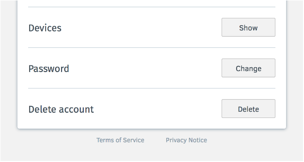

### Fetching Devices View
When the user clicks the **Show** button,
and the server has to fetch the images,
the **Show** button becomes disabled
and is replaced with a spinning wheel
(halved in size from full size spinning wheel).

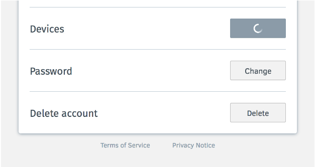

### Zero or one Device Views

When the user expands the Device section,
and has no devices,
they are shown their current device
but are able to download Firefox for iOS or Android
and to refresh the list:

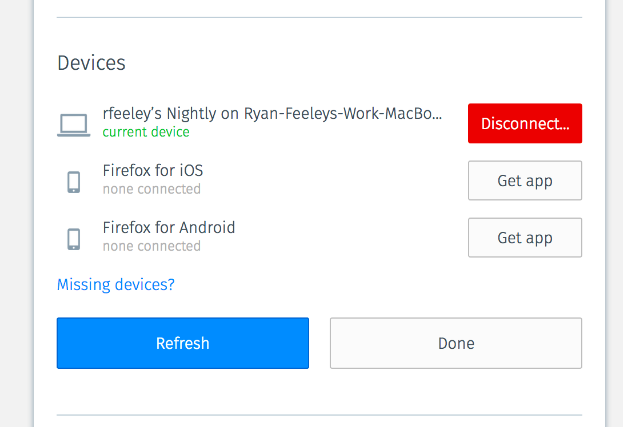

Links for Android and iOS go their respective stores.
The mobile app placeholders should not be there
if the user has a real mobile device
attached to their account.

### List View

When the user expands the Devices section,
the Firefox profiles that are syncing through this account
are presented with the relative time they were “Last active”,
with a "Disconnect..." button beside each.

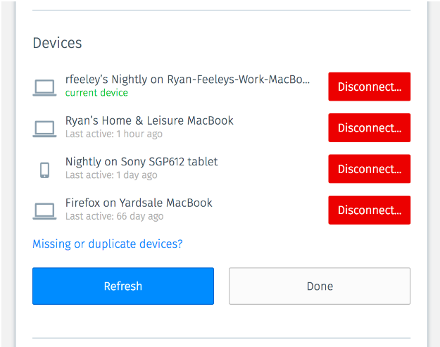

Unlike in the first version of this feature,
when devices are connected,
we *should not* display “Firefox is available for Windows, OS X, etc…”.
The reason for this is that we want to make sure
we are not distracting the users
when they are about to disconnect one of their devices.
A distraction could result in them disconnecting the wrong device.

When the user is viewing the device list
from a web session on accounts.firefox.com,
and is on a compatible Firefox browser
that is not currently connected to Sync,
we provide a "Connect..." button
that will allow them to sign in to sync
on that device.

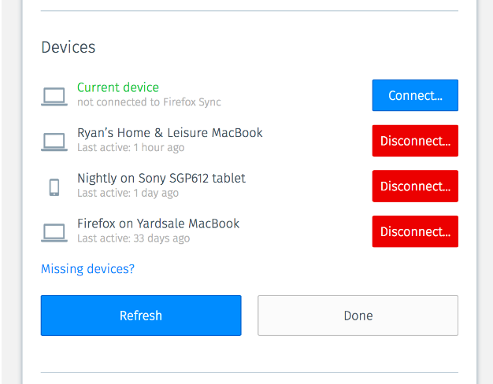

### Disconnecting View

When the user chooses to disconnect a device,
we overlay a modal confirmation dialog.
This will minimize accidental clicks on "Disconnect..."
and help us measure signals as to why a device is removed.

In this view, we will not show
any message to download Firefox on other devices,
as we want to minimize noise and distractions.

When the user clicks and releases the "Disconnect..." button
the following occurs:

1. We display a modal dialog
   asking them to confirm
   and supply a reason why they are disconnecting:

   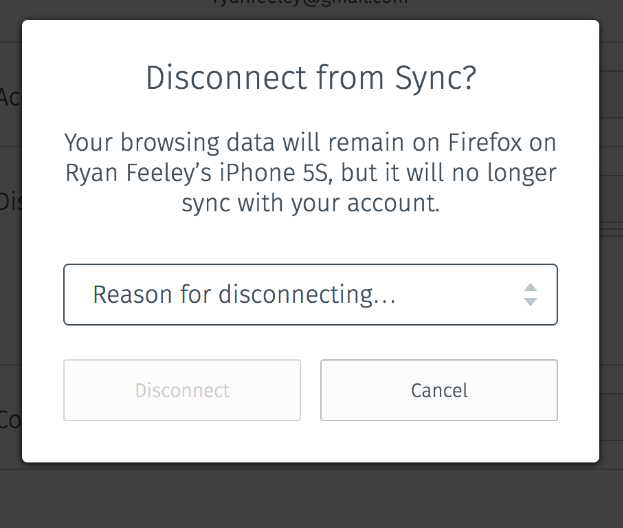

2. We display an error "Valid response required"
   if they submit the dialog
   without selecting a reason:

   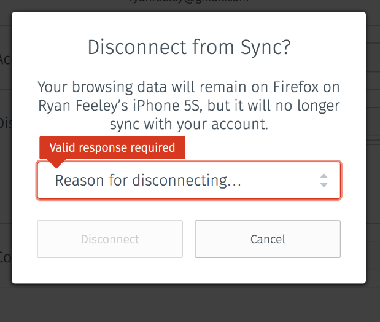

3. When the user selects any option,
   the placeholder floats up to be a field label
   and the Disconnect button becomes enabled:

   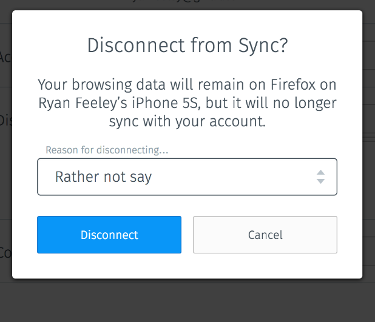

4. When the form is submitted
   we disconnect the device
   by calling the `/account/device/destroy` endpoint
   on the server.

5. Depending on the user's selected reason for disconnecting
   we may show an additional message styled as follows:

   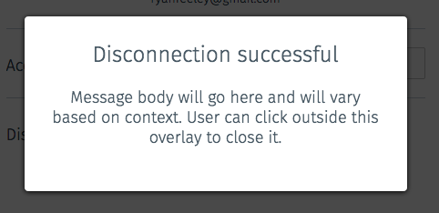

The available choices for disconnection reason will be:

* Suspicious device
  * Upon Disconnect, show additional message with the body copy:
    “We’re sorry to hear about this. If this was a device you
    really don’t trust, you should change your Firefox Account password,
    and change any passwords saved in Firefox.”
* Lost or stolen device
  * Upon Disconnect, show additional message with the body copy:
  “We’re sorry to hear about this. You should change your Firefox Account password,
  and look for information from your device manufacturer about erasing your data remotely.”
* Old or replaced device
  * Upon Disconnect, don’t present an additional message.
    Close the dialog and return to the device view.
* Rather not say
  * Upon Disconnect, don’t present an additional message.
    Close the dialog and return to the device view.

After device removal has been confirmed,
the dialog closes and,
the row is overtaken by the area beneath it:

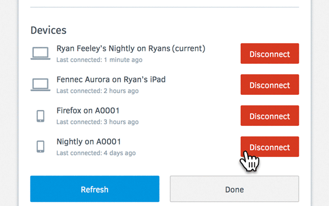

One the server side,
we send the user an email notification about the removed device.
It includes:
* The name of the removed device
* IP and geo information of person that triggered the removal
* Link that says: “I did not request to remove this device from my FxA”,
  linking to a SUMO page that says:
  * Verify your currently connected devices
  * Disconnect any unknown devices
  * Change your FxA password
  * Change the passwords of any websites that you’ve saved in Firefox.
    To see which sites have been saved, visit:  about:preferences#security > Saved Logins

If the device had registered a push endpoint,
we will send it a push notification
to inform it that it has been disconnected.

### Refreshing View

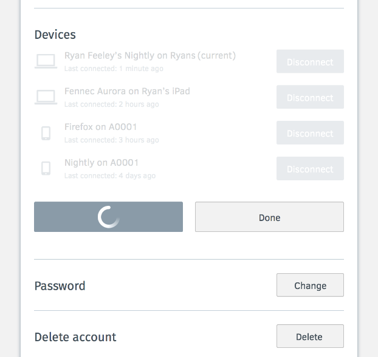

### Outgoing Links

The links to download Firefox for desktop
should go to the following URL,
which works for all OSes and all languages:

* https://www.mozilla.org/firefox/new/?utm_source=accounts.firefox.com&utm_medium=referral&utm_campaign=fxa-devices

It should contain the UTM parameters as specified
and should not contain any locale in the URL.

The link to get Firefox for iOS:

* https://app.adjust.com/2uo1qc?campaign=fxa-device-manager&adgroup=ios&creative=button&fallback=https%3A%2F%2Fitunes.apple.com%2Fapp%2Fapple-store%2Fid989804926%3Fpt%3D373246%26ct%3Dadjust_tracker%26mt%3D8
* The `fallback` parameter  will force the App Store
  since default is Play Store if link is opened
  on desktop instead of a mobile device.

The link to get Firefox for Android:

* https://app.adjust.com/2uo1qc?campaign=fxa-device-manager&adgroup=ios&creative=button
* No `fallback` parameter is required
  since the URL will open the Play Store
  if it doesn’t recognize any mobile device.

The link labelled "Missing or duplicate devices?"
will link to a SUMO article:

* https://support.mozilla.org/kb/fxa-managing-devices

When a user is using desktop Firefox
and has a web session with accounts.firefox.com
but is not connected with the current browser,
we can provide a "Connect..." button that links to:

* /signin?service=sync&context=fx_desktop_v3"

## Implementation Plan

We will implement this feature in several phases,
intending each phase to be independently shippable
if we so choose.

Since the primary goal for this feature is security,
we will first focus on implementing the parts
related to disconnecting devices.
This will be followed by additional notifications
and security checks to improve the disconnection experience,
and finally by the new affordances
for connecting additional devices.

### Phase 1

First we'll make sure
that the core disconnecting-your-devices experience
works well and emits the necessary metrics,
building on the existing devices view code.

Acceptance criteria:

* [ ] When I am connected to Sync on Desktop Firefox,
      my device list shows that device
      with a desktop icon,
      a plausible last-active timestamp,
      and a "Disconnect..." button.
* [ ] When I am connected to Sync from Fennec or iOS on a phone,
      my device list shows that device
      with a phone icon,
      a plausible last-active timestamp,
      and a "Disconnect..." button.
* [ ] When I am connected to Sync from Fennec or iOS on a tablet,
      my device list shows that device
      with a tablet icon,
      a plausible last-active timestamp,
      and a "Disconnect..." button.
* [ ] When I sign in to Firefox Accounts on the web
      without connecting to sync,
      this does not appear as an item
      in the device list.
* [ ] The devices view does not show
      any messaging about connecting new devices.
* [ ] Clicking the "Disconnect..." button for a device
      causes a modal confirmation dialog to be displayed
      with the specified messaging.
* [ ] Successfully submitting the dialog
      destroys the device record and session
      token for that device.
* [ ] When I disconnect my current Desktop device
      through the devices view,
      and then go to about:preferences#sync,
      I immediately see that the device is disconnected.
* [ ] When I disconnect a different Desktop device
      through the devices view,
      and then go to about:preferences#sync on that device,
      I immediately see that the device is disconnected.
* [ ] Front-end metrics events are emitted
      when users view the devices list,
      click the "Disconnect..." button,
      submit or cancel the disconnect dialog,
      click the "refresh" button,
      and click the "missing or duplicate devices" link.
* [ ] Metrics events are emitted
      when a device is disconnected,
      and include the reason for its disconnection.
* [ ] Graphs are available to view
      the number of views of this screen,
      the number of device disconnections
      broken down by reason,
      and the click rate on various buttons and links.

With these parts of the feature built,
we will begin rolling out the feature
to some percentage of the userbase,
in order to get preliminary metrics
on whether and how it will be used.

### Phase 2

Before beginning this work,
we will review metrics
from the deployment of Phase 1,
and may decide not to proceed with Phase 2
if usage of the Device List is very low.

In this phase we re-introduce the affordances
for connecting new devices,
according to the latest designs.

Acceptance criteria:

* [ ] When I connect a single desktop Firefox to Sync,
      my device list shows that device
      along with placeholders for iOS and Android,
      each with a "Get app" button
      linking to the relevant app store.
* [ ] When viewing my device list
      in a recent Desktop Firefox
      that is not connected to Sync,
      it appears in my device list
      as "not connected to Firefox Sync"
      and has a "Connect..." button that takes me
      to a login form where I can connect that device.
* [ ] Graphs viewable for the number of mobile
      installs generated on each app store.
* [ ] Graph available showing click rate
      on the "Connect..." button.

Open questions:

* Precisely what link should we use
  for the login form
  when connecting the current device?
  What browsers will it work in?

* How to deal with cases where I'm browsing accounts.firefox.com
  in a browser that is connected to sync,
  but the web content doesn't know that
  because it's using a different sessionToken?

### Phase 3

Before beginning this work,
we will review metrics
from the deployment of the feature so far,
and may decide not to proceed with Phase 3
if users very rarely disconnect devices through this view.

In this phase we improve the notifications
and timliness around disconnecting a device.

Acceptance criteria:

* [ ] When I disconnect a device
      through the devices view,
      I receive an email notifying me
      that the device has been disconnected.
* [ ] When I disconnect my current Android or iOS device
      through the devices view,
      and then go to the sync preferences on that device,
      I immediately see that the device is disconnected.
* [ ] When I disconnect an Android or iOS device
      by accessing the devices view on a desktop browser,
      and then go to the sync preferences on the mobile device,
      I immediately see that the device is disconnected.

****

## Results

### Phase 1 Results

A [new dashboard created in DataDog](https://app.datadoghq.com/dash/203154/fxa-content---devices-and-apps) to keep track of Devices view usage.

Here are some results from Phase 1 of devices view:

* At most 38% of those who view the Devices view press the "Refresh" button.
* Device Disconnect reason breakdown:
  * ~4% - lost
  * ~6% - suspicious
  * ~30% - would rather not say
  * ~60% - old device
* From all who saw the "Devices" screen, ~20% users tried to disconnect something. 
* ~65% of users confirmed disconnection after seeing the modal
