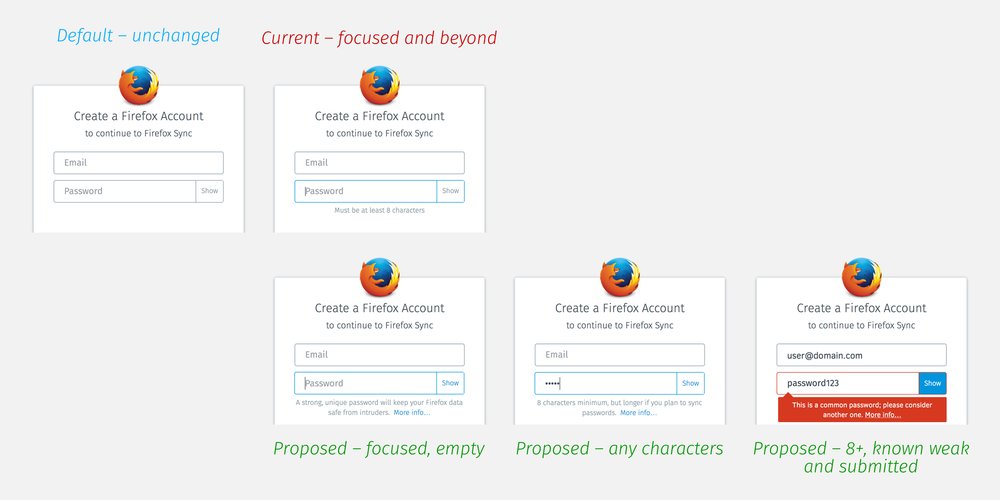
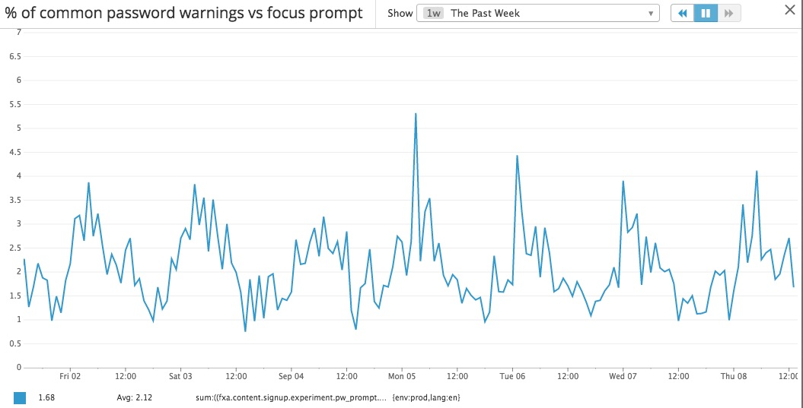
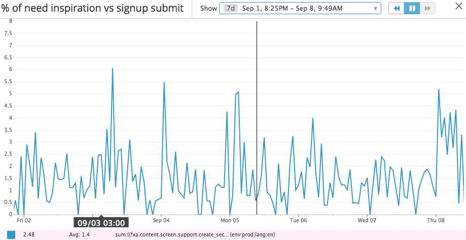

# Strengthening Passwords

## Problem Summary

[comment]: # (Talk about current goals of the system and how they aren't being met. What outcomes are we not delivering? This can also include an explicit request for improvement that doesn't dictate a specific or concrete solution.)

Users possess varying levels of understanding of what they are signing up for, and what is at risk. When syncing Firefox data (namely passwords) to a cloud-based account, reusing a password for their account puts them at greater risk to online attacks.

### Assumptions

[comment]: # (This is where you talk about what you assume to be true. This could include assumptions around what users are doing, errors, gaps, etc., based on anecdotes, opinions, testing, or data.)

Since account registration has appeared during First Run in an iframe, we are receiving more users, but with less of an understanding of the significance of making an account. Since the Choose What To Sync screen has launched, we've noticed that First Run users are twice as likely to abandon during sign-up than users from other entry points.

## Outcomes

[comment]: # (What are the outcomes you want to achieve? What is the success criteria?)

We feel that we could better serve user security and our [Data Privacy Principles](https://www.mozilla.org/en-US/privacy/principles/) by being more transparent about the risks and benefits of signing up for an account. This will hopefully result in stronger passwords as measured by our bloom filter, and also result in fewer account sign-ups (as many users will realize it's not something they need or want). Another goal is increasing multi-device usage, which in turn should result in an increase in overall Firefox engagement.

## Hypothesis

[comment]: # (A high level hypothesis of how the feature you're proposing is going help us achieve the outcomes listed above. I recommend this be a sentence of the form. We believe that doing this building this creating this experience for these people will achieve this outcome. We will know this is true when we see this qualitative feedback quantitative feedback KPI change.)

We believe that providing more information about password strength for registering users will achieve stronger passwords. We will know this is true when we see a reduction in our bloom filter numbers.

We believe that providing more information about password strength for registering users will achieve greater awareness about password strength. We will know this is true when we survey new users and ask about passwords.

We believe that blocking known weak passwords will achieve stronger passwords. We will know this is true when we see a reduction in our bloom filter numbers.

We believe that these changes will result in us collecting only the data that benefits users. We will know this is true when we see a slight reduction in the number of new accounts.

## Metrics

[comment]: # (How are you going to measure the outcome / success? Please provide sample artifact graphs here.)

* Datadog Dashboard › FxA Content Server - Password Strength › % of users that hit each restriction
 * Fewer users hitting ALL_LETTERS_OR_NUMBERS and BLOOMFILTER_HIT
* Datadog Dashboard › FxA Content Server - Registration › % of too short passwords
 * Fewer users hitting TOO_SHORT
* Datadog Dashboard › FxA Content Server - Registration › Signup funnel
 * Slightly reduced signup rate

As of 25th July 2016,
prior to shipping the new UX,;
the [Datadog password-strength dashboard](https://app.datadoghq.com/dash/67511/fxa-content-server---password-strength)
gives the following percentages for these events:

* Passwords that are too short: 10.6%
* Passwords that are just letters and numbers: 21.1%
* Passwords that are too common (aka BLOOMFILTER_HIT): 1.67%
* Bloom filter misses: 70.44%
* Successful signups as a % of submissions: 70.9%

## Detailed design

[comment]: # (This is the bulk of the RFC. Explain the design in enough detail for somebody familiar with the language to understand. This should get into specifics and corner-cases, and include examples of how the feature is used.)

#### Password field give focus
When the user gives focus to the password field on the registration form, show instructions below that say:
* A strong, unique password will keep your Firefox data safe from intruders. <u>More info</u>.

"More info" will link to a modal dialog containing concise instructions on creating a strong password based on [this SUMO article](https://support.mozilla.org/en-US/kb/create-secure-passwords-keep-your-identity-safe)

#### User enters characters
When the user enters any characters, the instructions change to become:
* 8 characters minimum, but longer if you plan to sync passwords. <u>More info</u>.

#### Submitted password is on our blocklist
When the user enters a password that is on our blocklist, the UI will behave as if the following error will be shown. The user is still able to submit the form if unchanged. If the user modifies the password, it starts the process over again, and is only submitted if the password is strong enough.
* This is a common password; please consider another one.  <u>More info</u>.

## Results

We have deployed this feature to 10% of FxA users.
Before showing the "weak" password tooltip
we gathered some metrics about the bloomfilter.
That data can be found in the "Metrics" section
of the document.

Since July 2016 and introducing new password prompts the following changed:

* Passwords that are just letters and numbers increased by 2%.
* Passwords that are too common (aka BLOOMFILTER_HIT) remained unchanged (1.7%).
* Bloom filter misses increased by 10%.
* Successful signups as a % of submissions decreased by 10%.

The decrease in signups may be attributed to having more users
login rather than signup.

About 2.1% of `en` locale users that see a focus tooltip also get the
"password is weak" warning tooltip

About 1.4% of `en` locale users that submit the signup form
also view the 'Create secure passwords' page:

About 60% of users use the large "Back" button to
navigate back from the support page. Other 40% either leave or use the 'Back' functionality in the browser.
Around ~3 users per hour view the "Need inspiration" page.

All these results and more can be found in the [Password Strength Dashboard](https://app.datadoghq.com/dash/67511/fxa-content-server---password-strength).

## Conclusion

The password strength tooltips help the small
percentage of our users. It helps those users better
understand FxA / Sync. It also helps them generate
better passwords if their password is really bad.

## Next Steps

The plan is to enable the strength checker and
a better password tooltip for all users in FxA train-70.
