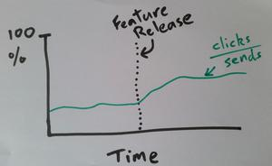
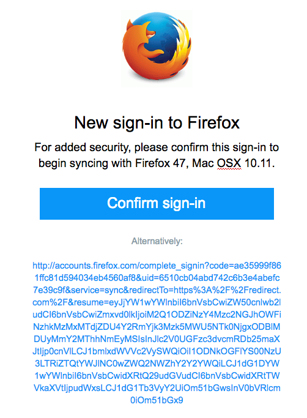
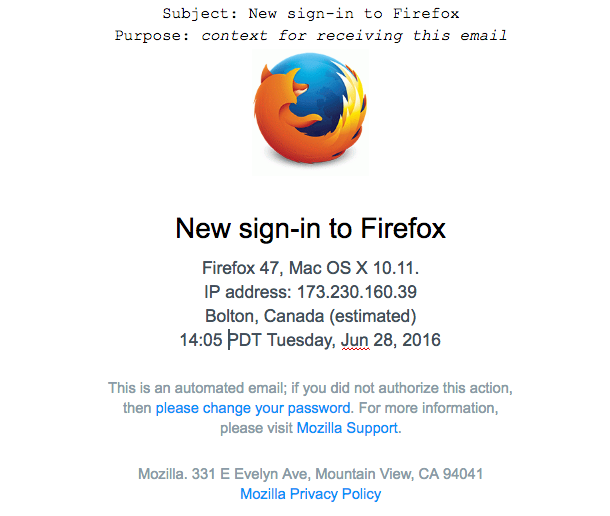
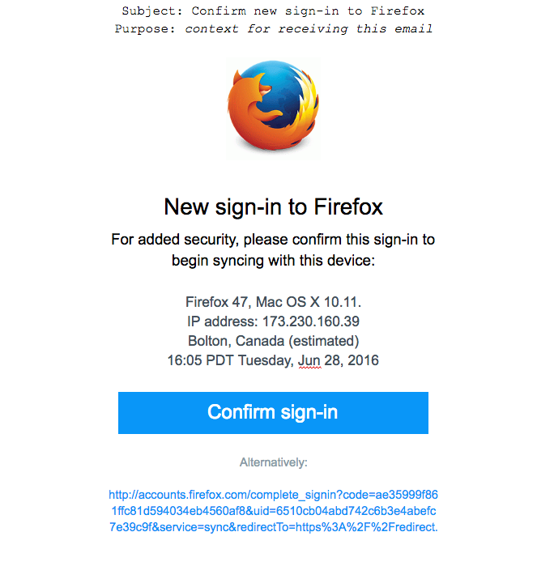
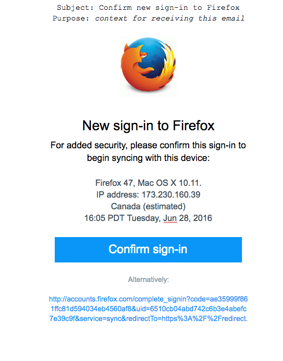
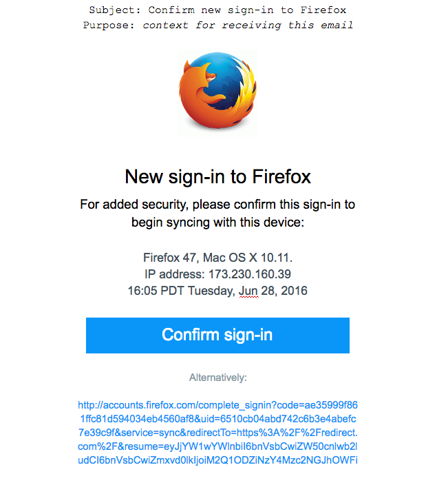
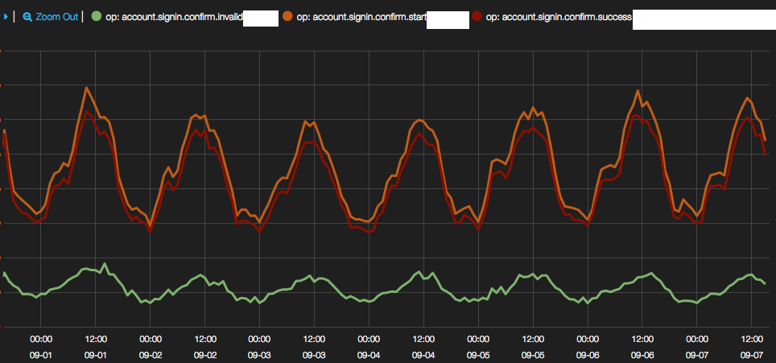
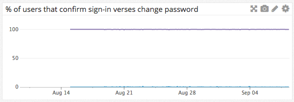
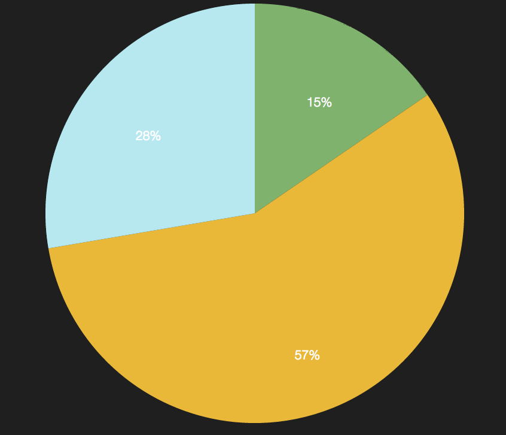

# Fxa-89: Improved Login Notifications

## Problem Summary

The current emails we use to notify users of logins
contain only minimal information about the event,
and present it in a potentially-confusing format.
We can increase the usefulness of these emails
by providing more detail
and presenting it in a more user-friendly format.

### Assumptions

* Users expect to know what sort of device
  was being used to log in, and its approximate location.

* IP-based geoprofiling
  can give us sufficiently reliable information
  about the physical location of the device
  that was used to log in to FxA,
  and a reasonable estimate of
  the accuracy of this location.


****

## Hypothesis

We believe that
including more detailed and user-friendly information
in our login notification emails,
will improve user understanding of the email
and help then know whether to act on it.

We will know this is true when we see
a measurable change in the rate at which users
act on links in the email,
although we're not able to predict
whether activity will increase or decrease.

## Outcomes

Users will see more contextual information
in the "New sign-in to Firefox" email,
in both its pre-login-confirm and post-login-notify variants.

Acceptance criteria:

* [x] Both the signin-confirmation and new-signin-notification emails
      contain browser and platform information,
      the originating IP address,
      an approximate location,
      and a timestamp.
* [x] The location information is determined by geo-lookup of IP address.
* [x] The location information displays both city and country name
      if these can be determined with reasonable confidence. Language to indicate
      approximation is `estimated`.
* [x] The location information displays just the country name
      if no city information can be determined with reasonable confidence.
* [x] The location information is not displayed
      if no country information can be determined with reasonable confidence.
* [x] The timestamp is presented in the timezone
      of the determined login location,
      if it was determined to at least country-level accuracy.
* [x] The timestamp is presented in UTC
      if no country information can be determined with reasonable confidence.
* [x] The email is localized according to the user's accept-language header.
      It is *not* localized based on the location of the login attempt.

## Metrics

To determine the success of this feature
we will measure the number of users
that click a link in the signin notification email,
as a percentage of the number of such emails sent.
This will demonstrate that the new information
has changed the way users engage with the emails:



We're not able to predict
whether the click-through rate
will decrease because fewer users
are needlessly alarmed by legitimate logins,
or will increase because more users
are able to identify suspicious behaviour.

To help monitor the accuracy of the location data,
we will emit the following events:

* Unknown location (`fxa.location.accuracy.unknown`)
  * Accuracy radius > 200 km
* Uncertain location (`fxa.location.accuracy.uncertain`)
  * 200 km >= Accuracy radius > 25 km
* Confident location (`fxa.location.accuracy.confident`)
  * 25 km >= Accuracy radius

This will allow us to produce
a stacked chart of the number of geolocation attempts
and their accuracy.

****

## Detailed design

### UX Mocks

The current login notification email
comes in two variants,
one for post-login notification
and the other for pre-login confirmation.
They look like this:




When city and country information is available,
the emails should look like this:




When only country information is available,
the emails should look like this:




When no location data could be accurately determined,
the emails should look like this:




### Technical Details

The primary source of the location data
will be [Maxmind](https://www.maxmind.com/en/geoip2-city),
which claims to be 99.8% accurate on a country level,
90% accurate on a state level,
and 81% accurate on a city level
for the US within a 50 kilometer radius.
Outside of the US it can be considerably lower.

The location services needed
to support the enhanced email notifications,
will be developed as a standalone module.
This will allow it to also be integrated into other services if needed.
This module will act as a wrapper for `node-maxmind`,
which is a wrapper for the Maxmind geoip database.

This module will expose one high level api function
that takes an ip address
and returns location data
like the following:

```javascript
{
    accuracy: 'accuracy-radius-in-km', // 5
    city: 'human-readable-city-name', // Mountain View
    continent: 'human-readable-continent-name', // North America
    country: 'human-readable-country-name', // USA
    ll: {
        latitude: 'latitude-in-decimal', // 37.386
        longitude: 'longitude-in-decimal' // -122.0838
    },
    time_zone: 'IANA-compatible-timezone', // America/Los_Angeles
}
```

This information will be passed
from fxa-auth-server to fxa-auth-mailer
for inclusion when constructing the localized email.


## High-level work breakdown

* [x] Confirm or add ability to measure click-through
      rate from these emails.
* [x] Select and integrate an IP geo lookup service.
* [x] Integrate geo lookup in fxa-auth-server and pass
      the resulting information to fxa-auth-mailer
* [x] Update email templates for the new information
      and test them via email-on-acid.
* [x] Build graph to monitor accuracy of geolocation.
* [x] Build graph to measure click-through rate
      of the email.


### Unresolved questions and risks

* Is there a way for us to measure how accurate
  the IP-based geoprofiling is in practice?
  For example can users report a location that
  seems wildly inaccurate?

### Results

Improved login notifications went live on 2016-08-11.
Two dashboards were created to show the overall success of this feature.

From [first dashboard](https://kibana.fxa.us-west-2.prod.mozaws.net/index.html#/dashboard/elasticsearch/FxA%20Sign-in%20Confirmation), sign-in confirmation with improved login notification has roughly an 92% confirmation success rate, `account.signin.confirm.success/account.signin.confirm.start`.



While there appears to be a high level of `account.signin.confirm.invalid`, this could be due to our system reporting an error if a confirmation link was clicked multiple times.

This graph shows that roughly 99% of users click the confirm sign-in button verses the change password button in confirm sign-in email. Something to note, is that these % are for normal system traffic (aka not during a security incident).



The [second dashboard](https://kibana.fxa.us-west-2.prod.mozaws.net/index.html#/dashboard/elasticsearch/FxA%20GeoDB%20Stats) shows that the geo-location accuracy from our traffic is typically resolved to within 200km, 85% of the time. This is within the stated accuracy performance of the Maxmind database.

* fxa.location.accuracy.confident = 57%
* fxa.location.accuracy.uncertain = 28%
* fxa.location.accuracy.unknown = 15%



Unfortunately, we were not able to verify if featured changed the way users interacted with the email.
We shipped the new notifications before we had the click-through metrics, so we were not able to detect this change.

However, based on the charts and graphs we do have, it is reasonable to think that improved login notifications has a neutral to positive overall impact on user behavior.
