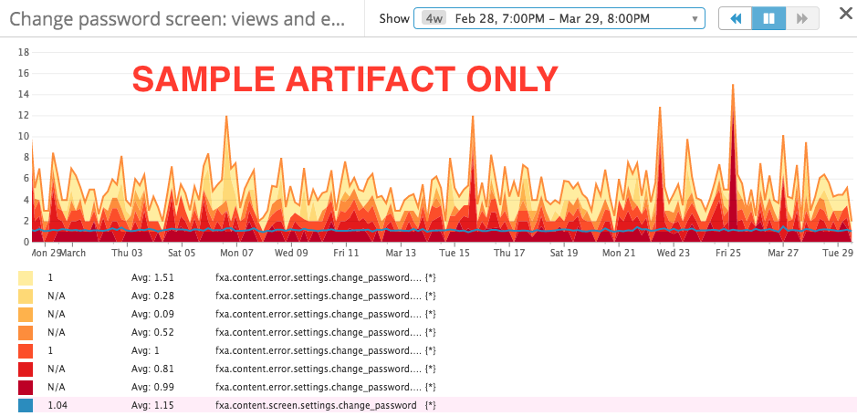
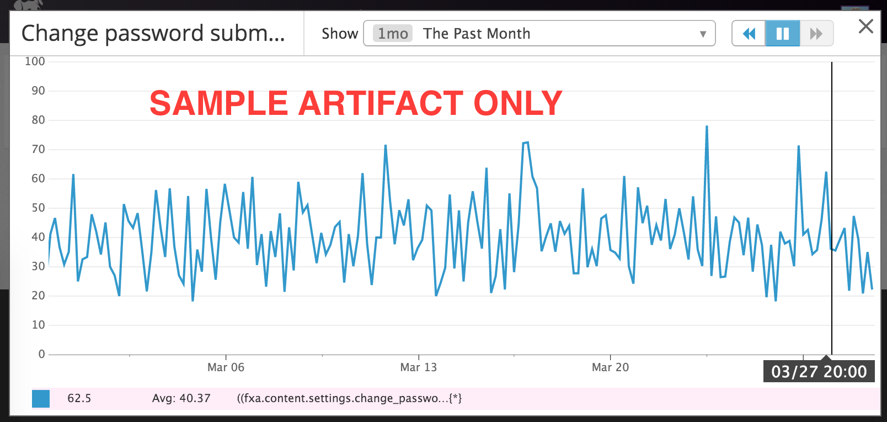
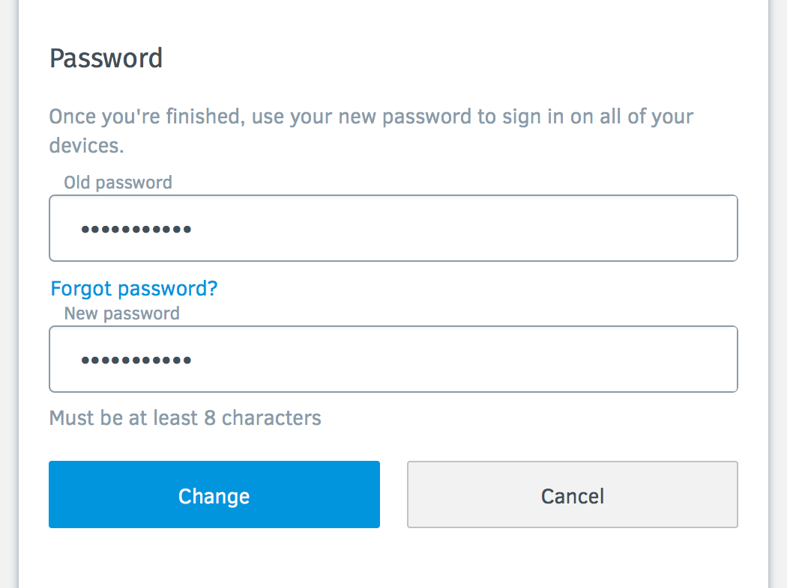

# Match 1 - Control vs. No Show
> Eye Password Experiment FXA-80

Part of the [Eye Password Experiment](https://github.com/mozilla/fxa/blob/rfeeley/eye-password-emoji/features/FxA-80-eye-password-experiment/README.md)

Idea in AHA: https://mozilla.aha.io/ideas/ideas/FXA-I-11

## Problem Summary

There are a lot of errors related to password entry.

### Assumptions

- Users use this functionality on Android more.
- The "Show" password button is useful.

****

## Outcomes

The success of this feature is being able to answer the question:

"Is the 'Show' password button useful in its current form?".
"Does it reduce the number of errors the users make on the change password page?"

## Hypothesis

We believe that the unmasking functionality helps users to reduce errors when entering their password. We will know this is true if password forms offering the unmasking functionality result in fewer password related errors compared to password forms that don't contain the unmasking functionality.

We will know this is true when we see an increase in bounces to the section, and Task Success errors outlined below.

## Metrics

Here are **proposed** metrics events:

```
fxa.content.screen.settings.change_password
fxa.content.settings.change_password.password.hidden
fxa.content.settings.change_password.password.visible
fxa.content.settings.change_password.submit
fxa.content.settings.change_password.success

fxa.content.error.settings.change_password.auth.103
// Incorrect password

fxa.content.error.settings.change_password.auth.121
// Your account has been locked for security reasons

fxa.content.error.settings.change_password.auth.1008
// Your new password must be different

fxa.content.error.settings.change_password.auth.1009
// Must be at least 8 characters

fxa.content.error.settings.change_password.auth.1010
// Valid password required

fxa.content.screen.settings.change_password
// Change Password section in Settings

// OPTIONAL EVENTS BELOW, these might "just work" and we don't have to manually add them.
fxa.content.error.settings.change_password.auth.999
// UNEXPECTED_ERROR_MESSAGE

fxa.content.error.settings.change_password.auth.1005
// Working…

fxa.content.experiment.[group].[experiement_name].enrolled
```

where `[group]` is `treatment` or `control`.

**Each event will have a tag called `experiment` and `group` that
 will signal which experiment state the user is in.**

Having these tags will help us produce the artifacts mentioned above.
To understand the bounce rate we will rely on form submissions.

Proposed DataDog query for submission rate of change password (Graphs 3) and 4):

```
{
  "requests": [
    {
      "q": "( sum:fxa.content.settings.change_password.submit{$env}.as_count() / sum:fxa.content.screen.settings.change_password{$env}.as_count() ) * 100",
      "type": "line",
      "conditional_formats": [],
      "aggregator": "avg"
    }
  ],
  "viz": "timeseries"
}
```


We will build at least **eight** graphs.

The four main graphs are:

1. "Flame chart" for those who do not have an opportunity to use "Show" password.
2. "Flame chart" for those who can "Show Password"
3. Change password submission for control
4. Change password submission for treatment

The other 4 are the same as above but just for **Android**.

Example of graph 1) and 2):



Example of graph 3) and 4):



****

## Detailed design


Below are the defined Control vs Treatment designs:

### Control


### Treatment



****
