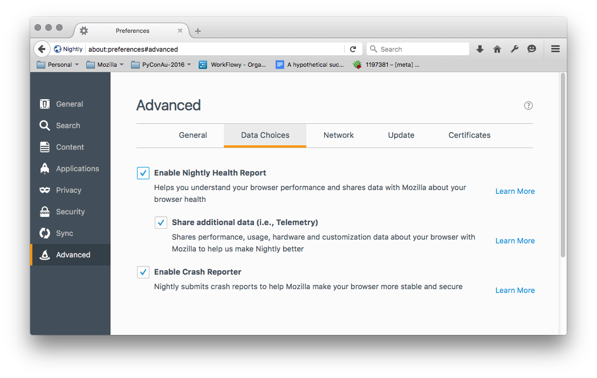

# Metrics Opt-Out

https://mozilla.aha.io/features/FXA-76

## Stories

As a privacy conscious user,
I want the ability to opt-out of non-essential metrics gathering
from Firefox Accounts and related services.

As a user, I want Firefox Accounts to
automatically respect the data choices
that I've already expressed in my local Firefox settings.

## Details

Firefox users can make choices about the data they share with Mozilla
by using the following UI in Firefox:

Which toggle the following options in about:config:

* datareporting.healthreport.uploadEnabled
* toolkit.telemetry.enabled

Which in turn control whether
the browser will collected and submit
usage and performance metrics.

Firefox Accounts should provide a similar level of control
over its metrics data collection,
and should automatically respect the user's data choices
that they've already made in the browser.
We'll do this by adding
a single opt-out preference
to control metrics gathering behaviour.

### Metrics opt-out preference

We will add an additional field
called "metrics\_optout"
to the user's profile data,
which will have three possible states:

* `null`: the user has not made an explicit choice to disable metrics.
* `false`: the user has explicitly chosen to allow metrics collection.
* `true`: the user has explicitly chosen to disable metrics collection.

The default will be `null`,
and metrics-gathering will be assumed enabled by default,
analogous to the way Health Report
is enabled by default in Firefox.

The preference will be managed by fxa-profile-server
in the same manner as existing profile data elements,
using the following new API endpoints:

* `GET /v1/metrics_optout`
* `POST /v1/metrics_optout`

The preference will be readable by any relier
granted the "profile:metrics\_optout" scope,
which will only be available
to trusted internal reliers.
Mozilla properties that rely on Firefox Accounts
should consider respecting the user's preference,
although we will not make it a hard requirement
for becoming a relier.

### Effects of the preference

For users with `metrics_optout=true`,
we will disable non-essential metrics collection by:

* Disabling submission of in-page metrics from the content-server
  (specifically, data currently submitted to the `post-metrics`
  and `get-metrics-errors` endpoints).
* Ensuring they are excluded from
  (or failing that, are in the control group for)
  any A/B experiments
* Communicating the preference to iframe embedders
  such as the first-run page,
  so that they too can respect it.

The preference does *not* opt the user out of metrics gathered
as a side-effect of operations essential to the service,
such as aggregated server log metrics
or the server-side "activity events" metrics stream.

XXX TODO: does this cost us a round-trip to fetch the preference
or can we inline it with work we're already doing?

### Exposing the preference

XXX TODO: what sort of UI treatment do we want
for the initial version of this, if any?

### Respecting choices made in Firefox

When accounts.firefox.com is loaded by Firefox,
it should perform a handshake with the browser
to discover whether the user
has opted out of metrics gathering
via Firefox Health Report.
If the browser reports that they have done so,
then we will do our best to respect that preference
Specifically:

* If there is no currently-logged-in user,
  we will act as though "metrics\_optout" were true
  and disable non-essential metrics gathering.

* If there is a currently-logged-in user,
  and their "metrics\_optout" prefence is `null`,
  we will update their profile data
  to set "metrics\_optout=true",
  so that they don't have to express their preference again.

* If there is a currently-logged-in user,
  and their "metrics\_optout" prefence is not `null`,
  we will ignore the value provided by the browser
  because they've already made an explicit choice.

* If a user creates an account or logs in
  via a browser with FHR disabled,
  we will automatically set "metrics\_optout=true"
  in their profile data.

XXX TODO: this needs more design work
informed by previous discussions about "device handshake".

The handshake will go something like this:

* Early in its loading sequence, fxa-content-server
  sends a WebChannel message to probe the browser
  for internal state.
* fxa-content-server listens for
  a response from the browser,
  timing out after a reasonable period
  if no reply is received.
  The timeout behavoir may be adjusted
  depending on the context parameter.
* The browser responds with a JSON object.
  If the preference `datareporting.healthreport.uploadEnabled` is false
  then the object will include a key "metrics\_optout" with value `true`.
  If the preference is unset or true then no "metrics\_optout" key is
  provided.

We may choose to include additional data in the response,
such as reporting the logged-in state of the browser,
but the metrics opt-out preference
is the only piece of data that must ship
in the initial version of the handshake.

### Measuring success

We will measure success of this feature
simply by checking whether people are using it.
We do not have a target percentage of users
who are expected to use this feature,
but expect some non-zero percentage to trigger it
through data choices made in the browser.

To confirm that it is being used,
we will track the absolute number of users
who record a metrics opt-out preference per day,
and expect it to be small but non-zero.

Whenever the fxa-profile-server sets a non-default
value for the "metrics\_optout" setting, it will emit
an increment statistic for monitoring in datadog.
While it's a little ironic
to track metrics about a feature
that's designed to disable metrics gathering,
the setting of the preference
is essential to the operation of the service,
so there's no reason to be shy about tracking it.

## Work breakdown

* [ ] Confirm acceptability of the plan with legal.
* [ ] Confirm acceptability of the plan with growth team.
* [ ] Implement storage/retreival APIs in fxa-profile-server.
* [ ] Finalize and implement UX for managing the preference.
* [ ] Implement device handshake logic:
  * [ ] Finalize precise details of the messaging protocol.
  * [ ] Have fxa-content-server send probe message on page load.
  * [ ] Have Desktop Firefox to listen for probe and respond.
* [ ] Make non-essential metrics gathering in fxa-content-server
      conditional on the preference.
* [ ] Make experiment choices in able conditional on the preference.

## Open Questions

* Should this also disable metrics
  reported via postMessage to the firstrun page?

## Notes

Some previous disucssion in https://github.com/mozilla/fxa-content-server/issues/2642
