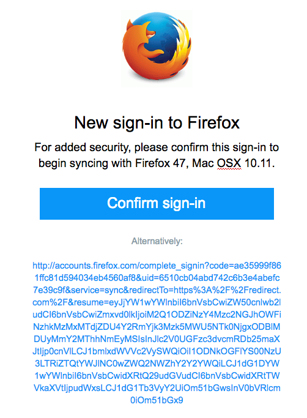
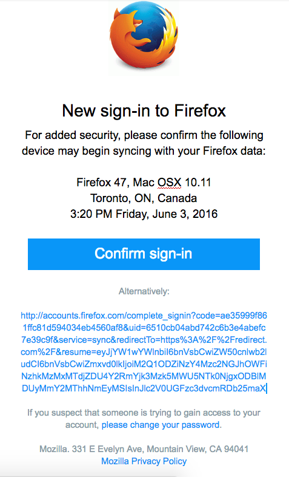

# Fxa-89: Improved Login Notifications

## Problem Summary

The current emails we use to notify users of logins
contain only minimal information about the event,
and present it in a potentially-confusing format.
We can increase the usefulness of these emails
by providing more detail
and presenting it in a more user-friendly format.

### Assumptions

* Users expect to know what sort of device
  was being used to log in, and its approximate location.

* IP-based geoprofiling
  can give us sufficiently reliable information
  about the physical location of the device
  that was used to log in to FxA.

****

## Hypothesis

We believe that
including more detailed and user-friendly information
in our logn notification emails,
will improve user understanding of the email
and help then know whether to act on it.

We will know this is true when we see
a measurable change in the rate at which users
act on links in the email,
although we're not able to predict
whether activity will increase or decrease.

## Outcomes

Users will see more contextual information
in the "New sign-in to Firefox" email,
in both its pre-login-confirm and post-login-notify variants.

Acceptance criteria:

* [ ] Both the signin-confirmation and new-signin-notification emails
      contain browser and platform information, an approximate location,
      and a timestamp.
* [ ] The location information is determined by geo-lookup of IP address.
* [ ] The location information is displayed to city-level precision
      and includes city, state and country where applicable.
* [ ] The timestamp is presented in the timezone of the login location.
* [ ] The email is localized according to the user's stored language
      prefernces, or their accept-language header.  It is *not* localized
      based on the location of the login attempt.

## Metrics

To determine the success of this feature
we will measure the number of users
that click a link in the signin notification email,
as a percentage of the number of such emails sent.
This will demonstrate that the new information
has changed the way users engage with the emails.

We're not able to predict
whether the click-through rate
will decrease because fewer users
are needlessly alarmed by legitimate logins,
or will increase because more users
are able to identify suspicious behaviour.

TODO: sample metric artifact

****

## Detailed design

## UX Mocks

The current login notification email
comes in two variants,
one for post-login notiication
and the other for pre-login confirmation.
They look like this:

With the additional details included,
the emails should look like this:

## High-level work breakdown

* [ ] Confirm or add ability to measure click-through
      rate from these emails.
* [ ] Select and integrate an IP geo lookup service.
* [ ] Integrate geo lookup in fxa-auth-server and pass
      the resulting information to fxa-auth-mailer
* [ ] Update email templates for the new information
      and test them via email-on-acid.

### Unresolved questions and risks

* Is there a way for us to measure how accurate
  the IP-based geoprofiling is in practice?
  For example can users report a location that
  seems wildly inaccurate?

