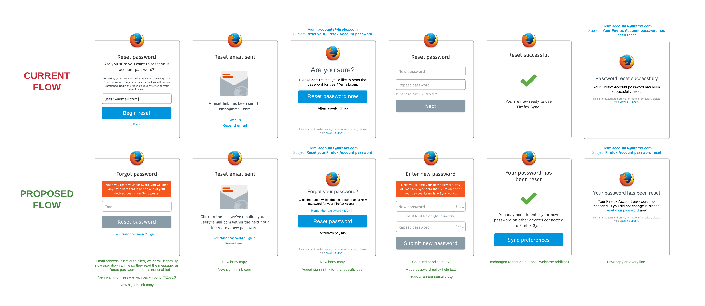
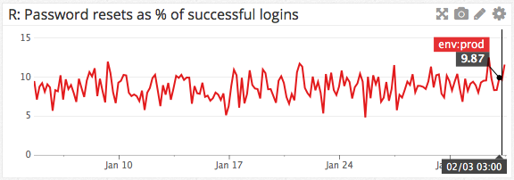

Reset Password
==============

https://mozilla.aha.io/features/FXA-72

So that I can avoid inadvertently losing all my Sync data, as a forgetful Firefox Accounts user, I want to understand more clearly what will happen when I reset my password.

## Outcomes

The revised password reset UX
went live in FxA train-58
in mid-March 2016.

While it's difficult to measure
or attribute with any certainty,
the support team does note
a decrease in the number of complaints
related to password reset
and the data loss that ensues.

There does not appear to have been
any meaningful change
in the rate of password resets
as a percentage of successul logins,
which remains at around 10%:

Additionally, there appears to be a slight drop off of password resets after seeing the updated reset warning message.

----------------

## Current/Proposed UX

([Static](https://cloud.githubusercontent.com/assets/68213/12796515/2cec6c90-ca8d-11e5-99da-4d511062c61c.png))

## Success Criteria

We will measure whether this messaging is successful
though a qualitative decrease in user support requests/complaints
related to data loss after password reset.

We will also monitor for any change in
the number of password resets as a percentage of successful logins
[as tracked in datadog](https://app.datadoghq.com/dash/92125/fxa-content-server---password-resets?live=true&page=0&is_auto=false&from_ts=1451695460137&to_ts=1454287460137&tile_size=m).
As at end of January 2016 this rate is around 10%:

If some users are encouraged to "try harder" to remember their password
as a result of this improved messaging,
then we may observe a decrease in this percentage.
