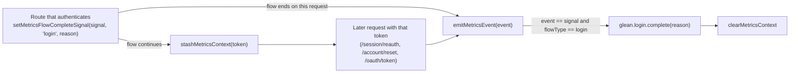

# Auth server metrics: `login.complete`

The Glean event `login.complete` marks the end of a sign-in. Each sign-in
emits it once, with a `reason` that tells how the user authenticated. The
metric is defined in `packages/fxa-shared/metrics/glean/fxa-backend-metrics.yaml`.

## Reasons

| `reason`         | Set by                                                                                 |
| ---------------- | -------------------------------------------------------------------------------------- |
| `email`          | Password sign-in (`routes/utils/signin.js`)                                            |
| `passkey`        | Passkey sign-in (`routes/passkeys.ts`, and `signin.js` for a passkey-verified session) |
| `otp`            | Passwordless code sign-in (`routes/passwordless.ts`)                                   |
| `google`/`apple` | Third-party sign-in (`routes/linked-accounts.ts`)                                      |
| `reset`          | Sign-in at the end of a password reset (`routes/password.ts`)                          |

## How it is emitted

A sign-in can complete several requests after the route that authenticated
the user. For example, a Sync sign-in completes only when the browser gets its
Sync token at `/oauth/token`. The auth server uses the flow-complete signal in
the metrics context to connect these requests.

1. The route that authenticates the user calls
   `request.setMetricsFlowCompleteSignal(signal, 'login', reason)`
   (`context.js`). `signal` is the name of the event that ends the flow.
2. If the flow continues on a later request, the route calls
   `request.stashMetricsContext(token)`. A later request that uses that
   token reads the signal back from the stash.
3. When a route calls `request.emitMetricsEvent(event)` (`events.js`) and
   `event` is the same as the signal, with `flowType` `login`, the auth
   server emits `login.complete` with `reason` set to the stashed value.
4. After it emits `login.complete`, the auth server deletes the stash for
   the token, so a later request with that token cannot emit it again.

The signal in step 3 does not depend on the legacy flow events or Amplitude.

## Which event ends the flow

| Flow                                  | Signal              | Emitted at                                                                                    |
| ------------------------------------- | ------------------- | --------------------------------------------------------------------------------------------- |
| Sync, any sign-in method              | `account.signed`    | `/oauth/token`, for an oldsync token without `profile`                                        |
| Not Sync, session already verified    | `account.login`     | The sign-in route                                                                             |
| Not Sync, session needs a second step | `account.confirmed` | The route that confirms the session (TOTP, recovery code, recovery phone, email code or link) |
| Not Sync, password reset              | `account.reset`     | `/account/reset`                                                                              |
| Not Sync, passwordless code           | none                | `routes/passwordless.ts` calls `glean.login.complete` directly                                |

## Rules for a new sign-in path

- Set the signal before the first `stashMetricsContext` call for that token.
  The stash uses `cache.add`, so the first stash wins. A later stash for the
  same token does not replace it, so it cannot add or change the signal.
- Use `account.signed` as the signal for every Sync sign-in. The login is not
  complete until the browser has its keys and turns on Sync.
- Do not call `glean.login.complete` directly on a code path that also sets
  a signal. If you do, the sign-in counts twice.
- `setMetricsFlowCompleteSignal` does nothing when the request has no
  `metricsContext` in its payload. A client that does not send one gets no
  `login.complete`.

## `account.signed` is not `login.complete`

`account.signed` is a legacy event. `/oauth/token` emits it for each oldsync
token, also for registrations and later token requests, to the activity log,
the flow event log and Amplitude (`cert_signed`). It causes `login.complete`
only when it matches a stashed `login` signal.
