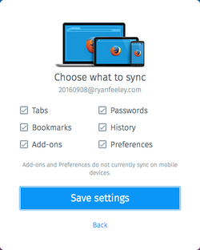
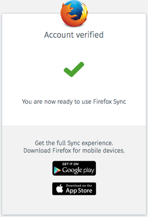
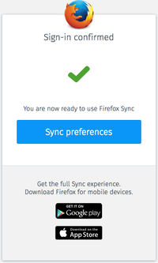
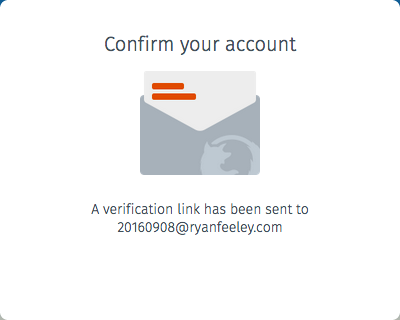
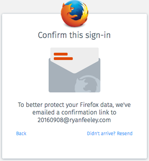
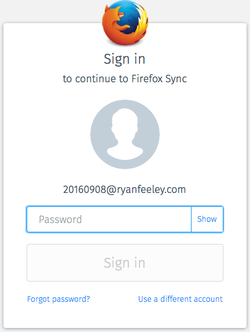

# Client side metrics

## Top level

### context

The context will be one of:

-   `fx_desktop_v1` Fx Desktop Sync v1 (Uses CustomEvents to communicate)
-   `fx_desktop_v2` Fx Desktop Sync v2 (Uses WebChannels to communicate)
-   `fx_desktop_v3` Fx Desktop Sync v3 (Enables CWTS on the web)
-   `fx_fennec_v1` Fx Fennec v1
-   `fx_firstrun_v2` Fx Desktop firstrun v2
-   `iframe` Fx Desktop firstrun v1
-   `oauth` OAuth relier
-   `web` Interact w/ content server w/o signing into a relier.

### broker

The broker used to coordinate behavior between FxA and the relier.

### duration

How long the user was at Firefox Account

### entrypoint

If the user is signing in from the Firefox browser, the entrypoint is where the user came from. Set to `none` if not signing into a Firefox browser service.

The known values of `entrypoint` are:

-   menupanel: the "sign in to sync" option at the bottom of the hamburger menu.
-   menubar: the "sign in to sync" itme in the top-level "tools" menu
-   abouthome: the sync button on about:home
-   dev-edition-setup: the dev-edition configuration process, which invites users to sync with their main profile
-   syncbutton: the "sync now" button in the hamburger menu
-   preferences: direct navigation to about:preferences#sync
-   synced-tabs: the synced-tabs item in the hamburger menu
-   tabs-sidebar: the synced-tabs sidebar
-   accounts-page: the iframe at https://www.mozilla.org/firefox/accounts/
-   firstrun: the iframe on the Firefox first-run page
-   firstrun_v2: the iframe on the Firefox first-run page, version 2
-   whatsnew: the /whatsnew landing page shown after upgrading Firefox
-   fxa:connect_another_device: user clicked "sign in" button from /connect_another_device page
-   fxa:signin-complete: TODO: we need to track down what's sending this value
-   fxa:signup: user clicked the "Looking for Sync" text from the signup page
-   fxa:signup-complete: TODO: we need to track down what's sending this value

### entrypoint_experiment and entrypoint_variation

If an experiment is running at the entrypoint,
these properties will be set
with the name of the experiment
and the variation that
the user is part of.

### events

The event stream, see [Event Stream](#event_stream)

### migration

If the user is migrating from an "old sync", this is the version the user is migrating from. Set to `none` if not migrating.

### lang

The locale shown to the user.

### marketing

A log of marketing links shown to the user on `signup_complete`. An array of entries, each entry contains the following fields:

-   campaignId - The marketing campaign identifier.
-   clicked - Whether the user clicked the link.
-   url - the URL displayed.

### navigationTiming

Performance information from window.performance.timing.

Contains:

-   navigationStart
-   unloadEventStart
-   unloadEventEnd
-   redirectStart
-   redirectEnd
-   fetchStart
-   domainLookupStart
-   domainLookupEnd
-   connectStart
-   connectEnd
-   secureConnectionStart
-   requestStart
-   responseStart
-   responseEnd
-   domLoading
-   domInteractive
-   domContentLoadedEventStart
-   domContentLoadedEventEnd
-   domComplete
-   loadEventStart
-   loadEventEnd

See https://developer.mozilla.org/docs/Navigation_timing for more information.

### numStoredAccounts

The number of accounts the user has stored in localStorage. Only sent once from the /signin page.

### referrer

Where the user came from. Not set if the `referrer` header cannot be read.

### screen

Screen information

Contains:

-   clientHeight: viewport height as reported by window.documentElement.clientHeight. `none` if not supported.
-   clientWidth: viewport height as reported by window.documentElement.clientWidth. `none` if not supported.
-   devicePixelRatio: device pixel ratio as reported by window.devicePixelRatio. `none` if not supported.
-   height: screen height as reported by window.screen.height. `none` if not supported.
-   width: screen width as reported by window.screen.width. `none` if not supported.

### service

Service using FxA to authenticate. If Sync, this will be `sync`. If
an OAuth relier, this will be the relier's `client_id`. Set to `none` if the user browsed directly to the https://accounts.firefox.com without going through a relier.

## Event stream

The event stream is a log of events and the time they occurred while the user is interacting with Firefox Accounts. The event stream includes which screens are displayed, any success or error messages displayed, any JavaScript errors that occurr, as well as any other information the developers or metrics team feel is important.

### Generic events

-   tooltip.generic-dismissed - a dismissable tooltip is dismissed
-   error.&lt;resource&gt;.require-on-demand.999 - resource dependency fetch had an unexpected error.
-   error.&lt;resource&gt;.require-on-demand.1000 - resource dependency fetch has timed out.
-   error.&lt;resource&gt;.require-on-demand.1001 - resource dependency does not have a define.
-   error.&lt;resource&gt;.require-on-demand.1002 - resource dependency had a script error.
-   error.&lt;screen_name&gt;.auth.1046 - attempt to render HTML using a string that contains an unescaped interpolation variable.
-   error.&lt;screen_name&gt;.auth.1047 - attempt to render an escaped string
    that contains HTML.
-   error.&lt;unexpected_origin&gt;.auth.1027 - a postMessage message was received from an unexpected origin.
-   error.&lt;image_url&gt;.profile.997 - a profile image could not load.
-   error.&lt;screen_name&gt;.&lt;service&gt;.998 - System unavailable.
-   error.persistAccount.auth.1050 - an attempt is being made to write an account with no uid to localStorage.
-   loaded - logged after the first screen is rendered.
-   &lt;screen_name&gt;.submit - A submit event has occurred and all of the form's input elements are valid.
-   &lt;screen_name&gt;.refresh - The aforementioned screen was refreshed.
-   signin.success - The user has succesfully completed the signin flow.

#### Authentication namespace

-   error.&lt;screen_name&gt;.auth.114 - account has been throttled ("Attempt limit exceeded")
-   error.&lt;screen_name&gt;.auth.1005 - request taking longer than expected ("Working...")
-   error.&lt;screen_name&gt;.auth.999 - Unknown error.

### Events per screen

#### change_password

-   error.change_password.auth.103 - incorrect password
-   error.change_password.auth.121 - account locked
-   error.change_password.auth.1008 - new password must be different
-   error.change_password.auth.1009 - password must be at least 8 characters
-   error.change_password.auth.1010 - valid password required
-   change_password.unlock-email.send - user attempted to send unlock email
-   change_password.unlock-email.send.success - unlock email successfully sent
-   change_password.success - password changed successfully

#### choose_what_to_sync

-   choose-what-to-sync.engine-unchecked.`<engine_name>` - a Sync engine was unselected.

#### complete_reset_password

-   complete_reset_password.verification.success - email successfully verified.
-   complete_reset_password.resend - A verification email was resent after an expired link was opened.
-   error.complete_reset_password.auth.1004 - password does not match
-   error.complete_reset_password.auth.1009 - password must be at least 8 characters
-   error.complete_reset_password.auth.1010 - valid password required
-   error.complete_reset_password.auth.1011 - valid email required
-   error.complete_reset_password.auth.1025 - user clicked on an expired verification link.

#### verify_email

-   verify_email.verification.success - email successfully verified.
-   verify_email.resend - A verification email was resent after an expired link was opened.
-   error.verify_email.auth.1025 - user clicked on an expired verification link.
-   error.verify_email.auth.1026 - user clicked on a damaged verification link.
-   error.verify_email.auth.1040 - user tried to verify an account that does not exist.

#### complete_signin

-   complete_signin.verification.success - email successfully verified.
-   error.complete_signin.auth.1025 - user clicked on an expired verification link.
-   error.complete_signin.auth.1026 - user clicked on a damaged verification link.
-   error.complete_signin.auth.1041 - user tried to verify a sign-in that has already been verified.

#### confirm

-   confirm.resend - attempt to resend verification email
-   error.confirm.auth.1039 - Polling failed.
-   error.confirm.auth.1041 - user tried to verify a sign-in that has already been verified.

#### confirm_signin

-   confirm_signin.verification.success - email successfully verified.
-   confirm_signin.back - user clicked back.
-   confirm_signin.resend - user resent verification email.
-   error.confirm_signin.auth.110 - Invalid authentication token used.
-   error.confirm_signin.auth.1039 - Polling failed.
-   error.confirm_signin.auth.1041 - user tried to verify a sign-in that has already been verified.

#### confirm_reset_password

-   confirm_reset_password.verification.success - Password successfully reset.

#### cookies_disabled

-   error.cookies_disabled.auth.1003 - Cookies are still disabled.

#### delete_account

-   error.delete_account.auth.1009 - password must be at least 8 characters
-   delete-account.deleted - user successfully deleted an account

#### force_auth

-   error.force_auth.auth.114 - request has been throttled
-   error.force_auth.auth.125 - request has been blocked
-   flow.force_auth.engage - user engaged the form
-   flow.force_auth.submit - user submit the form with front-end validation passing

#### legal

#### pp

#### ready

#### report-signin

-   report-signin.submit - user has submit the signin report.
-   error.report-signin.auth.127 - unblock code does not match one on record
-   error.report-signin.auth.1045 - report sign in link is damaged

#### reset_password

-   error.reset_password.auth.102 - unknown account
-   error.reset_password.auth.1011 - user did not enter an email address
-   error.reset_password.auth.1023 - user entered an email address that was invalid

#### sms

-   error.sms.auth.114 - throttled - user has sent too many SMS messages
-   error.sms.auth.129 - entered phone number is invalid
-   error.sms.auth.130 - attempt to send an SMS to an unsupported country
-   error.sms.auth.131 - SMS message ID is invalid
-   error.sms.auth.132 - SMS could not be sent
-   error.sms.auth.1049 - no phone number entered
-   error.sms.sms.1 - (SMS provider) throttled
-   error.sms.sms.2 - (SMS provider) missing parameter
-   error.sms.sms.3 - (SMS provider) invalid parameter
-   error.sms.sms.4 - (SMS provider) invalid credentials
-   error.sms.sms.5 - (SMS provider) internal error
-   error.sms.sms.6 - (SMS provider) unroutable message
-   error.sms.sms.7 - (SMS provider) number blocked
-   error.sms.sms.8 - (SMS provider) account blocked
-   error.sms.sms.9 - (SMS provider) account quota limit exceeded
-   error.sms.sms.11 - (SMS provider) account not enabled for REST
-   error.sms.sms.12 - (SMS provider) message too long
-   error.sms.sms.13 - (SMS provider) communication failed
-   error.sms.sms.14 - (SMS provider) invalid signature
-   error.sms.sms.15 - (SMS provider) invalid sender address
-   error.sms.sms.16 - (SMS provider) invalid ttl
-   error.sms.sms.19 - (SMS provider) facility not allowed
-   error.sms.sms.20 - (SMS provider) invalid message class
-   error.sms.sms.23 - (SMS provider) missing protocol
-   error.sms.sms.29 - (SMS provider) destination not allowed
-   error.sms.sms.35 - (SMS provider) invalid phone number

#### settings

-   settings.signout.submit - user clicked signout
-   settings.signout.success - user successfully signed out
-   settings.signout.error - user signed out but with an error
-   settings.communication-prefs-link.visible.true - communication preferences link is visible
-   settings.communication-prefs-link.visible.false - communication preferences link is not visible

#### settings/avatar

#### settings/avatar/camera

-   fxa.content.settings.avatar.camera.submit.change - user submit the camera avatar and had an avatar set before
-   fxa.content.settings.avatar.camera.submit.new - user submit the camera avatar and had an avatar set before

#### settings/avatar/change

#### settings/avatar/crop

-   settings.avatar.crop.rotate.cw - user rotated the image clockwise using the rotate button
-   settings.avatar.crop.translate - user translated the image using a drag operation
-   settings.avatar.crop.zoom.in - user zoomed into the image using the magnify button
-   settings.avatar.crop.zoom.out - user zoomed out from the image using the magnify button
-   settings.avatar.crop.zomm.range - user zoomed in or out the image using the input range control
-   settings.avatar.crop.submit.change - user submit the cropper and had an avatar set before
-   settings.avatar.crop.submit.new - user submit the cropper avatar

#### settings/clients

-   settings.clients.[clientType].disconnect - user is attempting to disconnect a client type (types: `device` or `app`)
-   settings.clients.refresh - user refreshed the device and apps panel
-   settings.clients.open - user opened the client panel

#### settings/clients/disconnect

-   settings.clients.disconnect.submit.[reason] - user submit the disconnect form with [reason] (types: `old`, `suspicious`, `lost`, `no`)

#### settings/communication_preferences

-   settings.communication-preferences.newsletter.optin.true - user is opted in to newsletter when opening screen.
-   settings.communication-preferences.newsletter.optin.false - user is not opted in to newsletter when opening screen.
-   settings.communication-preferences.checkbox.change.marketing-email-optin.unchecked - user has opted in to the marketing email
-   settings.communication-preferences.checkbox.change.marketing-email-optin.checked - user has opted out of the marketing email
-   settings.communication-preferences.optIn - user is attempting to opt in to email marketing.
-   settings.communication-preferences.optIn.success - user has successfully opted in to email marketing.
-   settings.communication-preferences.optOut - user is attempting to opt out of email marketing.
-   settings.communication-preferences.optOut.success - user has successfully opted out of email marketing.

#### signin

-   error.oauth.signin.auth.1011 - user did not enter an email address
-   error.oauth.signin.auth.1023 - user entered an email address that was invalid
-   error.signin.auth.103 - incorrect password
-   error.signin.auth.114 - request has been throttled
-   error.signin.auth.121 - account locked
-   error.signin.auth.125 - request has been blocked
-   error.signin.auth.1011 - user did not enter an email address
-   error.signin.auth.1023 - user entered an email address that was invalid
-   flow.signin.engage - user engaged the form
-   flow.signin.submit - user submit the form with front-end validation passing
-   signin.ask-password.skipped - skipped asking for password thanks to existing session token
-   signin.ask-password.shown.account-unknown - asked for password due to missing account data
-   signin.ask-password.shown.email-mismatch - asked for password due to using a different email
-   signin.ask-password.shown.keys-required - asked for password because the relier wanted keys
-   signin.ask-password.shown.session-from-web - asked for password because session was created via web content
-   signin.ask-password.shown.session-expired - asked for password due to expired session token
-   signin.success.skip-confirm - user successfully signed in and did not have to confirm login
-   signin.use-different-account - user clicked link to use different account
-   signin.unlock-email.send - user attempted to send unlock email
-   signin.unlock-email.send.success - unlock email successfully sent

#### signin_permissions

-   signin-permissions.accept - user accepts and grants the requested permissions
-   signin-permissions.success - sign in successfully occurred

#### signin-reported

No page specific events

#### signin_unblock

-   signin-unblock.submit - user has submit the signin unblock code
-   signin-unblock.signin.success - user has successfully signed in from the unblock screen
-   error.signin-unblock.auth.103 - password is incorrect
-   error.signin-unblock.auth.114 - request has been throttled
-   error.signin-unblock.auth.125 - request has been blocked
-   error.signin-unblock.auth.127 - unblock code does not match one on record
-   error.signin-unblock.auth.1043 - user did not enter an unblock code
-   error.signin-unblock.auth.1044 - user entered unblock code is malformed

#### signup

-   error.oauth.signup.auth.1011 - user did not enter an email address
-   error.oauth.signup.auth.1023 - user entered an email address that was invalid
-   error.signup.auth.103 - incorrect password (for signin from signup)
-   error.signup.auth.114 - request has been throttled
-   error.signup.auth.125 - request has been blocked
-   error.signup.auth.1011 - user did not enter an email address
-   error.signup.auth.1011 - user did not enter an email address
-   error.signup.auth.1012 - user did not enter year of birth
-   error.signup.auth.1016 - user did not enter their birthday
-   error.signup.auth.1018 - user's verification email bounced
-   error.signup.auth.1019 - user re-submitted bounced email address
-   error.signup.auth.1020 - user entered an @firefox.com address
-   error.signup.auth.1023 - user entered an email address that was invalid
-   error.signup.auth.1029 - signup is disabled on Fx for iOS v1
-   error.signup.auth.1030 - signup has been force disabled by a Sync based relier.
-   flow.signup.engage - user engaged the form
-   flow.signup.submit - user submit the form with front-end validation passing
-   signup.checkbox.change.customize-sync.checked - user checked the "Choose what to sync" checkbox.
-   signup.checkbox.change.customize-sync.unchecked - user unchecked the "Choose what to sync" checkbox.
-   signup.checkbox.change.marketing-email-optin.checked - user checked the email opt-in
-   signup.checkbox.change.marketing-email-optin.unchecked - user unchecked the email opt-in
-   signup.checkbox.change.show-password.checked - password is shown
-   signup.checkbox.change.show-password.unchecked - password is hidden
-   signup.experiment.pw_strength.all_letters_or_numbers - password contains all numbers or letters and is &lt; 12 characters in length
-   signup.experiment.pw_strength.bloomfilter_hit - password was found in bloomfilter
-   signup.experiment.pw_strength.bloomfilter_miss - password was checked against the bloomfilter but no found
-   signup.experiment.pw_strength.bloomfilter_used - bloomfilter was used
-   signup.experiment.pw_strength.enabled - user was opted in to password strength check
-   signup.experiment.pw_strength.long_enough - password is &gte; 12 characters
-   signup.experiment.pw_strength.missing_password - no password supplied
-   signup.experiment.pw_strength.too_short - password was &lt; 8 characters
-   signup.password.hidden - password is hidden
-   signup.password.visible - password is shown
-   signup.signin.success - user has signed in from the signup screen
-   tooltip.mailcheck-suggested - an email address correction was suggested
-   tooltip.mailcheck-used - an email address correction was chosen by the user in the tooltip
-   tooltip.mailcheck-dismissed - an email address correction tooltip was dismissed without the selection being made.
-   signup.mailcheck-useful - an email address correction was used by the user during sign up form submit. This is tracked because some users might not use the tooltip to correct the email.

#### signup_permissions

-   signup-permissions.accept - user accepts and grants the requested permissions

#### tos

#### unexpected_error

## Experiment Metrics

### mailcheck

-   experiment.mailcheck.treatment.enrolled
-   experiment.mailcheck.treatment.triggered
-   experiment.mailcheck.treatment.closed
-   experiment.mailcheck.treatment.clicked
-   experiment.mailcheck.treatment.corrected
-   experiment.
mailcheck.control.enrolled
-   experiment.mailcheck.control.triggered
-   experiment.mailcheck.control.corrected
-   experiment.mailcheck.treatment.verified
-   experiment.mailcheck.treatment.triggered.verified
-   experiment.mailcheck.treatment.corrected.verified
-   experiment.mailcheck.control.verified
-   experiment.mailcheck.control.triggered.verified
-   experiment.mailcheck.control.corrected.verified
