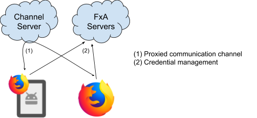
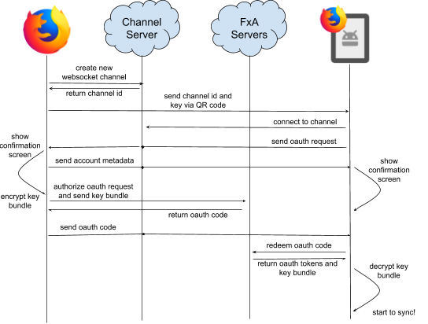

## Pairing Flow Architecture

The goal of the pairing flow is to allow users to quickly connect a mobile browser to Firefox Sync, without having to type their password,
Firefox Accounts allows a mobile device to connect by pairing with an authenticated Firefox profile on their PC via scanning a QR code.
See the [Project Plan Document](https://docs.google.com/document/d/1mFf0sfEK8o1csXLeyK1x4GS9SUMIq4q8bu25LiydPew/edit#) for more information.

The intended user flow operates as follows:

1. On their Desktop (Authority) device, the user selects an option to connect other device, and a QR code is displayed.
1. On their Mobile (Supplicant) device, the user selects an option to connect to Firefox Sync via pairing, which launches a QR code scanner.
1. The user scans the QR code from Desktop with their Mobile device.
1. The devices establish a secure communication channel, and Mobile sends an OAuth request for Desktop to authorize.
1. After confirming on both devices, the user's Mobile is connected to their Firefox Account.

The Desktop (Authority) and Mobile (Supplicant) devices will not communicate directly, because we cannot assume that they will be on
the same network and because this is difficult to achieve from web content.
Instead, they will exchange encrypted messages via WebSocket to a lightweight "channel server" service which can relay messages back and forth.
The flow performs a remote authorization where the already authenticated device generates Sync keys and an OAuth code for the new device.
PKCE facilitates the transfer of the Sync key between devices and the channel server facilitates direct communication between the two, including the final transfer of the OAuth code.



---



### Detailed Flow

It is advised to read the following section while looking at the detail diagram.


[View / Edit in LucidChart](https://www.lucidchart.com/documents/edit/1bc1b604-0047-4542-8827-ed8518b0433e/0)

#### 1) Desktop opens an encrypted channel and advertises it via QR code

To make itself available for pairing, the Desktop device opens a connection to the Channel Server using the [fxa-pairing-channel library](https://github.com/mozilla/fxa-pairing-channel).

Once connected it will receive a server-allocated channel id, then the library will generate a 32-byte channel key to be used for client-side encryption of messages on the channel.

-   The channel key is what secures the pairing flow.
    -   Any application that learns the channel key will be able to request pairing from the Desktop device, or intercept messages exchanges during the pairing flow.
    -   The fxa-pairing-channel library uses a subset the pre-shared key mode of TLS 1.3 for communication between the two devices.
-   The channel id and channel key are encoded using base64url and then combined into a "pairing url".
-   The generated URL looks like: https://accounts.firefox.com/pair#channel_id=[channel_id]&channel_key=[channel_key]
-   This URL is then encoded in a QR code and displayed on screen.

#### 2) Mobile scans the QR code and connects to the encrypted channel

To initiate pairing, the Mobile device scans the QR code displayed by Desktop and extracts the channel id and channel key.
It opens a WebSocket to the Channel Server using the same fxa-pairing-channel library specifying the channel id, channel key.
The Channel Server will now relay WebSocket messages from Mobile to Desktop and vice-versa. The [supplicant broker](app/scripts/models/auth_brokers/pairing/supplicant.js) handles the
creation of the PairingChannelClient and the state machine. The supplicant triggers messages after user's approval and finally sends
the code to the relier by using the existing OAuth redirection broker.

#### 3) Devices exchange metadata and show confirmation screens

At this point the devices have established a baseline level of trust and can exchange metadata to allow the user to confirm the pairing on both sides.
We use explicit confirmation screens to reduce the risk of phishing or over-the-shoulder attacks.

The Mobile device sends what is essentially an OAuth request, delivered over the WebSocket channel rather than opened as a local web page.
It includes all parameters that would appear in an ordinary OAuth authorization request.
The exceptions are the `scope`and `keys_jwk` parameters, they just get passed through when authorizing the request.

The Desktop device sends an "account metadata" message that includes information about the account being connected to.
The properties of that messages are listed in the "Pairing messages" section.

This information will help the Mobile device show a meaningful confirmation screen.
It's PII, but the channel has established a base level of trust between devices, so it should be safe to share this information directly.

-   Upon receiving the metadata message from the other device, both Desktop and Mobile show an explicit confirmation screen.
-   To show the confirmation screen on desktop, the Desktop (Authority) side transitions from `about:preferences` Firefox UI to
    the fxa-content-server hosted page. This engages the [authority broker](app/scripts/models/auth_brokers/pairing/authority.js) and
    establishes [WebChannel communication](https://developer.mozilla.org/docs/Mozilla/JavaScript_code_modules/WebChannel.jsm) with Native code.
-   There's no set confirmation order: the Supplicant and the Authority will show the confirmations screens at the same time, and can be accepted in any order.

For additional security, the Channel Server annotates each message with information about the originating device, such as geoip lookup data. This may help the user detect if they're connecting to a different device than expected.

#### 4) Desktop device authorizes OAuth request

When the user accepts the confirmation screen on the Desktop device, it will use its local credentials to authorize the OAuth request from the Mobile device. This involves no user interaction, and will include the following steps:

-   Check that redirect_uri is the expected value; error out if not.
-   Check that scope contains exactly `"profile"` and `"https://identity.mozilla.com/apps/oldsync"`; error out if not.
-   Check that client_id is the expected value; error out if not.
-   Check that state exists and is well formed; error out if not.
-   Build the scoped-key bundle for `"https://identity.mozilla.com/apps/oldsync"`, encrypting it with the provided `keys_jwk` to produce `keys_jwe`.
-   Generate a BrowserID assertion with the fxa-oauth-server as audience.
-   POST all of this to fxa-oauth-server at `/v1/authorization` and receive back an OAuth code and state response parameters.

Desktop will then send the code and state parameters back to Mobile over the WebSocket channel, encrypted as before with the channel key.

#### 5) Mobile receives OAuth response and connects to Sync

When the user accepts the confirmation screen on the Mobile device, it will listen for the message produced by the Desktop device in step (4) above.
After receiving the message, it can tear down its WebSocket channel. The supplicant broker redirect step is captured by the Native app, as part of that step the `code` and `state`
params are extracted from the redirect url.

-   The mobile application can now complete its OAuth flow in its Native code just as if it had received code and state via a standard web-content-based OAuth flow:
-   Submit the code to fxa-oauth-server at /v1/token in exchange for an access token, refresh token, and bundle of encrypted key material.
-   Decrypt the bundle of key material with its keys_jwk private key.
-   Fetch user profile data, and check that it matches the data provided by Desktop in step (3).
-   Use the access token and key material to access Firefox Sync.

## Exchanged messages specification

The pairing flow is made possible by messages that are forwarded between the Desktop native code and the web content page opened on the supplicant device.

The Firefox Desktop native code gathers information from web content via WebChannels and communicates that to the supplicant using the
channel server socket.

Meanwhile, the web content opened on the supplicant device connects directly to a WebSocket, without native code infrastructure.
It waits for user's approval on both sides of the flow and once that is achieved, it can receive the OAuth `code` and `state`
from the authority side of the pairing flow.

### Pairing Channel messages

The message payload is a JSON object that contains a message identifier and a data object.
Every message envelope also contains information about the sender (IP address, geolocation..).
Here's an example of the channel server envelope:

```
data: {
  ...,
  "remoteMetaData": {
    "city": "Kanata",
    "country": "Canada",
    "region": "Ontario",
    "ua": "Mozilla/5.0 (Macintosh; Intel Mac OS X 10.10; rv:40.0) Gecko/20100101 Firefox/40.0",
    "ipAddress": "1.1.1.1"
  }
}
```

#### pair:supp:request

Direction: Supp -> Auth

Description: Sent right after connecting to the pairing channel by the supp. Contains OAuth request parameters, a key encryption JWK if required by the relier.

```
{
  message: "pair:supp:request",
  data: {
    // See the OAuth server API doc for a description of the parameters.
    access_type,
    client_id,
    code_challenge,
    code_challenge_method,
    // FxA Scoped Keys key-fetching public key (base64url encoded).
    [keys_jwk,].
    scope,
    state,
  },
}
```

#### pair:auth:metadata

Direction: Auth -> Supp

Description: Sent by the Auth and contains the account and device information of the Auth.

```
{
  message: "pair:auth:metadata",
  data: {
    email,
    avatar,
    displayName,
    deviceName,
  },
}
```

#### pair:auth:authorize

Direction: Auth -> Supp

Description: Sent by the Auth once the pairing has been confirmed by the user on this side. Contains an OAuth code that can be traded for a token.

```
{
  message: "pair:auth:authorize",
  data: {
    // See the OAuth server API doc for a description of the parameters.
    code,
    state,
    redirect,
  },
}
```

#### pair:supp:authorize

Direction: Supp -> Auth

Description: Sent by the Supp once the pairing has been confirmed by the user on this side.

```
{
  message: "pair:supp:authorize",
}
```

### Desktop WebChannel messages

On Desktop, the Firefox Accounts Web Content page communicates with the native code (which owns the pairing channel connection) using WebChannel.
WebChannel messages can only be initiated from the content side, however the native side can send a response.

#### fxaccounts:pair_supplicant_metadata

Description: Allows the web content to request the supp’s device information.

Expected response:

```
{
  ua,
  city,
  region,
  country,
  ipAddress,
}
```

#### fxaccounts:pair_authorize

Allows the web content to inform the native side the confirmation dialog has been accepted.

Expected response: N/A

#### fxaccounts:pair_heartbeat

Description: Sent by the web content every second or so. Allows to surface errors but to also transition to a "completed" screen once the supp side has confirmed the pairing request.

Expected Response:

```
{
  err, // String
}
<OR>
{
  suppAuthorized, // Boolean
}

```

#### fxaccounts:pair_complete

Description: Allows the web content to inform the native side it is aware the flow is finished, has shown a confirmation screen and the resources can be finalized on the native side.

Expected Response: N/A

## Other Details

### Routes

-   The Mobile (Supplicant) side, implements the following URL: https://accounts.firefox.com/pair/supp

This view accepts OAuth query parameters equivalent to those on the existing /oauth/ view, and will accept the channel id and channel key as parameters in the URL hash fragment.
The view performs the entire Mobile side of the protocol, including:

-   connecting to the provided channel via WebSocket
-   passing the OAuth request to the Desktop over the WebSocket channel
-   displaying a confirmation screen using the account metadata information sent by Desktop
-   receiving OAuth code and state from Desktop over the WebSocket channel.
-   completing the OAuth flow by redirecting back to the relier

*   The Desktop (Authority) side, loads the following URL: https://accounts.firefox.com/pair/auth

This view establishes communication with Native Desktop code. The Native Desktop code takes care of the following:

-   establishing the WebSocket channel and corresponding secret key
-   displaying the QR code as a URL to https://accounts.firefox.com/pair
-   receiving the OAuth request from the Mobile device
-   constructing the keys_jwe bundle and authorizing the OAuth request
-   return the OAuth code to the Mobile device over the WebSocket channel
-   communicating between Native code and Authority web content using WebChannels

### QR Code and URLs

The QR code is a URL: `https://accounts.firefox.com/pair/#channel_id=XYZ&channel_key=ABC`

When the Mobile device scans this from the QR code, it parses out the channel parameters and combines them with its OAuth request parameters to produce a URL like the following:

```
https://accounts.firefox.com/pair/supp
?client_id=<the client's oauth client id>
&state=<generated state token>
&scope=<scopes to request>
&code_challenge=<generated PKCE challenge>
&code_challenge_method=<generated PKCE challenge method>
&keys_jwk=<generated public key>
&redirect_uri=<the client's registered redirect_uri>
#channel_id=XYZ&channel_key=ABC
```

Open the constructed URL, just as it would if it were initiating a standard username-and-password OAuth flow.
Wait for a redirect from the opened OAuth flow to return `code` and `state` parameters.

-   After the OAuth flow redirects with the `code`, it can be exchanged for the `keys_jwe` bundle.
-   Decrypt the key bundle using corresponding private key for `keys_jwk`.
-   The Desktop pairing flow implements a custom `redirect_uri` - `urn:ietf:wg:oauth:2.0:oob:pair-auth-webchannel`. This indicates that this is a pairing flow.
