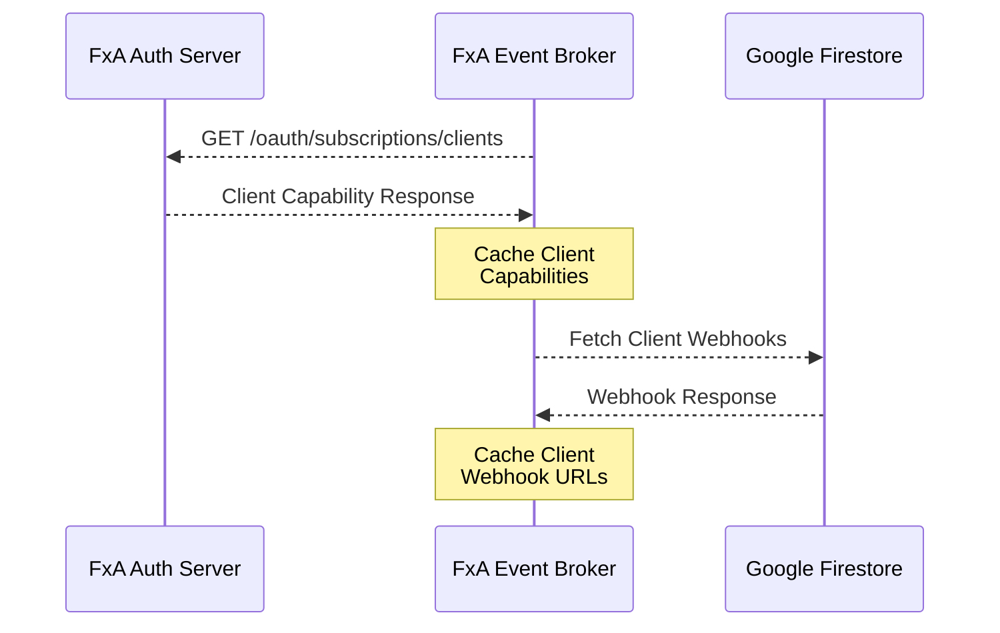
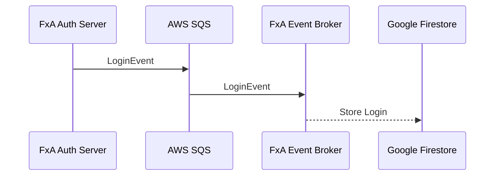
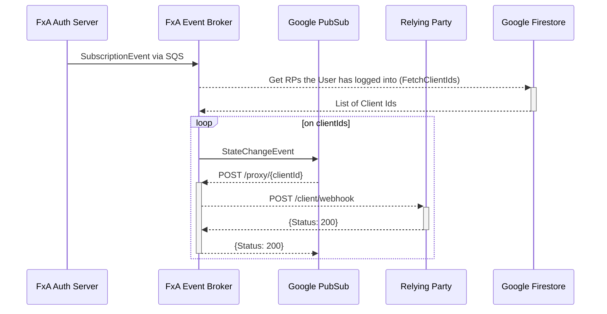

# Architecture

## Recurring Services

FxA Event Broker runs two services (`selfUpdatingService`) which refresh a cached copy of data at a given
interval (default is 5 minutes).

     

## Login Events

     

## Subscription State Change Events

Note: SQS participant not shown here to save space.

